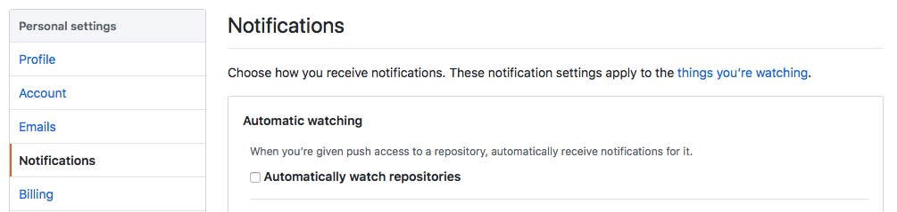

## Welcome to Learn JavaScript

You'll learn how to take your JavaScript skills from a novice to a ninja in this course.

This private Github repo is a temporary place for you to read the lessons. I wanted to give you access before working on the course portal so you can learn without waiting for the course to be 100% ready.

You can contribute to the quality of the material and practice the same steps as you would to contributing to an open source project. See the last section on [contributing assistance](#spot-a-typo).

## Lesson Updates

I'll push new lessons to this repo whenever they're ready for you. Make sure you watch the repo if you want the latest updates. I'll also send you an email and ping you on slack (if I remember 😅).

Protip: you'll want to disable "Automatically watch repositories" or you'll get flooded with emails when students' create forks of the course repo.

## The lessons

You may check out the [course outline](outlines/outline8.md) if you're curious about what's in store for you in Learn JavaScript. Otherwise, feel free to go through these lessons that are ready for you:

1. JavaScript and its ecosystem
    1. [Welcome to Learn JavaScript!](lessons/01.javascript-and-its-ecosystem/01.how-to-use-this-course.md)
    2. [What is JavaScript used for?](lessons/01.javascript-and-its-ecosystem/02.what-is-javascript.md)
    3. [The JavaScript ecosystem](lessons/01.javascript-and-its-ecosystem/03.the-ecosystem.md)
    4. [Varying versions of JavaScript](lessons/01.javascript-and-its-ecosystem/04.varying-versions-of-javascript.md)
2. JavaScript basics
    1. [Linking your JavaScript file](lessons/02.js-basics/01.linking.md)
    2. [Preparing your text editor](lessons/02.js-basics/02.preparing-your-text-editor.md)
    3. [The console](lessons/02.js-basics/03.console.md)
    4. [Comments](lessons/02.js-basics/04.comments.md)
    5. [You don't need semicolons](lessons/02.js-basics/05.semicolons.md)
    6. [Strings, numbers and booleans](lessons/02.js-basics/06.str-num-bool.md)
    7. [Declaring variables](lessons/02.js-basics/07.variables.md)
    8. [Functions](lessons/02.js-basics/08.functions.md)
    9. [Arrow functions](lessons/02.js-basics/09.arrow-functions.md)
    10. [Intro to Objects](lessons/02.js-basics/10.objects.md)
    11. [If/else statements](lessons/02.js-basics/11.if-else.md)
    12. [The NOT operator](lessons/02.js-basics/12.not-operator.md)
    13. [Null and undefined](lessons/02.js-basics/13.null-and-undefined.md)
    14. [The BOM and the DOM](lessons/02.js-basics/14.bom-and-dom.md)
    15. [Selecting an element](lessons/02.js-basics/15.selecting-an-element.md)
    16. [Changing classes](lessons/02.js-basics/16.changing-classes.md)
    17. [Listening to events](lessons/02.js-basics/17.listening-to-events.md)
    18. [Callbacks](lessons/02.js-basics/18.callbacks.md)
3. Building simple components
    1. [How to think like a developer](lessons/03.building-simple-components/01.think-like-dev.md)
    2. [How to use the starter template](lessons/03.building-simple-components/02.starter-template.md)
    3. [Do this for every component](lessons/03.building-simple-components/03.do-this.md)
    4. [🛠 Building an off-canvas menu](lessons/03.building-simple-components/04.building-off-canvas.md)
    5. [🛠 Building a modal window](lessons/03.building-simple-components/05.building-modal-window.md)
    6. [Lessons from the building process](lessons/03.building-simple-components/06.lessons-from-the-building-process.md)
    7. [Debugging errors](lessons/03.building-simple-components/07.debugging-errors.md)
    8. [How to use a linter](lessons/03.building-simple-components/08.linter.md)
4. Arrays and loops
    1. [Intro to arrays](lessons/04.arrays-and-loops/01.arrays.md)
    2. [For loops](lessons/04.arrays-and-loops/02.for-loops.md)
    3. [The forEach loop](lessons/04.arrays-and-loops/03.foreach.md)
    4. [Selecting multiple elements](lessons/04.arrays-and-loops/04.selecting-multiple-elements.md)
    5. [Nodes vs elements](lessons/04.arrays-and-loops/05.nodes-vs-elements.md)
    6. [🛠 Building an accordion](lessons/04.arrays-and-loops/06.building-accordion.md)
5. Dom basics
    1. [Ids, classes, attributes, and tags](lessons/05.dom-basics/01.id-class-attribute-tag.md)
    2. [Changing CSS with JavaScript](lessons/05.dom-basics/02.changing-css.md)
    3. [Getting CSS with JavaScript](lessons/05.dom-basics/03.getting-css.md)
    4. [Changing attributes](lessons/05.dom-basics/04.changing-attributes.md)
    5. [Finding an element's size and position](lessons/05.dom-basics/05.finding-element-size-and-position.md)
    6. [DOM Traversals](lessons/05.dom-basics/06.dom-traversals.md)
    7. [🛠 Building a tabbed component](lessons/05.dom-basics/07.building-tabbed-component.md)
    8. [🛠 Building a carousel](lessons/05.dom-basics/08.building-carousel.md)
    9. [🛠 Building a carousel (part 2)](lessons/05.dom-basics/09.building-carousel-2.md)
6. Events deep dive
    1. [The listening element](lessons/06.events-deep-dive/01.listening-element.md)
    2. [Default behaviors](lessons/06.events-deep-dive/02.default-behaviors.md)
    3. [Event propagation](lessons/06.events-deep-dive/03.event-propagation.md)
    4. [Event delegation](lessons/06.events-deep-dive/04.event-delegation.md)
    5. [Removing listeners](lessons/06.events-deep-dive/05.remove-listeners.md)
    6. [🛠 Improving the modal](lessons/06.events-deep-dive/06.improving-modal.md)
    7. [🛠 Improving the accordion](lessons/06.events-deep-dive/07.improving-accordion.md)
    8. [🛠 Improving the tabbed component](lessons/06.events-deep-dive/08.improving-tabbed-component.md)
    9. [🛠 Improving the carousel](lessons/06.events-deep-dive/09.improving-carousel.md)
7. Animations and Transitions
    1. [CSS Transitions](lessons/07.animations-and-transitions/01.css-transition.md)
    2. [CSS Animations](lessons/07.animations-and-transitions/02.css-animation.md)
    3. [Jank free animations](lessons/07.animations-and-transitions/03.jank-free-animations.md)
    4. [Integrating transitions and animations with JavaScript](lessons/07.animations-and-transitions/04.integrating-transitions-and-animations-with-js.md)
    5. [🛠 Animating the off-canvas menu](lessons/07.animations-and-transitions/05.animating-off-canvas.md)
    6. [🛠 Animating the accordion](lessons/07.animations-and-transitions/06.animating-accordions.md)
    7. [🛠 Animating the carousel](lessons/07.animations-and-transitions/07.animating-carousel.md)
    8. [Animating with JavaScript](lessons/07.animations-and-transitions/08.animating-with-js.md)
    9. [Greensock Animation API (gsap)](lessons/07.animations-and-transitions/09.gsap.md)
    10. [🛠 Animating the modal (part 1)](lessons/07.animations-and-transitions/10.animating-modal.md)
    11. [🛠 Animating the modal (part 2)](lessons/07.animations-and-transitions/11.animating-modal-2.md)
8. Useful JavaScript features
    1. [Ternary operators](lessons/08.useful-javascript-features/01.ternary-operators.md)
    2. [AND and OR operators](lessons/08.useful-javascript-features/02.and-and-or.md)
    3. [Early returns](lessons/08.useful-javascript-features/03.early-returns.md)
    4. [Template literals](lessons/08.useful-javascript-features/04.template-literals.md)
    5. [Destructuring](lessons/08.useful-javascript-features/05.destructure.md)
    6. [Default parameters](lessons/08.useful-javascript-features/06.default-params.md)
    7. [Enhanced object literals](lessons/08.useful-javascript-features/07.enhanced-object-literals.md)
    8. [Rest and spread](lessons/08.useful-javascript-features/08.rest-and-spread.md)
    9. [Useful array methods](lessons/08.useful-javascript-features/09.useful-array-methods.md)
    10. [Reduce](lessons/08.useful-javascript-features/10.reduce.md)
    11. [Looping through objects](lessons/08.useful-javascript-features/11.looping-through-objects.md)
    12. [Returning objects with implicit return](lessons/08.useful-javascript-features/12.implicit-return-objects.md)
    13. [🛠 Improving the accordion](lessons/08.useful-javascript-features/13.improving-accordion.md)
    14. [🛠 Improving the carousel](lessons/08.useful-javascript-features/14.improving-carousel.md)
9. JavaScript best practices
    1. [Write declarative code](lessons/09.javascript-best-practices/01.write-declarative-code.md)
    2. [Functions should have one purpose](lessons/09.javascript-best-practices/02.one-purpose.md)
    3. [Understanding scope](lessons/09.javascript-best-practices/03.understanding-scope.md)
    4. [Reduce state changes](lessons/09.javascript-best-practices/04.reduce-state-changes.md)
    5. [Don't reassign](lessons/09.javascript-best-practices/05.dont-reassign.md)
    6. [Don't mutate](lessons/09.javascript-best-practices/06.dont-mutate.md)
    7. [Preventing objects from mutating](lessons/09.javascript-best-practices/07.prevent-objects-from-mutating.md)
    8. [Preventing arrays from mutating](lessons/09.javascript-best-practices/08.prevent-arrays-from-mutating.md)
    9. [Write pure functions](lessons/09.javascript-best-practices/09.pure-functions.md)
    10. [🛠 Refactoring the off-canvas menu](lessons/09.javascript-best-practices/10.refactoring-off-canvas.md)
    11. [🛠 Refactoring the modal](lessons/09.javascript-best-practices/11.refactoring-modal.md)
    12. [🛠 Refactoring the accordion](lessons/09.javascript-best-practices/12.refactoring-accordion.md)
    13. [🛠 Refactoring the tabbed-component](lessons/09.javascript-best-practices/13.refactoring-tabbed-component.md)
    14. [🛠 Refactoring the carousel](lessons/09.javascript-best-practices/14.refactoring-carousel.md)
10. Text and Content
    1. [Changing text and HTML](lessons/10.text-and-content/01.changing-text-and-html.md)
    2. [Creating HTML Elements](lessons/10.text-and-content/02.creating-html-elements.md)
    3. [Adding multiple elements to the DOM](lessons/10.text-and-content/03.adding-multiple-elements.md)
    4. [Removing elements](lessons/10.text-and-content/04.removing-elements.md)
    6. [Building a calculator](lessons/10.text-and-content/06.building-calculator.md)
    7. [Building a calculator (part 2)](lessons/10.text-and-content/07.building-calculator-2.md)
    8. [Refactoring the calculator](lessons/10.text-and-content/08.refactor-calculator.md)
11. Forms
    1. [Intro to forms](lessons/11.forms/01.forms.md)
    2. [Getting form fields](lessons/11.forms/02.getting-form-fields.md)
    3. [Types of form fields](lessons/11.forms/03.types-of-fields.md)
12. Asynchronous JavaScript
    1. [Intro to Ajax](lessons/12.asynchronous-javascript/01.ajax.md)
    2. [Understanding JSON](lessons/12.asynchronous-javascript/02.json.md)
    3. [The Fetch API](lessons/12.asynchronous-javascript/03.fetch-api.md)
    4. [Possible data types](lessons/12.asynchronous-javascript/04.data-types.md)
    5. [JavaScript Promises](lessons/12.asynchronous-javascript/05.promises.md)
    6. [Requests and responses](lessons/12.asynchronous-javascript/06.request-and-response.md)
    7. [Sending post requests](lessons/12.asynchronous-javascript/07.post-request.md)
    8. [Authentication](lessons/12.asynchronous-javascript/08.authentication.md)
    9. [Handling errors](lessons/12.asynchronous-javascript/09.handling-errors.md)
    10. [Viewing response headers](lessons/12.asynchronous-javascript/10.viewing-response-headers.md)
    11. [CORS and JSONP](lessons/12.asynchronous-javascript/11.cors-and-jsonp.md)
    12. [XHR or Fetch](lessons/12.asynchronous-javascript/12.xhr-or-fetch.md)
    13. [Using an Ajax Library](lessons/12.asynchronous-javascript/13.ajax-library.md)—new!
    14. [Reading API Documentation](lessons/12.asynchronous-javascript/14.reading-api-docs.md)—new!
    15. [Understanding Curl](lessons/12.asynchronous-javascript/15.curl.md)—new!
13. Advanced asynchronous JavaScript
    1. [Requesting many resources at once](lessons/13.advanced-async/01.requesting-many-resources.md)—new!
    2. [Response headers in JavaScript](lessons/13.advanced-async/02.response-headers-in-js.md)—new!
    3. [Dealing with paginated responses (part 1)](lessons/13.advanced-async/03.paginated-responses.md)—new!
    4. [Dealing with paginated responses (part 2)](lessons/13.advanced-async/04.paginated-responses.md)—new!
    5. [Asynchronous functions](lessons/13.advanced-async/05.async-await.md)—new!
    6. [Timeouts](lessons/13.advanced-async/06.timeouts.md)—new!

## Private Community

Since you pre-ordered Learn JavaScript, you have access to the Slack (the app we're using for the private community) to learn together with your peers. To join the slack group, head over to [this link](https://zellwk-slack.herokuapp.com) and fill in your best email.

You'll get an invitation to join a Slack group. **Once you've signed in, join the #learn-javascript Slack channel**.

## Spot a typo?

If you spot any typo, you can correct it by sending a [pull request](https://help.github.com/articles/creating-a-pull-request/). Typo-catching is much appreciated! Thanks in advance!
