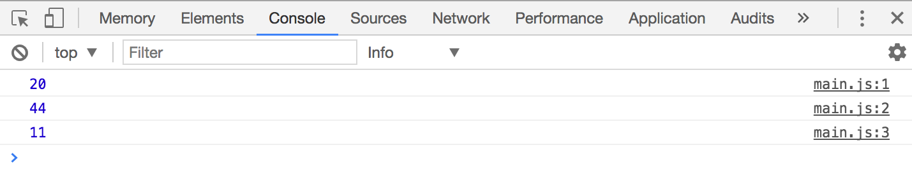

## Strings, Numbers and Booleans

What is `1 + 1`?

Some say the answer is 2, others say the answer is 11.

In JavaScript, both answers can be correct. It depends on how `1 + 1` is written. To understand why both answers can be correct, you need to look at JavaScript basic data types and how they work.

## The six data types

JavaScript has six basic data types in total. These data types are also called "primitives". They are:

1. String
2. Number
3. Boolean
4. Null
5. Undefined
6. Symbol

## String

A String represents text data in JavaScript. You can create strings by enclosing them in quotation marks:

```js
'JavaScript is easier than I thought!'
```

If you log this string to the console, you'll see the text appears to be black. That's how you can quickly tell it's a String.

```js
console.log('JavaScript is easier than I thought!')
```

<figure>
  
  <figcaption>Text that appears black in a JavaScript console represents a String</figcaption>
</figure>

You can use singular quote marks (`''`) or double quote marks (`""`) to create a String. What you use comes down to your preference.

Some people prefer using the single marks, others prefer double marks. What's important is to be consistent. If you use single marks, make sure you use single marks all the way.

In this course, I'll use single quotation marks for declaring strings.

### Handling strings with apostrophes

Strings with apostrophes (like it's) can be created with single quotation marks if you add a backslash `\` before the apostrophe.

```js
'It\'s my birthday today!'
```

They can also be created with backticks (<code>``</code>). Creating Strings with backticks is a new improvement from ES6. You'll learn more about this in later chapters.

```js
`It's my birthday today!`
```

### Adding Strings together

Strings can be added together with the `+` operator, like this:

```js
console.log('Super' + 'man')
```

<figure>
  
  <figcaption>Strings can be added together</figcaption>
</figure>

Notice how `man` is added directly after `Super` in this case? Whenever you add strings together, you join the two strings into one. This process is also called String concatenation.

This is why `1 + 1` can equal `11` in JavaScript. In this case, you're concatenating the two strings.

```js
console.log('1' + '1')
// 11
```

<figure>
  
  <figcaption>Adding two strings of '1' gives a string of '11'</figcaption>
</figure>

Let's move on to Numbers next.

## Number

A Number represents numeric data. In JavaScript, you can create numbers by writing the number directly in its numeric form:

```js
3456789
```

If you log out the number in your console, you'll see the number appear in blue:

```js
console.log(3456789)
```

<figure>
  
  <figcaption>Numbers appear in blue in Chrome's console</figcaption>
</figure>

### Adding numbers together

Numbers in JavaScript behave like numbers in Math. If you add `1 + 1`, you'd see 2. If you add `20 + 2`, you'd see 22.

```js
console.log(1 + 1)
console.log(20 + 2)
```

<figure>
  
  <figcaption>Adding numbers would give you what you'll expect to see in Math</figcaption>
</figure>

### Subtracting, multiplying and dividing numbers

You can also subtract, multiply or even divide them numbers with `-`, `*` and `/` respectively.

```js
console.log(22 - 2)
console.log(22 * 2)
console.log(22 / 2)
```

<figure>
  
  <figcaption>You can also subtract, multiply and divide numbers</figcaption>
</figure>

Let's move on to the next primitive.

## Boolean

A boolean takes either one of two values in JavaScript – `true` or `false`. To understand Booleans, take a look at the light switch in your room.

When you flick the switch on, you get light. When you flick the switch off, the your light goes off.

Booleans are very much like these switches. They can only be "switched on" (`true`) or "switched off" (`false`). By themselves, Booleans aren't really useful, but they can tie a program together.

You'll find out how to use Booleans as we go through the `if` statement in a later chapter.

## Null and undefined

Null and undefined are two important primitive values you need to know, but learning them now would only cause more confusion. We'll come back to null and undefined later in a later chapter when you're ready to learn them.

## Symbol

A Symbol is a new primitive that comes together with ES6. You don't need to use symbols 99% of the time. They're meant for a very unique use case (creating unique identifiers) that you won't use throughout this course.

Since we're not going to use Symbols in this course, I suggest to read [more about symbols](https://developer.mozilla.org/en-US/docs/Glossary/Symbol) after you're done with the entire course.

## Exercise

Prepare yourself for the next lesson by creating numbers, strings and booleans. Try the following:

1. Create a String and `console.log` it
2. Add two strings together
3. Create a Number and `console.log` it
4. Add two numbers together
5. Subtract one number from another number
6. Multiply two numbers
7. Divide one number by another number
8. Create a Boolean and `console.log` it