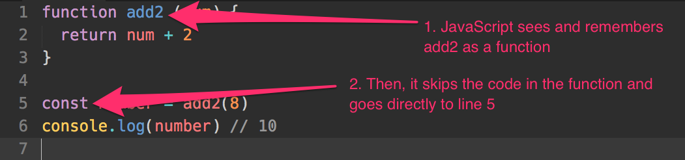

# All about Functions

Imagine you live in an village without tap water. To get water, someone from your household needs to take a empty bucket, head to the well in the middle of the village, draw water from the well and head back home.

You need to draw water from the well multiple times a day. It's a hassle to say "I'm going to take an empty bucket, go to the well, draw water and bring back home" every time you explain what you're doing.

To shorten it, you can say you're going to "draw water".

And my friend, you've created a function.

## Declaring functions

A function is a block of code that executes tasks in a specific order, like take empty bucket, go to well, draw water, head back home.

It can be defined with the following syntax:

```js
function functionName (arguments) {
  // Do stuff here
}
```

`function` is a keyword that tells JavaScript you're defining a function.

`functionName` is the name of the function. In the example given above, the function name could be `drawWater`.

The name of the function can be anything, as long as it follows the same rules as declaring variables. In other words, it needs to follow these rules:

1. It must be one word
2. It must consist only of letters, numbers or underscores (0-9, a-z, A-Z, `_`).
3. It cannot begin with a number.
4. It cannot be any of these [reserved keywords](https://developer.mozilla.org/en-US/docs/Web/JavaScript/Reference/Lexical_grammar#Keywords)

`arguments` is optional. It is a comma-separated list of variables you wish to declare for your function. They can be assigned values when you use the function.

## Using functions

Once you declared your function, you can use (or invoke, or call, or execute) it by writing the name of the function, followed by parenthesis `()`.

Here's an example where a `sayHello` function is declared and used.

```js
// Declaring a function
function sayHello () {
  console.log('Hello world!')
}

// using a function
sayHello()
```

<figure>
  
  <figcaption>Declaring and using sayHello function</figcaption>
</figure>

## The indentation

Code within a block (anything within curly braces `{}`) gets indented to the right. This is an important practice that helps you make code easier to read. It allows you to tell at a glance that `console.log` is part of `sayHello`.

You can choose to indent with 2 spaces or with a tab key. Some prefer spaces, others prefer tab. I prefer spaces. Both are fine, as long as you keep it consistent.

## Arguments

Most useful functions take in arguments. It is a comma-separated list of variables to you wish to declare for your function.

You can have any number of arguments.

```js
function functionName(argument1, argument2, argument3) {
  // Do stuff here
}
```

When you call a function, you assign values to your arguments by passing in values (also called parameters).

To do so, you write these parameters as comma-separated values in the parenthesis. The first parameter would be assigned to the first argument, the second parameter to the second argument and so on.

```js
functionName('arg1', 'arg2')
```

Let's make it clearer with an example.

Let's say you wish to write a function called `sayName` that logs the firstName and lastName of a person. The function looks like this:

```js
function sayName(firstName, lastName) {
  console.log('firstName is ' + firstName)
  console.log('lastName is ' + lastName)
}
```

Zell is my first name, Liew is my last name. To get the function to work correctly, I pass my `Zell`, as the first parameter, and `Liew` as the second parameter:

```js
sayName('Zell', 'Liew')
// firstName is Zell
// lastName is Liew
```

If you declared an argument, but did not pass a parameter to it, your argument would take up the `undefined` value.

```js
sayName()
// firstName is undefined
// lastName is undefined
```

That's it for arguments.

## The return statement

Functions can have a return statement that consists of the return keyword and a value:

```js
function functionName () {
  return 'some-value'
}
```

When JavaScript sees this return statement, it stops executing the rest of the function and "returns" (passes the value back to the function call).

```js
function get2 () {
  return 2
  console.log('blah') // This is not executed
}

const results = get2()
console.log(results)
// 2
// Note: You would not see 'blah' in the console
```

If the return value is an expression, JavaScript evaluates the expression before returning the value.

```js
function add2(num) {
  return num + 2
}

const number = add2(8)
console.log(number) // 10
```

## Flow of a function

Functions can be hard for beginners to understand. To make sure you understand functions completely, let's go through what happens when you declare and use a function again. We'll take things one step at a time.

Here's the code we're dissecting:

```js
function add2 (num) {
  return num + 2
}

const number = add2(8)
console.log(number) // 10
```

First of all, before using any function, you'll need to declare it. In the first line, JavaScript sees the `function` keyword. It knows the function is called `add2`.

It skips over the code in the function at this point because the function is not used yet.

<figure>
  
  <figcaption>JavaScript sees add2 and skips it</figcaption>
</figure>

Next, JavaScript sees you're declaring a variable called `number`, and assigning it as the result of `add2(8)`.

Since the RHS is a function call (an expression), JavaScript needs to evaluate the value of `add2(8)` before it can assign it to the `number` variable. Here, it sets the argument `num` to `8`, since we passed in the value 8 in `add2`.

<figure>
  
  <figcaption>JavaScript executes the add2 function</figcaption>
</figure>

Next, JavaScript sees a return statement that says `num + 2`. This is an expression, so it needs to evaluate it before moving on. Since `num` is 8, `num + 2` must be 10.

<figure>
  
  <figcaption>JavaScript evaluates num + 2 as 10</figcaption>
</figure>

Once `num + 2` is evaluated, JavaScript returns the value to the function call. It replaces the function call with the returned value. So, `add2(8)` becomes 10.

<figure>
  
  <figcaption>JavaScript replaces add2(8) with the result, 10</figcaption>
</figure>

Finally, once the RHS is evaluated, JavaScript creates the variable, `number` and assigns the value 10 to it.

That's how you read the flow of a function.

## Hoisting

When functions are declared with a function declaration (what you learned above), they are hoisted to the top of your scope (see next lesson for scope). This means the following two sets of code are exactly the same.

```js
function sayHello () {
  console.log('Hello world!')
}
sayHello()

// This is automatically converted to the above code
sayHello()
function sayHello () {
  console.log('Hello world!')
}
```

Function hoisting gets confusing because JavaScript changes the order of your code. I highly recommend you declare your functions before you use them. Don't rely on hoisting.

## Declaring functions with function expressions

A second way to declare functions is with a function expression. Here, you declare a variable, then assign a function without a name (an anonymous function) to it.

```js
const sayHello = function () {
  console.log('This is declared with a function expression!')
}
```

Note that functions declared with functions expressions are not automatically hoisted to the top of your scope.

```js
sayHello () // Error, sayHello is not defined
const sayHello = function () {
  console.log(aFunction)
}
```

Function expressions are redundant in the past. You almost never declare functions with them, since function declarations are so much easier to use.

I'm showing you this method because it's the foundation of [arrow functions](../02.es6/02.arrow-functions.md), which is a shorter and more concise way to declare functions in ES6.

## Exercise

Functions are basic building blocks in JavaScript. Practice making them. Do the following:

1. Make a function named logger that `console.log` the argument you passed into it.
2. Make a function called `add` that adds two numbers together.
3. Make a function called `multiply` that multiplies two numbers together.
