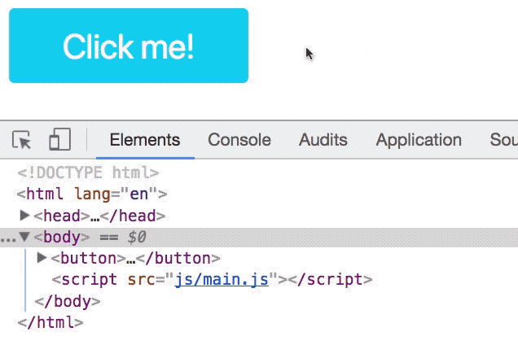
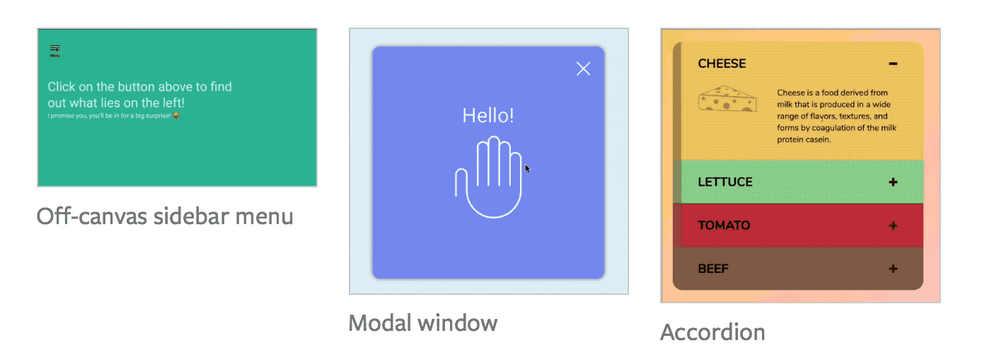

# What is JavaScript used for?

In the beginning, the web was static. All you could do as a developer was write text (through HTML tags) and make websites look a bit nicer (with CSS).

Users could only interact with your website through links—the blue (sometimes of another color) underlined text that brings a user from one page to another.

People had a vision that the web could become more interactive; animations could also exist. These thoughts prompted the development of JavaScript.

Of course, what I've written above is a short and informal history of JavaScript. Things didn't go so simply—JavaScript wasn't the first language that tried to make websites dynamic.

But you're not here to learn about the history of JavaScript. You're here to learn how to use the language, so we won't go into any more history lessons from this point on.

If you're interested in a long and detailed history, check out "[A brief history of JavaScript](https://auth0.com/blog/a-brief-history-of-javascript/)" by Sebastián Peyrott.

## JavaScript makes things dynamic

JavaScript allows three things to happen.

First, it allows you to detect user interaction, which allows your website to respond according to a user's action.

For example, when a user clicks on a tab in the the tabbed interfaced below, what's shown on screen changes to reflect what the tab contains.

<figure>
  
  <figcaption>Clicking on a tab changes what's shown on the screen</figcaption>
</figure>

Second, JavaScript lets you change the structure of your HTML and CSS. In the example below, when the button gets clicked, a class called `red` appears in the Document Object Modal (the DOM), which is your HTML in the browser.

<figure>
  
  <figcaption>When the button is clicked, a red class is added to the button</figcaption>
</figure>

Third, JavaScript lets you create animations like any of the following:

<figure>
  
  <figcaption>JavaScript lets you create animations</figcaption>
</figure>

## JavaScript does much more than these three things

But JavaScript isn't just about making things dynamic on browsers anymore. It can be used on the server too. In the next lesson, you'll learn more the JavaScript ecosystem and how to navigate yourself around it.

