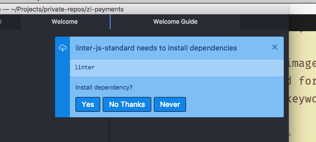
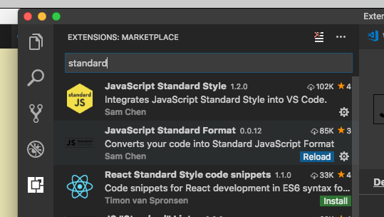

# Preparing your text editor

You can choose from many text editors. The most notable ones are:

1. [Sublime Text](https://www.sublimetext.com)
2. [Atom](https://atom.io)
3. [Visual Studio Code (VS Code)](https://code.visualstudio.com)

If you're starting out with JavaScript, I recommend either Atom or VS Code because it's easier for a beginner to set up their text editor. Setting up things with Sublime Text is slightly tougher.

To help you with JavaScript, I recommend you install the following packages.

## A Linter, Standard and Standard formatter

A **linter** is a tool that tells you if your code looks wrong. It helps you check against most typo errors.

In the example below, my linter told me that something is wrong in line 4. Upon checking, I discovered that I missed a closing parenthesis in line 3. This is how a linter helps with typo checking.

<figure>
  
  <figcaption>The red bracket in line four hints that something is wrong with the code</figcaption>
</figure>

The linter can also be configured to highlight code formatting issues. In the following example, the linter picked up incorrect indentation of the `const` keyword in the line2; the second `const` should be flushed with the first `const`.

<figure>
  
  <figcaption>The red bracket surrounding const hints that something is wrong too. In this case, it should be flushed to the left with the first const keyword</figcaption>
</figure>

**Standard** is a style guide for writing JavaScript. By installing Standard, you can tell the linter to check whether your code looks right. There are many other style guide versions. In this course, I use Standard.

**Standard formatter** is a plugin that lets your text editor update your code automatically to conform with the Standard style guide with a shortcut key (or when you save your file).

In the image below, when I save my JavaScript file, Standard formatter corrects the positioning of the second `const` keyword.

<figure>
  
  <figcaption>Standard formatter shifts the second const keyword left by four spaces when the file is saved</figcaption>
</figure>

To install Standard on Atom, open up **Atom's preferences**, click on **install**, search for standard, and **install linter-js-standard** and **standard-formatter**.

Then, when asked to install linter dependencies, click yes.

<figure>
  
  <figcaption>Installing Standard and Standard formatter on Atom</figcaption>
</figure>

<figure>
  
  <figcaption>Installing linter dependencies</figcaption>
</figure>

To install Standard on VS Code, click on **Extensions** on the left sidebar, search for standard, and install **JavaScript Standard Style** and **JavaScript Standard Format**

<figure>
  
  <figcaption>Installing Standard and Standard formatter on VS Code</figcaption>
</figure>

To install Standard and Standard formatter on Sublime text, follow [these instructions](https://zellwk.com/blog/js-env/#setting-up-a-standard-in-sublime-text).

You're ready to begin your JavaScript journey now. Go forth and learn JavaScript! :)

---

- Previous Lesson: [Varying versions of JavaScript](04.varying-versions-of-javascript.md)