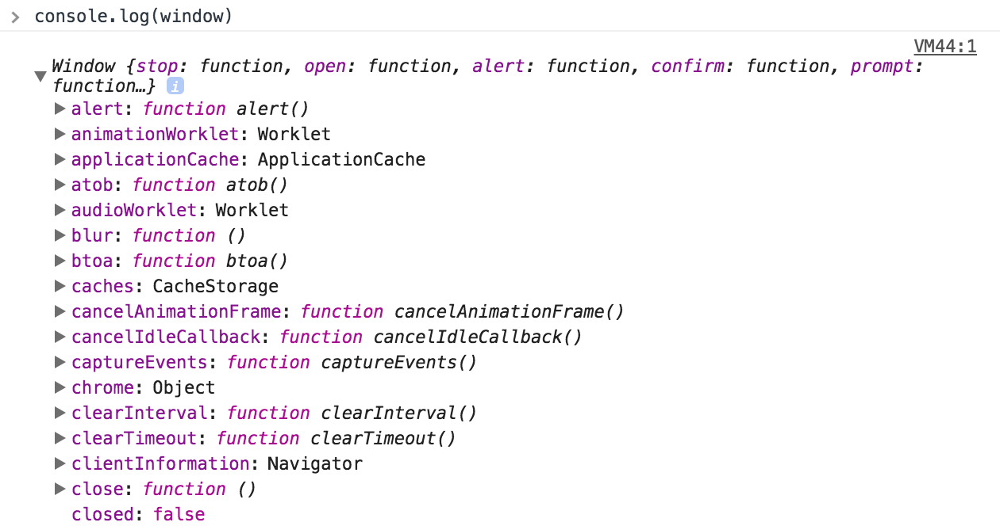
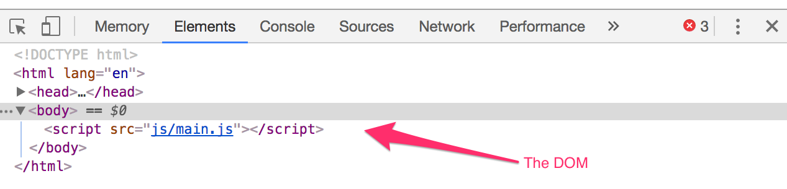
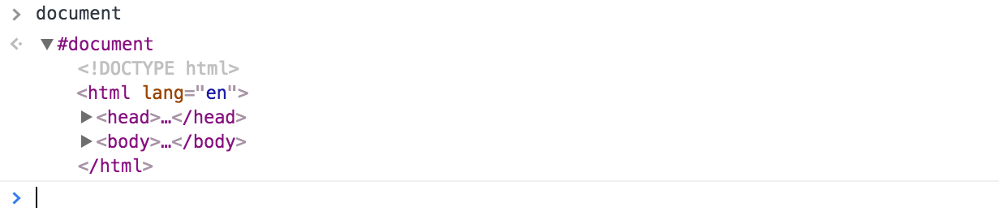

# BOM and DOM

First, let's talk about BOM and DOM.

## BOM

BOM is an acronym of Browser Object Model. It refers to the complete set of JavaScript functionality you can use with your browser. If you think of BOM as your browser window, you're pretty much spot on.

BOM exposes the `window` object in JavaScript. If you open up your inspector and write `console.log(window)`, you'll see the list of every JavaScript method you can use.

<figure>
  
  <figcaption>A incomplete list of methods exposed through the Window Object</figcaption>
</figure>

As you can see, there's a lot we can do with JavaScript. We'll cover the most important ones you need to know as you proceed through the course. For now, let's move on with this lesson.

You can use any property within the window object my typing `window.propertyName` or simply just `propertyName`. So, the following two are equivalent

```js
window.document
document
```

Let's move on to the DOM.

## DOM

DOM is an acronym for Document Object Model. It refers to your HTML. Open up your inspector, click on the "Elements" tab and you'll see the DOM.

<figure>
  
  <figcaption>The Elements tab contains the DOM</figcaption>
</figure>

You can access it with `document`.

<figure>
  
  <figcaption>The Document is an Element</figcaption>
</figure>

You'll use the DOM a lot in the next few lessons to come.

## Exercise

Try to get the DOM with `document`. Log it out with your `console`. Click on the arrows in the results of that log to explore your DOM.