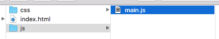
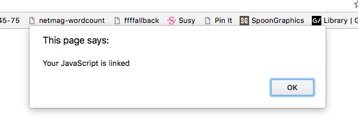

# Linking your JavaScript file

When you write JavaScript, you should write them in a JavaScript file that ends with a `.js` extension. Doing so allows you to use the same set of JavaScript code across all your HTML files.

These JavaScript files can be named anything you want. Most people name their first JavaScript file either `app.js` or `main.js`.

These files are then stored in a `js` folder that's located at the same level of your HTML files for easy identification.

<figure>
  
  <figcaption>JavaScript files are located in a js folder for easy identification</figcaption>
</figure>

# Linking your JavaScript file to your HTML file.

For your JavaScript files to work, you need to link them to your HTML. You do so by adding a `<script>` tag at the bottom of your HTML, before closing the `</body>` tag.

This `<script>` tag should contain a `src` attribute that points to your JavaScript file, like this:

```html
<html>
<head>
  <title>Title of website</title>
</head>
<body>
  <!-- Stuff -->
  <script src="js/main.js"></script>
</body>
</html>
```

Now, go ahead and type in this code in your JavaScript file to make sure it's linked properly.

```js
alert('Your JavaScript is linked')
```

When you're done, open up your `index.html` file with a browser of your choice. If your JavaScript file is linked, you should get an ugly prompt.

<figure>
  
  <figcaption>alert produces a prompt like this one here</figcaption>
</figure>

Once you're sure your JavaScript file is linked, remove the code you just typed. You won't ever use it again.

## Always add your JavaScript at the bottom of your HTML.

You may have seen developers add their JavaScript file at the top of their HTML, within the `<head>` tag as you went through other tutorials online:

```html
<html>
<head>
  <title>Title of website</title>
  <script src="js/main.js"></script>
</head>
<body>
  <!-- Stuff -->
</body>
</html>
```

I highly discourage this approach.

If you do this, the browser cannot begin displaying your HTML and CSS until it has finished downloading your JavaScript. It delays your users from viewing your content.

If you want to add your JavaScript file at the top of your HTML, make sure to use the `async` attribute which tells browsers to download the file only after it's done with other tasks.

```html
<head>
  <title>Title of website</title>
  <!-- The async attribute is important if you put your JavaScript in the head -->
  <script src="js/main.js" async></script>
</head>
```

## Relative and absolute paths

In the examples above, you linked your JavaScript file with a **relative path**. They begin directly with the name or folder of the file you're trying to link. This code below tells browsers to look into the `js` folder that is for the `main.js` file.

```html
<!-- Example of relative url -->
<script src="js/main.js"></script>
```

**Absolute paths**, on the other hand, begin with a `/` or a HTTP protocol:

```html
<!-- Examples of absolute url -->
<script src="https://ajax.googleapis.com/ajax/libs/jquery/3.2.1/jquery.min.js"></script>
<script src="/js/main.js"></script>
```

In general, you should link your JavaScript files with relative URLs unless you need to link to an external resource like jQuery shown in the example above.

## Exercise

Create a folder on your computer for going through this course. In this project folder, create a HTML file and a JavaScript file. Link your JavaScript file to your HTML file.

---

- Previous Lesson: [Preparing your text editor](../01.javascript-and-its-ecosystem/05.preparing-your-text-editor.md)
- Next Lesson: [Console](02.console.md)