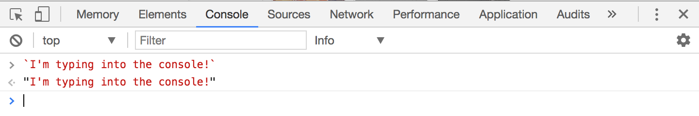
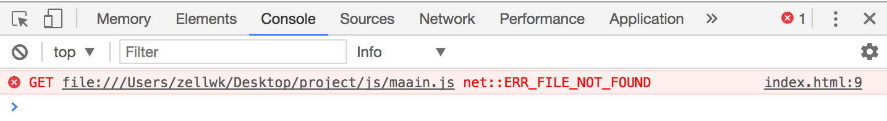

# The Console

The console is a place for you to write commands to find out what's happening in your JavaScript code so you can check and remove errors from it (a process known as debugging).

It is a useful tool you'll keep using, so make sure you're comfortable with it.

## Browser contains their own console.

Every browser has their own console. The consoles between browsers are largely similar to each other, with minor differences in style and capabilities. The best browsers for debugging are Firefox and Chrome when you develop websites.

Personally I use [Google Chrome Canary](https://www.google.com/chrome/browser/canary.html) when I code. Their console is far superior to a normal Google Chrome console. I highly suggest you use it as you go through the course.

## Bringing up the console

If you use Google Chrome (or Canary), you can open the console by clicking on `view > developer > developer tools`.

Alternatively, you can also use a keyboard shortcut (`cmd + opt + i` on Mac and `ctrl + shift + i` on Windows) to bring up the console. I highly suggest you learn the keyboard shortcut because you'll be using the console a lot.

This is how the console looks like.

<figure>
  
  <figcaption>The JavaScript console looks like a blank screen with an area you can type in</figcaption>
</figure>

## Typing in the console

You can type in the console. If you typed valid JavaScript into the console, it will be evaluated and the results would be shown to you, like this:

<figure>
  
  <figcaption>The console returns the results of whatever you typed in</figcaption>
</figure>

If you typed invalid JavaScript into the console, you would get an error, like this:

<figure>
  
  <figcaption>The console shows you an error if you typed in invalid code</figcaption>
</figure>

Every error the console throws at you has a meaning. You can use it to debug and make things right, and you'll learn how to do so in later chapters.

For now, know that you can type JavaScript into the console to debug.

## Printing to the console

Code you type into your JavaScript file does not appear in the console automatically.

This behavior is ideal because you can have hundreds of lines of JavaScript when you make something. It would make things hard to debug if you were forced to look at hundreds of lines of logs at the same time whenever you view the console.

So, to get things from your JavaScript file into your console, you need to use the `console.log` method.

```js
console.log(`Hello, I'm Zell!`)
```

<figure>
  
  <figcaption>Console.log allows you to write things from your JavaScript file to the console</figcaption>
</figure>

Now, to make the language less verbose, whenever I mention "log into the console" in this course, I mean for you to write a `console.log` statement, just like you did above.

## File not found error

Sometimes, when you open up your console, you'll see an error that says `ERR_FILE_NOT_FOUND`.

<figure>
  
  <figcaption>File not found error</figcaption>
</figure>

If you see this error, it means the URL you wrote in your HTML cannot be found. Sometimes, it can be due to a typo error. In this example, you can see that in line #9, I have misspelled the word `main` as `maain`.

## Saving and refreshing

When you change your JavaScript file, you need to save it. After saving it, you need to refresh your browser window for the changes to take effect.

This is one of the most common errors that people face when they find their JavaScript didn't work – they either forget to save, forget to reload, or both.

So, when you feel that your code isn't working, try saving and refreshing first before proceeding with other debugging steps (which you'll learn later).

## Exercise

You'll be using the console a lot as you go through the next few lessons. Try the following tasks:

1. Bring up the console with the keyboard shortcut
2. Close the console again with the same shortcut
3. Type 1 + 1 in the console and see what you get
4. Type 1 + 1 in your JavaScript file and see what you get in your console.
5. Type `console.log('I am writing JavaScript!')` into your JavaScript file and see what you get in your console.

---

- Previous Lesson: [Linking](01.linking.md)
- Next Lesson: [Primitives](03.primitives.md)