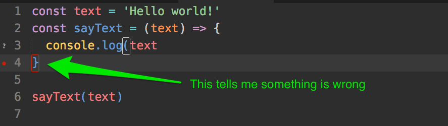
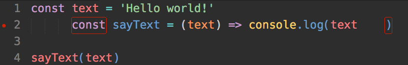
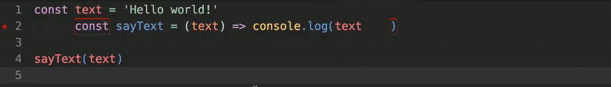

# Preparing your text editor

You can use many text editors to write JavaScript. The most notable ones are:

1. [Visual Studio Code (VS Code)](https://code.visualstudio.com)
2. [Sublime Text](https://www.sublimetext.com)
3. [Atom](https://atom.io)

For this course, especially if you're starting out with JavaScript, I highly recommend you use VS Code. This is because it's easier for you to setup a great workflow in VS Code compared to Sublime Text.

The second reason is because I've created a series of videos you can follow to setup VS Code.

## What you need to install

I recommend you install the following things:

1. Standard Linter
2. Standard Formatter

A **linter** is a tool that tells you if your code looks wrong. It helps you check against most typo errors.

In the example below, my linter told me that something is wrong in line 4. Upon checking, I discovered that I missed a closing parenthesis in line 3. This is how a linter helps with typo checking.

<figure>
  
  <figcaption>The red bracket in line four hints that something is wrong with the code</figcaption>
</figure>

The linter can also be configured to highlight code formatting issues. In the following example, the linter picked up incorrect indentation of the `const` keyword in the line2; the second `const` should be flushed with the first `const`.

<figure>
  
  <figcaption>The red bracket surrounding const hints that something is wrong too. In this case, it should be flushed to the left with the first const keyword</figcaption>
</figure>

**Standard** is a style guide for writing JavaScript. By installing Standard, you can tell the linter to check whether your code looks right. There are many other style guide versions. In this course, I use Standard.

**Standard formatter** is a plugin that lets your text editor update your code automatically to conform with the Standard style guide with a shortcut key (or when you save your file).

In the image below, when I save my JavaScript file, Standard formatter corrects the positioning of the second `const` keyword.

<figure>
  
  <figcaption>Standard formatter shifts the second const keyword left by four spaces when the file is saved</figcaption>
</figure>

## Instructions with VS Code

I have created a video series to help you get started with Visual Studio Code. You can watch this series through the following links:

1. [Part 1—setting up VS Code ]()
2. [Part 2—preparing VS Code to code HTML, CSS and JavaScript]()
3. [Part 3—useful VS Code extensions]() (optional)
4. [Part 4—useful VS Code keyboard shortcuts]() (optional)

## Instructions with Sublime Text

To install Standard and Standard formatter on Sublime text, follow [these instructions](https://zellwk.com/blog/js-env/#setting-up-a-standard-in-sublime-text).

---

- Previous Lesson: [Linking your JavaScript file](01.linking.md)
- Next Lesson: [The console](03.console.md)