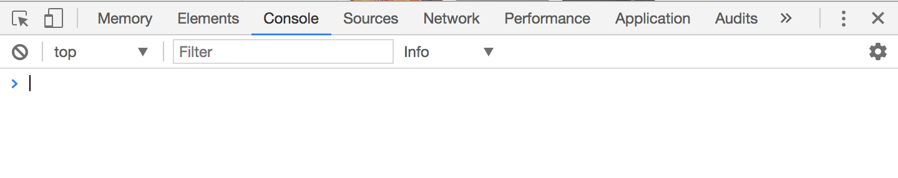
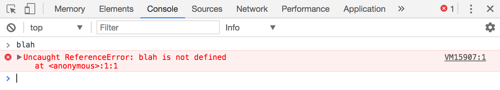
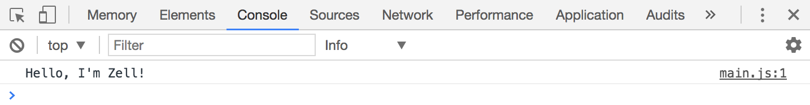
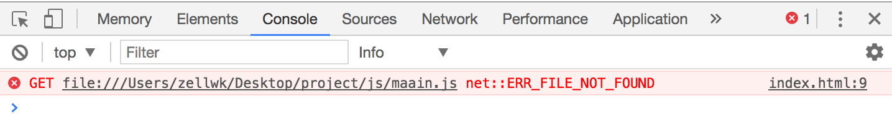
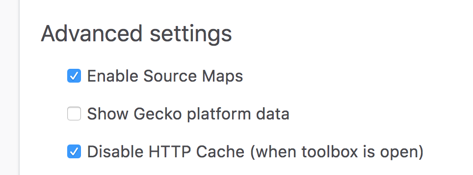
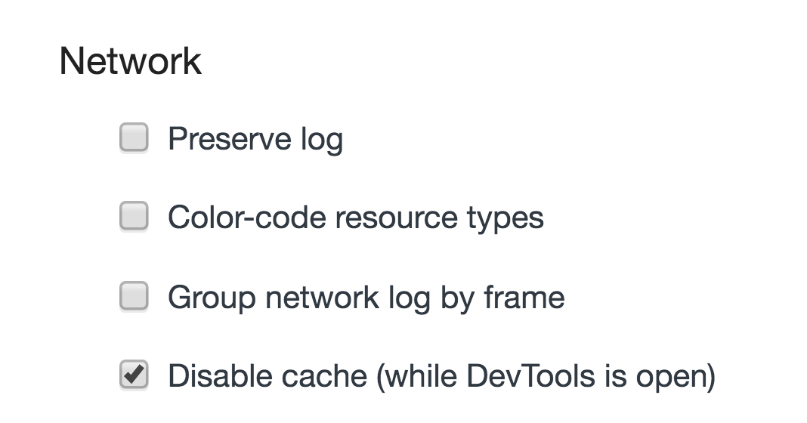

# The Console

The console is a place that lets you write commands to find out what's happening with your JavaScript code. It's a useful tool you'll keep using to check and eliminate errors (a process known as debugging).

## Browsers have their own console:

Browsers have their own console. The consoles between browsers are largely similar to each other, with minor differences in style and capabilities. The best browsers for debugging are Firefox and Chrome.

When I code, I use [Google Chrome Canary](https://www.google.com/chrome/browser/canary.html) and [Firefox Nightly](https://www.mozilla.org/en-US/firefox/channel/desktop/). This is because their consoles are superior compared the normal versions. I highly recommend you use one of these browsers.

This is how a console looks like.

<figure>
  
  <figcaption>The JavaScript console looks like a blank screen with an area you can type in</figcaption>
</figure>


## Bringing up the console

You can open the console through the keyboard shortcut `cmd + opt + i` on a Mac and `ctrl + shift + i` on Windows. I highly recommend using the shortcut because you'll bring up the console a lot.

Alternatively, you can open up the console in Chrome and firefox through the following ways:

1. Chrome: `view > developer > developer tools`.
2. Firefox: `tools > web developer > web console`

## Typing in the console

You can type in the console. If you typed valid JavaScript into the console, it will be evaluated and the results would be shown to you, like this:

<figure>
  
  <figcaption>The console returns the results of whatever you typed in</figcaption>
</figure>

If you typed invalid JavaScript into the console, you would get an error, like this:

<figure>
  
  <figcaption>The console shows you an error if you typed in invalid code</figcaption>
</figure>

Every error the console throws at you has a meaning. You can use it to debug and make things right, and you'll learn how to do so in later chapters.

For now, just know that you can type JavaScript into the console.

## Printing to the console

Code you type into your JavaScript file does not appear automatically in the console. This behavior is ideal because you can have hundreds of lines of JavaScript when you make something. It would be hard to debug if you were forced to look at hundreds of lines of logs every time!

To get things from your JavaScript file to the console, you need to use `console.log`. It looks like this:

```js
console.log(`Hello, I'm Zell!`)
```

<figure>
  
  <figcaption>Console.log allows you to write things from your JavaScript file to the console</figcaption>
</figure>

Note: whenever I mention "log into the console" in this course, I mean for you to write a `console.log` statement, just like you did above.

## File not found error

Sometimes, when you open up your console, you'll see an error that says `ERR_FILE_NOT_FOUND`.

<figure>
  
  <figcaption>File not found error</figcaption>
</figure>

If you see this error, it means the URL you wrote in your HTML cannot be found. Sometimes, it can be due to a typo error. In this example, you can see that in line #9 of `index.html`, I have misspelled the word `main` as `maain`.

## Saving and refreshing

When you change your JavaScript file, you need to save it. After saving it, you need to refresh your browser window for the changes to take effect.

This is one of the most common errors that people face when they find their JavaScript didn't work—they either forget to save, forget to reload, or both.

Next time, when your code doesn't update, try saving and refreshing.

When you work through the real components in the course, you will need to have the console open for the changes to take effect. Make sure you check "disable HTTP Cache" in your console's settings.

<figure>
  
  <figcaption>Disable HTTP cache in Firefox Nightly</figcaption>
</figure>

<figure>
  
  <figcaption>Disable HTTP cache in Chrome Canary</figcaption>
</figure>

## Exercise

You'll use the console a lot as you go through the next few lessons. Try the following tasks:

1. Bring up the console with the keyboard shortcut
2. Close the console again with the same shortcut
3. Type 1 + 1 in the console and see what you get
4. Type 1 + 1 in your JavaScript file and see what you get in your console.
5. Type `console.log('I am writing JavaScript!')` into your JavaScript file and see what you get in your console.

---

- Previous Lesson: [Preparing your text editor](02.preparing-your-text-editor.md)
- Next Lesson: [Comments](04.comments)