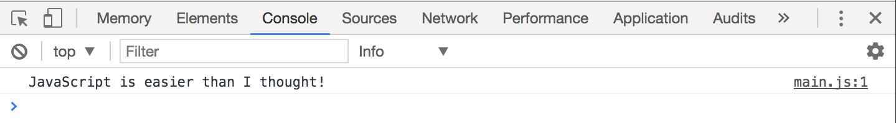
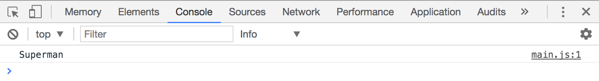
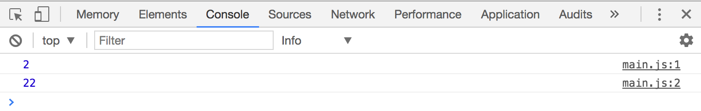
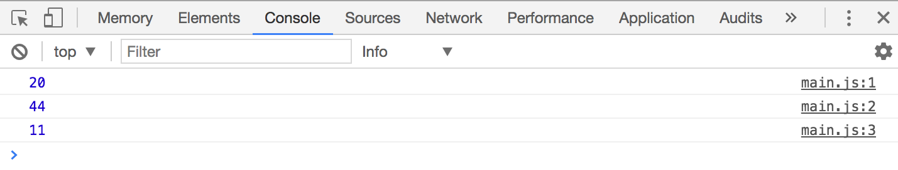

## Strings, numbers and booleans

What is 1 + 1?

In JavaScript, the answer can be 2 or 11. It depends on how `1 + 1` is written.

To understand why the answer can be 2 or 11, you need to understand JavaScript basic types and how they work.

## The six data types

JavaScript has six basic data types in total. These data types are also called **primitives**. They are:

1. String
2. Number
3. Boolean
4. Null
5. Undefined
6. Symbol

## String

A String represents text data in JavaScript. You create strings by enclosing them in quotation marks:

```js
'JavaScript is easier than I thought!'
```

If you log this string into Chrome's console, you'll see black text. This is how you can quickly tell if something is a string in the console.

```js
console.log('JavaScript is easier than I thought!')
```

<figure>
  
  <figcaption>Text that appears black in a JavaScript console represents a String</figcaption>
</figure>

You can use singular quote marks (`''`) or double quote marks (`""`) to create a string. What you use comes down to your preference.

Some people prefer using the single marks, others prefer double marks. What's important is to be consistent. If you use single marks, make sure you use single marks all the way.

In this course, I'll use single quotation marks for declaring strings.

### Handling strings with apostrophes

Strings with apostrophes (like it's) can be created with single quotation marks if you add a backslash `\` before the apostrophe.

```js
'It\'s my birthday today!'
```

They can also be created with backticks (<code>``</code>). Strings created with backticks are called template strings. You'll learn about template strings in a later chapter.

```js
`It's my birthday today!`
```

### Adding Strings together

Strings can be added together with the `+` operator. When you add strings together, you join the two strings into one. This process is also called String concatenation.

```js
console.log('Super' + 'man')
```

<figure>
  
  <figcaption>Strings can be added together</figcaption>
</figure>

Notice how `man` is added directly after `Super`?

This is why `1 + 1` can equal `11` in JavaScript. It happens if you concatenate two `1` strings.

```js
console.log('1' + '1')
// 11
```

<figure>
  
  <figcaption>Adding two strings of '1' gives a string of '11'</figcaption>
</figure>

## Number

A Number represents numeric data. In JavaScript, you can create numbers by writing the number directly in its numeric form:

```js
3456789
```

If you log out the number in Chrome's console, you'll see the blue text.

```js
console.log(3456789)
```

<figure>
  
  <figcaption>Numbers appear in blue in Chrome's console</figcaption>
</figure>

### Adding numbers together

Numbers in JavaScript behave like numbers in Math. If you add `1 + 1`, you'd see 2. If you add `20 + 2`, you'd see 22.

```js
console.log(1 + 1)
console.log(20 + 2)
```

<figure>
  
  <figcaption>Adding numbers would give you what you'll expect to see in Math</figcaption>
</figure>

### Subtracting, multiplying and dividing numbers

You can also subtract, multiply or even divide them numbers with `-`, `*` and `/` respectively.

```js
console.log(22 - 2)
console.log(22 * 2)
console.log(22 / 2)
```

<figure>
  
  <figcaption>You can also subtract, multiply and divide numbers</figcaption>
</figure>

You can also find the remainder of a number with the modulus (`%`) operator.

```js
// This means find the remainder of 22 / 5.
console.log(22 % 5) // 2
```

## Boolean

To understand Booleans, take a look at the light switch in your room. When you flick the switch on, you get light. When you flick the switch off, the your light goes off.

Booleans are very much like light switches. They can only be "switched on" (`true`) or "switched off" (`false`).

You'll find out how to use Booleans as we go through the `if` statement in a later chapter.

```js
console.log(true) // true
console.log(false) // true
```

If you log out a Boolean in Chrome's console, you'll see blue text as well

<figure>
  
  <figcaption>Booleans appear in blue in Chrome's console</figcaption>
</figure>

## Null and undefined

Null and undefined are two important primitive values you need to know, but learning them now would only cause more confusion. We'll come back to null and undefined later in a later chapter when you're ready to learn them.

## Symbol

A Symbol is a new primitive that comes with ES6. You don't need to use symbols 99% of the time. They're meant for a very unique use case that you won't use throughout this course.

Since we're not going to use Symbols in this course, I suggest you read [more about symbols](https://developer.mozilla.org/en-US/docs/Glossary/Symbol) after you're done with the course.

## Exercise

Prepare yourself for the next lesson by creating numbers, strings and booleans. Try the following:

1. Create a `String` and `console.log` it
2. Add two strings together
3. Create a `Number` and `console.log` it
4. Add two numbers together
5. Subtract one number from another number
6. Multiply two numbers
7. Divide one number by another number
8. Create a `Boolean` and `console.log` it

---

- Previous Lesson: [You don't need semicolons](05.semicolons.md)
- Next Lesson: [Declaring variables](07.variables.md)
