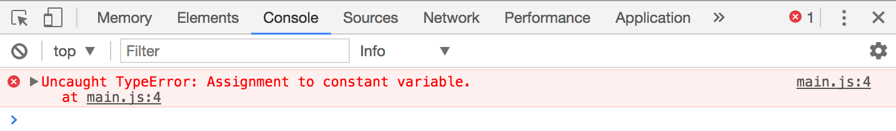
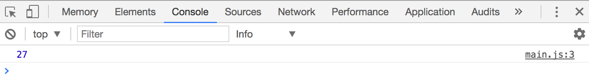

# Declaring variables

If you have 4 apples and you buy 27 more, how many apples do you have? Take a second and write your answer in your text editor.

What's your answer?

```js
// This?
31

// Or this?
4 + 27
```

Both answers are right, but the second method is better, because you're offloading the calculation to JavaScript. You're teaching it how to arrive at the answer.

But there's still one problem with the code.

If you look at `4 + 27` without any context from our apple problem, do you know we're calculating the number of apples you're currently holding?

Probably not.

A better way is to use Algebra to substitute 4 and 27 with variables. **Variables give you the ability to write code that has meaning**:

```js
initialApples + applesBought
```

The process of substituting 4 with a variable called `initialApples` is called declaring variables.

## Declaring Variables

You declare variables with the following syntax:

```js
const variableName = 'value'
```

There are four parts you'll want to take note of:

1. The `variableName`
2. The `value`
3. The `=` sign
4. The `const` keyword

### The variableName

`variableName` is the name of the variable you're declaring. You can name it anything, as long as it follows these rules:

1. It must be one word
2. It must consist only of letters, numbers or underscores (0-9, a-z, A-Z, `_`).
3. It cannot begin with a number.
4. It cannot be any of these [reserved keywords](https://developer.mozilla.org/en-US/docs/Web/JavaScript/Reference/Lexical_grammar#Keywords)

If you need to use two or more words to name your variable, you should join the words together, but capitalize the first letter of each subsequent word. This weird capitalization is called *camel case*.

A good example of a camel cased variable is `applesToBuy`.

### The value

The value is what you want the variable to be. It can be primitives (like strings and numbers etc) or objects (like arrays and functions).

### = in JavaScript

`=` in JavaScript doesn't work like `=` in Math. Don't get confused.

In JavaScript, `=` means **assignment**. When you use `=`, you set (or assign) the value on the right hand side (RHS) of the `=` sign to the left hand side (LHS) of the `=` sign.

In the following statement, we set the variable `initialApples` to the number 4.

```js
const initialApples = 4
```

If you `console.log` this variable, you can see that `initialApples` is 4.

```js
console.log(initialApples) // 4
```

### Evaluation before assignment

Variables can only take up one value each. If you have an equation that needs to be evaluated on the RHS, it must be evaluated before it can be assigned to a variable.

Note: equations that need to be evaluated are called **expressions** in JavaScript.

```js
const initialApples = 4
const applesToBuy = 27

// initalApples + applesToBuy is an expression
const totalApples = initialApples + applesToBuy
```

Here's what JavaScript does when you write `const totalApples = initialApples + applesToBuy`:

```js
// Step 1: See the statement
const totalApples = initialApples + applesToBuy

// Step 2: Substitute initalApples and applesToBuy with their respective variables
const totalApples = 4 + 27

// Step 3: Evaluate the expression
const totalApples = 31
```

This is why you get `31` if tried to log `totalApples`.

```js
console.log(totalApples) // 31
```

### The const keyword

`const` is one of three keywords you can use to declare variables. There are two other keywords – `let` and `var`.

All three keywords declare variables, but they're slightly different from each other.

## Const vs let vs var

`const` and `let` are keywords made available to us in ES6. They are better keywords to create variables than `var`. You'll understand why in a later lesson when we talk about scopes in JavaScript.

For now, let's concentrate on the difference between `const` and `let`.

## Const vs let

**If you declare a variable with** `const`, **you cannot reassign it with a new value**. The following code produces an error:

```js
const applesToBuy = 2

// Reassigning to a variable declared with const results in an error
applesToBuy = 27
```

<figure>
  
  <figcaption>Reassigning a variable declared with const results in an error</figcaption>
</figure>

**If you declare a variable with** `let`, **you can reassign it with a new value.**

```js
let applesToBuy = 2
applesToBuy = 27
console.log(applesToBuy)
```

<figure>
  
  <figcaption>It's okay to reassign variables declared with let</figcaption>
</figure>

## Use const over let. No more var

Understanding whether you should use `const` or `let` is more of an advanced topic.

When you're starting out, using `let` would be much simpler than using `const`. However, as you write more programs, you'll slowly realize that you want to refrain from reassigning your variables, and you'll begin to use `const` over `let`.  Why you'll want to do so is going to be covered in the best practices module.

Since you're going to use `const` over `let` anyway when you write more advanced programs, you might want to get in the habit of using `const` over `let` right now.

By the way, don't use `var` anymore; there's no need for it.

## Wrapping up

In JavaScript, variables are used to hold a value. It can hold any value, from primitives to objects.

The `=` sign in JavaScript isn't the same as the `=` sign in Math. In JavaScript, `=` means assignment.

When you declare variables, use camelCase to name your variables. Avoid reserved keywords.

You can declare variables with `const`, `let` or `var`. As much as possible, you'll want to use `const` over `let`. Use `let` when you need to reassign values. There's no longer a need to use `var`.

## Exercise

Try declaring variables with both `const` and `let`. Practice assigning variables to each of them.

---

- Previous Lesson: [Strings, numbers and booleans](06.str-num-bool.md)
- Next Lesson: [Functions](08.functions.md)