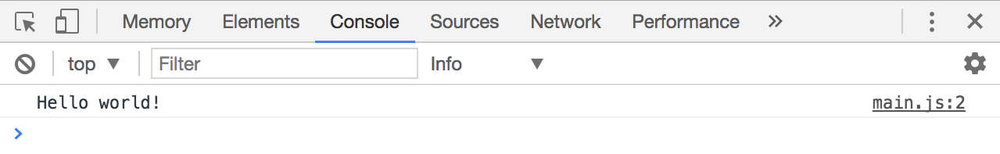
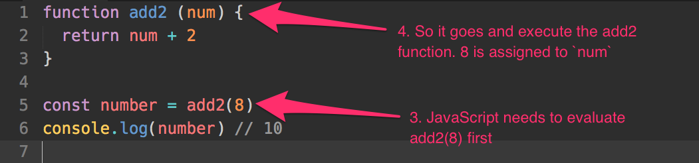

# Functions

Imagine you live in a village without tap water. To get water, someone from your household needs to take an empty bucket, head to the well in the middle of the village, draw water from the well and head back home.

You need to draw water from the well multiple times a day. It's a hassle to say "I'm going to take an empty bucket, go to the well, draw water and bring back home" every time you explain what you're doing.

To shorten it, you can say you're going to "draw water".

And my friend, you've created a function; "draw water" is the name of the function.

## Declaring functions

A function is a block of code that executes tasks in a specific order, like take empty bucket, go to well, draw water, head back home.

It can be defined with the following syntax:

```js
function functionName (parameters) {
  // Do stuff here
}
```

`function` is a keyword that tells JavaScript you're defining a function.

`functionName` is the name of the function. In the example given above, the function name could be `drawWater`.

The name of the function can be anything, as long as it follows the same rules as [declaring variables](/blog/javascript-variables). In other words, it needs to follow these rules:

1. It must be one word
2. It must consist only of letters, numbers or underscores (0-9, a-z, A-Z, `_`).
3. It cannot begin with a number.
4. It cannot be any of these [reserved keywords](https://developer.mozilla.org/en-US/docs/Web/JavaScript/Reference/Lexical_grammar#Keywords)

`parameters` is optional. It is a comma-separated list of variables you wish to declare for your function. They can be assigned values when you use the function.

## Using functions

Once you declared your function, you can use (or invoke, or call, or execute) it by writing the name of the function, followed by parenthesis `()`.

Here's an example where a `sayHello` function is declared and used.

```js
// Declaring a function
function sayHello () {
  console.log('Hello world!')
}

// using a function
sayHello()
```

<figure>
  
  <figcaption>Declaring and using sayHello function</figcaption>
</figure>

## The indentation

Code within a block (anything within curly braces is a block) gets indented to the right. This is an important practice that helps you make code easier to read. In the following example, you can immediately see that `console.log('Hello world')` is part of `sayHello`.

```js
function sayHello () {
  // This console.log statement is a part of sayHello
  console.log('Hello world!')
}
```

You can choose to indent with 2 spaces or with a tab key. Some people prefer spaces, others prefer tab. Both are fine, as long as you keep it consistent.

## Parameters and arguments

Most functions take in parameters. Parameters are a **comma-separated list of variables** to you wish to declare.

You can have any number of parameters.

```js
function functionName(param1, param2, param3) {
  // Do stuff here
}
```

To assign values to parameters, you pass in arguments. Arguments are comma-separated values you use in the function call.

The first argument gets assigned to the first parameter, the second argument to the second parameter, and so on.

```js
functionName('arg1', 'arg2')
```

Let's make it clearer with an example.

Let's say you wish to write a function called `sayName` that logs the firstName and lastName of a person. The function looks like this:

```js
function sayName(firstName, lastName) {
  console.log('firstName is ' + firstName)
  console.log('lastName is ' + lastName)
}
```

Zell is my first name, Liew is my last name. To get the function to work correctly, I pass my `Zell`, as the first argument, and `Liew` as the second argument:

```js
sayName('Zell', 'Liew')
// firstName is Zell
// lastName is Liew
```

If you declared a parameter, but did not pass an argument to it, your parameter would be `undefined`.

```js
sayName()
// firstName is undefined
// lastName is undefined
```

Note: In the real world, we don't differentiate between `parameters` or `arguments`. Everyone calls both of them `arguments` all the time. For this course, I'm going to call them arguments too.

## The return statement

Functions can have a return statement that consists of the `return` keyword and a value:

```js
function functionName () {
  return 'some-value'
}
```

When JavaScript sees this return statement, it stops executing the rest of the function and "returns" the value (passes the value back to expression that called the function call).

```js
function get2 () {
  return 2
  console.log('blah') // This is not executed
}

const results = get2()
console.log(results) // 2
// Note: You would not see 'blah' in the console
```

If the return value is an expression, JavaScript evaluates the expression before returning the value.

```js
function add2(num) {
  return num + 2
}

const number = add2(8)
console.log(number) // 10
```

## Types of values that can be passed around

**JavaScript can only pass around two types of values.** Everything else needs to be evaluated first.

1. Primitives (like Strings, numbers, and booleans)
2. Objects (like functions, arrays, and other objects)

You'll learn more about objects in a later chapter.

Note: Don't get confused between a function and a function call. A function call is an expression.

```js
function add2(num) {
  return num + 2
}

// add2 is a function. It can be passed around
const anotherAdd2 = add2
console.log(anotherAdd2) // function
```

```js
function add2(num) {
  return num + 2
}

// add2(2) is an expression. It needs to be evaluated first
const sum = add2(2)
console.log(sum) // 4
```

Remember, **Javascript can only pass around primitives** (like String, Numbers, Booleans) **and objects** (like functions, arrays and objects) as values. **Anything else needs to be evaluated**.

## Flow of a function

Functions can be hard for beginners to understand. To make sure you understand functions completely, let's go through what happens when you declare and use a function again. This time, we'll take things one step at a time.

Here's the code we're dissecting:

```js
function add2 (num) {
  return num + 2
}

const number = add2(8)
console.log(number) // 10
```

First of all, you need to declare a function before you can use it. In the first line, JavaScript sees the `function` keyword and knows the function is called `add2`.

It skips over the code in the function at this point because the function is not used yet.

<figure>
  
  <figcaption>JavaScript sees add2 and skips it</figcaption>
</figure>

Next, JavaScript sees you declare a variable called `number`; you also want to assign the result of `add2(8)` to it.

Since the right hand side (RHS) is a function call (an expression), JavaScript needs to evaluate `add2(8)` before assigning it to `number`. Here, it sets the parameter `num` to `8`.

<figure>
  
  <figcaption>JavaScript executes the add2 function</figcaption>
</figure>

In the `add2` function, JavaScript sees a return statement that says `num + 2`. This is an expression that needs to be evaluated. JavaScript adds 8 and 2 together.

<figure>
  
  <figcaption>JavaScript evaluates num + 2 as 10</figcaption>
</figure>

Once `num + 2` is evaluated, JavaScript returns the value to the function call. It replaces the function call with the returned value. So, `add2(8)` becomes 10.

<figure>
  
  <figcaption>JavaScript replaces add2(8) with the result, 10</figcaption>
</figure>

Finally, once the RHS is evaluated, JavaScript creates the variable, `number` and assigns the value 10 to it.

This is how you read the flow of a function.

Protip: whenever you're confused, slow down and read the flow of your program. Follow what we've done above. You'll clear things up.

## Hoisting

When functions are declared with a function declaration (what you learned above), they are hoisted to the top of your scope. More on scope in a later lesson, but this means the following two sets of code are exactly the same.

```js
function sayHello () {
  console.log('Hello world!')
}
sayHello()
```

```js
// This is automatically converted to the above code
sayHello()
function sayHello () {
  console.log('Hello world!')
}
```

Function hoisting gets confusing because JavaScript changes the order of your code. I highly recommend you declare your functions before you use them. **Don't rely on hoisting.**

## Declaring functions with function expressions

A second way to declare functions is with a function expression. Here, you declare a variable, then assign a function without a name (also called an anonymous function) to it.

```js
const sayHello = function () {
  console.log('This is declared with a function expression!')
}
```

**Functions declared with function expressions are not automatically hoisted to the top of your scope.**

```js
sayHello () // Error, sayHello is not defined
const sayHello = function () {
  console.log(aFunction)
}
```

At this point, you may wonder if function expressions are important. That's a common question to have. Why would you use function expressions if you can declare functions with the function declaration syntax?

They are important. You'll learn why when you use arrow functions in the next lesson (and object methods in the next next lesson).

## Wrapping up

A function is a block of code that executes tasks in a specific order, like take empty bucket, go to well, draw water, head back home.

You call functions by adding a `()` to the end of the function name. When you do so, you can add additional values as arguments to the function.

Each function can have a `return` statement that "returns" a value to the function call.

Don't rely on hoisting when you write functions. Always declare them upfront before you use them.

## Exercise

Practice making functions. You need to use them a lot when you code for real. Do the following:

1. Make a function named logger that `console.log` the argument you passed into it.
2. Make a function called `add` that adds two numbers together.
3. Make a function called `multiply` that multiplies two numbers together.

---

- Previous Lesson: [Declaring variables](07.variables.md)
- Next Lesson: [Arrow functions](09.arrow-functions.md)
