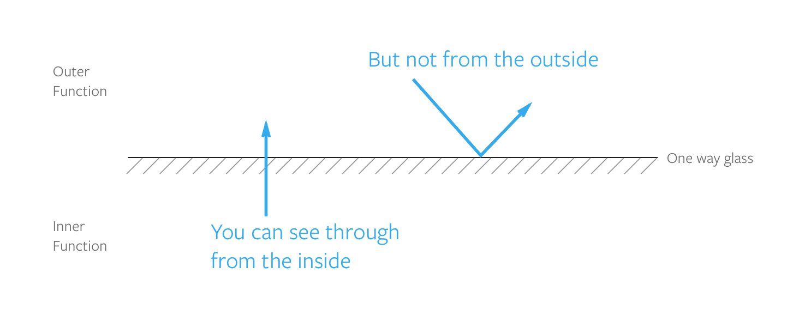

## Scopes and Closures

Did you know you can create variables both outside and inside functions?

```js
const outsideVar = 'outside value'

function varInFunction () {
  const insideVar = 'inside value'
  return outsideVar
}
```

When you do so, you can't get the value of `insideVar` when you're outside the function, but you can get the value of `outsideVar` when you're in the function.

```js
varInFunction() // outside value
console.log(insideVar) // Error, insideVar is not defined
```

This phenomenon happens because of JavaScript **scopes**.

Scopes determine what variables you have access to at any point in your code. You need to fully understand scopes in order to write any decent JavaScript.

There are two kinds of scope, global scope and local scope. Let's start the lesson by talking about global scope.

## Global scope

If a variable is declared *outside of functions and curly braces* (`{}`), it is said to be defined in the **global scope**. (Note: This is true only with JavaScript on browsers, not Node).

```js
const globalVariable = 'some value'
```

Once you've declared a global variable, you can use that variable anywhere in your code.

```js
const hello = 'Hello world!'

function sayHello () {
  console.log(hello)
}

console.log(hello) // 'Hello world!'
sayHello() // 'Hello world!'
```

Although you can create global variables, I strongly advise you from doing so. This is because you increase the chance of a naming collision (where two or more variables have the same name) when you use global variables.

If you already declared your variables with `const` or `let`, and accidentally created another variable with the same name, you'll get an error. This is undesirable since your code stops working:

```js
// Don't do this!
let thing = 'something'
let thing = 'something else' // Error, thing has already been declared
```

If you declared your variables with `var`, and accidentally create another variable with the same name, your second variable overwrites the first one.

This is also undesirable since it makes your code harder to debug:

```js
// Don't do this!
var thing = 'something'
var thing = 'something else'
console.log(thing) // 'something else'
```

The simple lesson here is to declare local variables whenever you can. You're in for a headache if you create global variables.

Now, let's move on to the local scope.

## Local Scope

If a variable is declared inside curly braces (`{}`) or functions, they are said to be created in a local scope. These variables can only be used within the braces or functions they're created in. As such, they're also called **local variables**.

In JavaScript, there are two kinds of local scope, **block scope** and **function scope**.

Let's talk about block scopes first.

## Block scope

Variables declared with `const` or `let` in *curly braces* (`{}`) are considered to be in a **block scope**. The curly brace begins and ends the block.

```js
{
  // a block scope
}
```

In the example below, the `hello` variable is in a block scope. You only have access to `hello` inside the curly braces:

```js
{
  const hello = 'Hello world!'
  console.log(hello) // 'Hello world!'
}

console.log(hello) // Error, hello is not defined
```

Variables declared with `var` do not respect the block scope. In the example below, you can see that `hello` ignores the block scope.

```js
{
  var hello = 'Hello world!'
  console.log(hello) // 'Hello world!'
}

console.log(hello) // 'Hello world!'
```

Since `var` variables don't respect block scopes, you sometimes run into an infamous JavaScript scope problem, where variables aren't what you'd expect them to be.

The problem involves a `for` loop and a `setTimeout` function. (You'll learn these two things in later chapters).

It goes like this:

```js
for (var i = 1; i < 5; i++) {
  console.log(i)
  setTimeout(function () {
    console.log(i)
  }, 1000)
};
```

If you're familiar with the `for` loop, you'd expect the console to log `1, 2, 3, 4`, followed by another set of `1, 2, 3, 4`.

However, you see `1, 2, 3, 4` followed by `5, 5, 5, 5` instead.

<figure>
  
  <figcaption>var variables don't respect block scopes</figcaption>
</figure>

If you changed the `var` to `let` within the `for` loop, you'll see the expected result, `1, 2, 3, 4`, followed by `1, 2, 3, 4`:

```js
for (let i = 1; i < 5; i++) {
  console.log(i)
  setTimeout(function () {
    console.log(i)
  }, 1000)
};
```

<figure>
  
  <figcaption>const and let variables respect block scopes</figcaption>
</figure>

This problem explains why you should use `const` or `let` over `var` to declare variables.

If you don't understand the problem because you don't know `for` loops, don't worry about it. You will understand the example after you go through `for` loops in detail in a [later chapter](./15.for-loops.md). For now, remember to declare variables with `const` or `let` only.

That's all you need to know about block scopes. Let's move on to function scopes.

## Function scope

If a variable is declared in a function, the variable can only be used in the function. These variables are said to be in a function scope.

In the example below, the variable `hello` is in the `sayHello` scope:

```js
function sayHello () {
  const hello = 'Hello world!'
  console.log(hello)
}

sayHello() // 'Hello world!'
console.log(hello) // Error, hello is not defined
```

Since all functions begin and end with curly braces (`{}`), all function scopes are also block scopes (fun fact).

Whenever we talk about scopes in JavaScript, we're mostly concerned with how different function scopes interact with each other. There are two main cases that we're concerned about:

1. Functions declared independently from other functions (independent functions)
2. Functions declared within functions (nested functions)

## Independent functions

Functions have their own scopes. If they're declared independently, their scopes don't get transferred into other functions, even if they're used.

In this example below, `second` does not have access to `firstFunctionVariable`, even though `first()` gets called within `second()`.

```js
function first () {
  const firstFunctionVariable = `I'm part of first`

}

function second () {
  first()
  console.log(firstFunctionVariable) // Error, firstFunctionVariable is not defined
}
```

This is an important feature to understand because you'd write a lot of functions this way in future.

## Nested functions

Functions can be declared in another function, like this:

```js
function outerFn () {
  function innerFn () {}
}
```

When you declare `innerFn` in `outerFn`, `innerFn` has access to `outerFn` variables. However, `outerFn` does not have access to `innerFn` variables.

```js
function outerFn () {
  const outerVar = `I'm the outer function!`

  function innerFn() {
    const innerVar = `I'm the inner function!`
    console.log(outerVar) // I'm the outer function!
  }

  console.log(innerVar) // Error, innerVar is not defined
}
```

This behavior is similar to how global scopes can be used in local scopes, but local scopes can't be used it a global scope.

To visualize how scopes work, you can imagine a one-way glass. You can see the outside, but people from the outside cannot see you.

<figure>
  
  <figcaption>Scopes in functions behave like a one-way-glass. You can see the outside, but people outside can't see you</figcaption>
</figure>

If you have scopes within scopes, visualize multiple layers of one-way glass.

<figure>
  
  <figcaption>Multiple layers of functions mean multiple layers of one-way glass</figcaption>
</figure>

After understanding everything about scopes so far, you're well primed to figure out what closures are.

## Closures

You'd almost never write closures when you're just starting out. They're an advanced concept.

Even though you might not use closures at this point, it's important for you to understand what they are, so when you finally need closures, you won't be afraid of them.

Closures are simple.

When you create an `innerFn` in an `outerFn`, you have created a closure. This pattern is called a closure.

```js
// This is a closure pattern
function outerFn () {
  return function innerFn() {}
}
```

Inner functions have access to an outer function's scope. When we create closures, we usually return the inner function so that we can use the outer function's variables later.

In the example below, `innerFn` has access to `outerVar` even though we call it outside `outerFn`.

```js
function outerFn () {
  var outerVar = `I'm a variable in the outer function!`
  return function innerFn () {
    console.log(outerVar)
  }
}

// Storing a reference to the closure
const theInnerFunction = outerFn()

// Calling the inner function
theInnerFunction() // I'm a variable in the outer function!
```

## Debugging scopes with devtools

Chrome's (and Firefox's) developer tools make it simple for you to debug scopes. There are two ways to use this functionality.

The **first way** is to add a `debugger` keyword in your code. When JavaScript in browsers hits the `debugger` keyword, they pause execution at that point, which allows you to debug.

Here's an example:

```js
function outerFn () {
  const outerVar = `I'm the outer function!`

  // Adding debugger
  debugger

  return function innerFn () {
    const innerVar = `I'm the inner function!`
  }
}

outerFn()
```

Open up your developer tools and navigate to the Sources tab (in Chrome) or Debugger tab (in Firefox), and you'll see the variables at the point where you added the `debugger` keyword:

<figure>
  
  <figcaption>Debugging outerFn's scope</figcaption>
</figure>

In the image above, you can see that you can access `outerVar` and `outerFn`.

Try shifting the `debugger` keyword into `innerFn`. Notice how the scope changes:

```js
function outerFn () {
  const outerVar = `I'm the outer function!`

  return function innerFn () {
    const innerVar = `I'm the inner function!`
    // Adding debugger
    debugger
  }
}

// Notice the two parenthesis here?
// We use two parenthesis because we want to run two functions
outerFn()()
```

<figure>
  
  <figcaption>Debugging the innerFn scope</figcaption>
</figure>

You can see that `innerFn` has access to `innerVar`.

Now, add a `console.log` statement for `outerVar` within `innerFn`. You'll see that `outerVar` is in a closure scope:

```js
function outerFn () {
  const outerVar = `I'm the outer function!`

  return function innerFn () {
    const innerVar = `I'm the inner function!`
    console.log(outerVar)
    // Adding debugger
    debugger
  }
}

outerFn()()
```

<figure>
  
  <figcaption>Getting outerVar in innerFn</figcaption>
</figure>

### Second way to use devtools

The second way is to add a breakpoint in the Sources (or Debugger) tab. You do so by clicking on a line number.

After you add the breakpoint, refresh your page and JavaScript will pause *just before executing your breakpoint*.

<figure>
  
  <figcaption>Debugging scopes by adding breakpoints</figcaption>
</figure>

## Exercise

Answer these questions:

1. What is a block scope?
2. What is a function scope?
4. Can you use global variables in a function scope?
5. Can you use a local variable in the global scope?
6. What is a closure?

Practice working with scopes. Do the following:

1. Create a global variable.
2. Create a local variable in a block scope.
3. Create a local variable in a function scope.
4. Create a closure.
5. Get the value of a variable in a closure after the outerFn is called

---

- Previous Lesson: [Arrow Functions](08.arrow-functions.md)
- Next Lesson: [Objects](10.objects.md)
