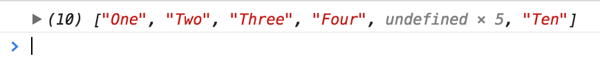

# Introduction to Arrays

Imagine you have a list of groceries to buy from the supermarket. How would you translate this list into JavaScript?

The answer is to use arrays, which is a special kind of object to store list-like information.

You'd be using a lot of arrays in JavaScript, so it makes sense to learn them well.

## Creating arrays

You create an array by writing square brackets:

```js
const emptyArray = []
```

If you wish to add items into the array while creating it, you can do so by separating each item with a comma.

```js
const groceriesToBuy = [
  'cabbage',
  'tomato sauce',
  'salmon'
]
```

## Array values

Arrays can contain any value that's valid in JavaScript. This means you can use arrays to store primitives (like Strings and Numbers) and Objects (like Objects, other arrays and even functions).

```js
const strings = ['One', 'Two', 'Three', 'Four']
const numbers = [1, 2, 3, 4]
const booleans = [true, true, false, true]

const objects = [{name: 'Zell'}, {name: 'Vincy'}]
const arrays = [[1, 2, 3], [1, 2, 3]]
```

Feel free to separate items in an array with new lines if it makes it easier for you to read:

```js
// Objects separated with new lines to make them easier to read
const objects = [{
  firstName: 'Zell',
  lastName: 'Liew'
}, {
  firstName: 'Vincy',
  lastName: 'Zhang'
}]

// Arrays separated with new lines to make them easier to read
const arrays = [
  [1, 2, 3],
  [1, 2, 3]
]
```

## Checking the number of items in an array

Arrays are Objects, so they have properties and methods as well. One useful property to check the number of items in an array is `array.length`.

```js
const numbers = [1, 2, 3, 4]
console.log(numbers.length) // 4
```

## Getting the value of an item

To get the value of an item in an array, you write the name of the array, followed by the number of the item in square brackets. This number is called the **index**.

```js
// Where n is the index
const item = array[n]
```

In JavaScript, the first item has an index of 0, the second item has an index of 1, and so on. Since the index starts at 0, this index is also called a **zero-based index**.

```js
const strings = ['One', 'Two', 'Three', 'Four']

const firstItem = strings[0] // One
const secondItem = strings[1] // Two
const thirdItem = strings[2] // Three
const fourthItem = strings[3] // Four
```

If you provide an index that exceeds the number of items in the array, you'll get `undefined`.

```js
const tenthItem = strings[9]
console.log(tenthItem) // undefined
```

## Getting items from the end

If you want to get the last item in the array, you can use `Array.length` to help you out:

```js
const strings = ['One', 'Two', 'Three', 'Four']
const lastItem = strings[strings.length - 1]

console.log(lastItem) // Four
```

In the example above, `strings.length` returns 4 since there are four items in the array. If you subtract 1 from `strings.length`, you'll get the last element of the array.

If you want the second last, third last and so on, feel free to use the same method.

```js
const strings = ['One', 'Two', 'Three', 'Four']

const lastItem = strings[strings.length - 1] // Four
const secondLastItem = strings[strings.length - 2] // Three
const thirdLastItem = strings[strings.length - 3] // Two
```

## Setting the value of an item

You can change the value of an item by assigning a value to it.

```js
const strings = ['One', 'Two', 'Three', 'Four']

// Assigning a new value to the first item
strings[0] = 1

console.log(strings) // [1, 'Two', 'Three', 'Four']
```

If you provide an index that exceeds the number of items in the array, JavaScript will help you create the intermediary items and fill them with `undefined`.

Say for example, if you added the String, `Ten` as the tenth item in an array that contains only four items:

```js
const strings = ['One', 'Two', 'Three', 'Four']
strings[9] = 'Ten'

console.log(strings);
```

<figure>
  
  <figcaption>JavaScript fills any intermediary items with undefined</figcaption>
</figure>

Here, JavaScript creates items 5, 6, 7, 8 and 9 and fills them with `undefined` before setting the tenth item as `Ten`.

So, whenever you set the value of a array item, make sure you provide the right index.

## Finding the position of an item in an array

To find the position of an item in an array, you can use the `indexOf` method. It looks like this:

```js
const index = array.indexOf(thingToFind)
```

This `thingToFind` is a primitive value you wish to locate in your array.

If the thing exists, `indexOf` returns the index you're looking for. If the thing doesn't exist, `indexOf` returns `-1`.

```js
const fruitsBasket = ['apple', 'banana', 'orange', 'pear']

const posOfBanana = fruitsBasket.indexOf('banana') // 1
const posOfKiwi = fruitsBasket.indexOf('kiwi') // -1 (not found)
```

Note: `indexOf` only works with primitive values. If you wish to find an object (array, object or function) in the array, you need to use another method like `findIndex`. You'll learn more about `findIndex` in a later chapter.

## Adding items to the end of array

You can add items to the end of an array with a method called `concat`. It looks like this:

```js
const newArray = array.concat(items)
```

`items` here can be a comma-separated list of items, arrays, or a combination of the two.

```js
const originalArray = [1, 2, 3]

const concatWithCommas = originalArray.concat(4, 5, 6)
console.log(concatWithCommas) // [1, 2, 3, 4, 5, 6]

const concatWithArray = originalArray.concat([4, 5, 6])
console.log(concatWithArray) // [1, 2, 3, 4, 5, 6]
```

## Adding items to the beginning of array

To add items to the beginning of an array, you need to do the following:

1. Convert items to add into an array (if they're not already one)
2. Combine the arrays together with `concat`

Let's go through this with an example. Say you want to add the number `1` to an array that contains the numbers `2` and `3`.

```js
const itemToAdd = 1
const existingArray = [2, 3]
```

To add `1` before `existingArray`, you need to convert `1` to an array by enclosing it with square brackets.

```js
const arrayToPrepend = [itemToAdd]
```

Then, you add the `existingArray` to the end of this newly-created array with `concat`.

```js
const combinedArray = arrayToPrepend.concat(existingArray)

console.log(combinedArray)
// [1, 2, 3]
```

## Removing items from the front

You can remove items from an array with a method called `slice`. With `slice`, you tell JavaScript which parts of the array you want to "copy" out as your new array.

It looks like this:

```js
const newArray = array.slice(startIndex, endIndex)
```

Both `startIndex` and `endIndex` are optional parameters. If you omitted them both, `slice` would make a copy of your entire array.

```js
const originalArray = [1, 2, 3, 4, 5]
const arrayCopy = originalArray.slice()

console.log(arrayCopy)
// [1, 2, 3, 4, 5]
```

The `startIndex` parameter indicates where you'd like `slice` to begin copying the array. This is the same index you use to get array items.

If you want to copy the second item onwards, you'll use an index value of 1.

```js
const fruitsBasket = ['apple', 'banana', 'orange', 'pear']
const newBasket = fruitsBasket.slice(1)

console.log(newBasket)
// ['banana', 'orange', 'pear']
```

The `endIndex` parameter indicates where you'd like `slice` to stop copying the array. This is the same index you use the get array items too.

When the `endIndex` is omitted, `slice` copies the array up to the last item (like in the above example).

If you provide an `endIndex` value, `slice` copies up to, *but not including*, the item you've indicated with the index.

```js
const fruitsBasket = ['apple', 'banana', 'orange', 'pear']
// Copies from 2nd item to 4th item (excluding the 4th)
const newBasket = fruitsBasket.slice(1, 3)

console.log(newBasket)
// [banana', 'orange']
```

## Removing items from the end

You can remove items from the end of an Array with `slice` if you pass in the correct `endIndex` value.

So, if you want to remove the last item, you can use `Array.length - 1` as your `endIndex` value.

```js
const fruitsBasket = ['apple', 'banana', 'orange', 'pear']

// Removes last fruit
const newBasket = fruitsBasket.slice(0, fruitsBasket.length - 1)

console.log(newBasket)
// ['apple', 'banana', 'orange']
```

To make things easier, you can use a negative value for `endIndex`. Here, `-1` means the last item, `
-2` means the second last, and so on.

```js
const fruitsBasket = ['apple', 'banana', 'orange', 'pear']

// Removes last fruit from basket with a negative index
const newBasket = fruitsBasket.slice(0, -1)

console.log(newBasket)
// ['apple', 'banana', 'orange']
```

(Note: Negative indexes can only be used in `slice`)

## Removing items from the middle

Removing items from the middle of an array is trickier compared to removing items from the ends.

The idea is to copy out the parts you want to retain with `slice`, then join the copied arrays together with `concat`.

Let's go through an example. Say you want to remove 3 and 4 from the following `numbers` array:

```js
const numbers = [1, 2, 3, 4, 5, 6, 7, 8]
```

To do so, you first grab 1 and 2 with `slice`:

```js
const firstPart = numbers.slice(0, 2) // [1, 2]
```

Then, you grab the remaining numbers (5 to 8) with another `slice`:

```js
const secondPart = numbers.slice(4) // [5, 6, 7, 8]
```

And you join these two copied arrays together with `concat`

```js
const combinedArray = firstPart.concat(secondPart)

console.log(combinedArray)
// [1, 2, 5, 6, 7, 8]
```

To make it easier, you might want to begin `concat` with an empty array:

```js
const combinedArray = [].concat(firstPart, secondPart)
```

Once you become savvy with `slice`, feel free to combine all the steps mentioned above into one:

```js
const combinedArray = [].concat(numbers.slice(0, 2), numbers.slice(4))

console.log(combinedArray)
// [1, 2, 5, 6, 7, 8]
```

## Adding items to the middle of an array

Adding items to the middle of an array is similar to removing items from the middle of an array.

The idea is to split your array into two parts with `slice`, then join three arrays together in this sequence: first part, items to add, second part.

Let's go through an example. Say you want to add the numbers 5 and 6 into the following `numbers` array.

```js
const numbers = [1, 2, 3, 4, 7, 8]
```

To do so, you grab the first four numbers (1 to 4) with `slice`

```js
const firstPart = numbers.slice(0, 4) // [1, 2, 3, 4]
```

Then, you grab the remaining numbers (7 and 8) with another `slice`:

```js
const secondPart = numbers.slice(4) // [7, 8]
```

Then, you create a array that stores the numbers you wish to add:

```js
const arrayToAdd = [5, 6]
```

Finally, you combine these arrays together with `concat`:

```js
const combinedArray = [].concat(firstPart, arrayToAdd, secondPart)

console.log(combinedArray)
// [1, 2, 3, 4, 5, 6, 7, 8]
```

Likewise, if you're savvier with `slice`, you can do everything here in one step:

```js
const combinedArray = [].concat(
  numbers.slice(0, 4),
  [5, 6],
  numbers.slice(4)
)
```

That's it :)

## What about push, pop, shift, unshift and splice?

If you googled around for methods to add and remove items from arrays, you'd most probably run into these five methods: `push`, `pop`, `shift`, `unshift` and `splice`.

They're not wrong. You can use them.

However, I highly recommend against using them because they mutate your arrays. (More information about mutation can be found later when you learn about Functional Programming).

## Exercise

Arrays are important in JavaScript. Practice them well. Here are some exercises and questions for you to try out.

1. Make an empty array that contains nothing.
2. Make an array that contains three items.

The following questions require you to make use of the `people` array provided below.

1. What is the index of Mahatma Gandhi in this list of people?
2. Get `Pablo Picasso` from the `people` array.
3. Set `Walt Disney` to `Disneyland`.
4. Add your best friend's name to the end of the list
5. Add another friend's name to the start of the list
6. Add your name after `Winston Churchill` in the list
7. Remove `Benjamin Franklin` from this list
8. Remove `Steve Jobs` from this list
9. Remove `Napolean Bonaparte` from this list

Here's the `people` array:

```js
const people = [
  'Benjamin Franklin',
  'Thomas Edison',
  'Franklin Roosevelt',
  'Napolean Bonaparte',
  'Abraham Lincoln',
  'Mother Theresa',
  'Mahatma Gandhi',
  'Winston Churchill',
  'Charles Darwin',
  'Albert Einstein',
  'Pablo Picasso',
  'Ludwig Beethoven',
  'Walt Disney',
  'Henry Ford',
  'Steve Jobs'
]
```
