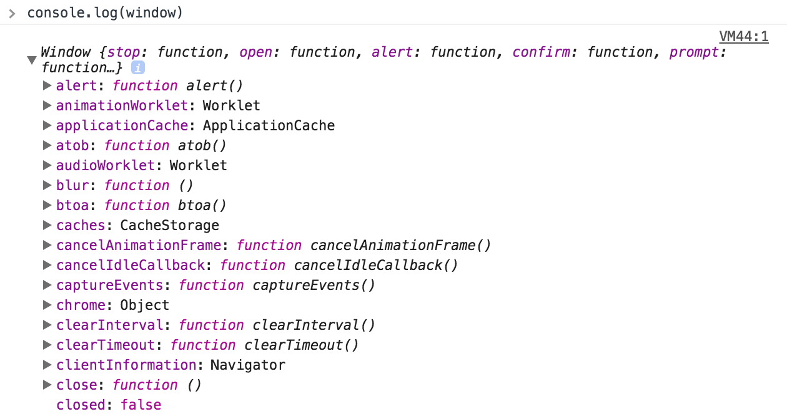
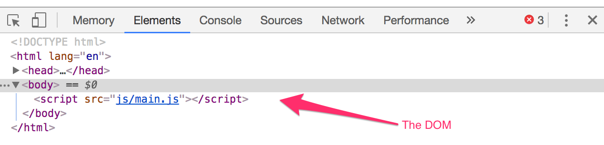
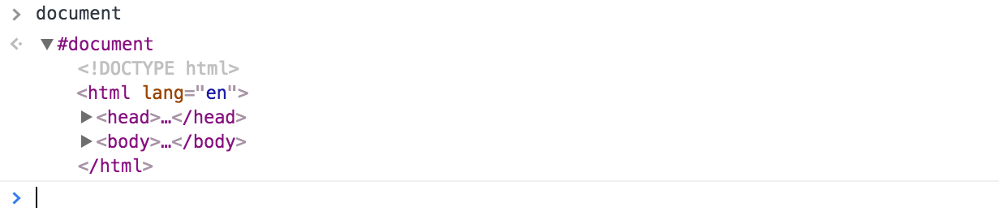

# The BOM and the DOM

BOM stands for Browser Object Model while DOM stands for Document Object Model.

## BOM

BOM refers to the set of JavaScript browsers provide you with. It gives you the `window` object in JavaScript. If you open up your inspector and write `console.log(window)`, you'll see the list of every JavaScript method you can use.

<figure>
  
  <figcaption>A list of methods exposed through the Window Object</figcaption>
</figure>

As you can see, there's a lot we can do with JavaScript. We'll cover the most important ones you need to know as you proceed through the course. For now, let's move on with this lesson.

You can use any property within the window object by typing `window.propertyName` or simply just `propertyName`. So, the following two are equivalent

```js
window.document
document
```

## DOM

DOM refers to your HTML in JavaScript. Open up your inspector, click on the "Elements" tab and you'll see the DOM.

<figure>
  
  <figcaption>The Elements tab contains the DOM</figcaption>
</figure>

You can access it with `document`.

<figure>
  
  <figcaption>The Document is an Element</figcaption>
</figure>

You'll use the DOM a lot in the next few lessons to come.

## Exercise

Try to get the DOM with `document`. Log it out with your `console`. Click on the arrows in the results of that log to explore your DOM.

---

- Previous Lesson : [Null and undefined](13.null-and-undefined.md)
- Next Lesson: [Selecting an Element](15.selecting-an-element.md)