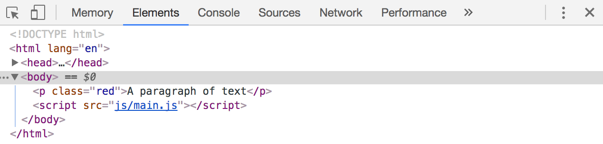

# Changing Classes

Yes, you can change CSS with JavaScript, but you don't want to do it often (more on how and why in a later lesson).

For now, you'll want to change CSS with classes because that's the best way to do it—let CSS handle CSS stuff.

## Adding a class:

To add a class, you use the `add` method. This method can be found within the `classList` property that exists for all elements.

```js
Element.classList.add('className')
```

Here's how you would add the `red` class to a paragraph of text:

```html
<p>This is a paragraph of text</p>
```

```js
const p = document.querySelector('p')
p.classList.add('red')
```

If you check your paragraph in the DOM, you should see the `red` class:

<figure>
  
  <figcaption>Adding a class</figcaption>
</figure>

### Adding multiple classes at once

You can add multiple classes to the same element if you pass in extra arguments, like this:

```js
Element.classList.add('firstClass', 'secondClass', 'thirdClass')
```

Note: there's no need to add multiple classes in practice. One class is good enough, provided you're smart with your classes (don't worry, you'll see why and how when we build components together).

## Removing a class

To remove a class, you use the `remove` method, which is present in `classList`.

```js
Element.classList.remove('className')
```

Here's how you would remove the `red` class from a paragraph of text:

```html
<p class="red">This is a paragraph</p>
```

```js
const p = document.querySelector('p')
p.classList.remove('red')
```

If you check the DOM, you should see a paragraph without the `red` class:

<figure>
  
  <figcaption>Removing a class</figcaption>
</figure>

Note: You don't need to add `.` before your classes when you us `Element.classList`. This is a common mistake if you mix up the syntax for `querySelector` and `Element.classList`.

### Removing multiple classes at once

You can remove multiple classes at one go by passing extra classes as arguments:

```js
Element.classList.remove('firstClass', 'secondClass', 'thirdClass')
```

As before, you won't have to remove multiple classes. A single class would do, provided you're smart with your classes.

## Checking if a class exists

If you want to check if a class exists, you can use the `contains` method:

```js
Element.classList.contains('className')
```

This method is often used together with the `if` statement to check whether the class exists:

```js
const div = document.querySelector('div')
if (div.classList.contains('superpower')) {
  // Do something if the div has the class '.superpower'
}
```

## Toggling a class

Toggling classes means this:

1. Remove `.red` if `.red` exists
2. Add `.red` on if `.red` does not exist

You can toggle a class manually with `if/else` statements:

```js
if (element.classList.contains('red')) {
  element.classList.remove('red')
} else {
  element.classList.add('red')
}
```

You'll toggle class on/off frequently when you build components—so much that JavaScript provides you with a `toggle` method that does exactly the same thing.

```js
element.classList.toggle('red')
```

## Exercise

Practice adding, removing, checking for classes and toggling classes with `Element.classList`. Work through the examples in this HTML:

```html
<div class="add">Add a "red" class to me!</div>

<div class="remove">Remove the class, "remove" from me!</div>

<div class="contains">
  <div>Do I have a "blue" class?</div>
  <div class="blue">Do I have a "blue" class?</div>
</div>

<div class="toggle">Do I have a "red" class? If yes, remove it. If no, add it.</div>
```

---

- Previous Lesson: [Selecting an element](15.selecting-an-element.md)
- Next Lesson: [Listening to events](17.listening-to-events.md)
