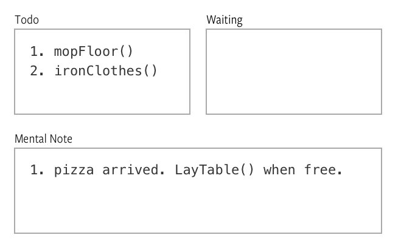

## Callbacks

A **callback** is a *function* that is *passed into another function* as an *argument* to be *executed later*.

One example of a function that accepts a callback is `setTimeout`.

## Example of a callback: setTimeout

`setTimeout` is a function that executes a function after a certain amount of time has elapsed. It takes in two variables, `callback` and `delay`:

```js
setTimeout (callback, delay)
```

`delay` is a number in milliseconds. It determines how long to wait for before executing the callback. If `delay` is omitted, a value of 0 will be used. When this happens, the callback would be executed as soon as possible.

`callback` is a function to execute when the delay is up.

Let's go through a quick example.

Say you have a function that logs `Hello world`. You want to execute this function after 1 second with `setTimeout`. Here's what you'll do:

```js
const sayHello = function () {
  console.log('Hello world!')
}

setTimeout(sayHello, 1000)
```

If you navigate to your console, you should see `Hello world!` after one second:

<figure>
  
  <figcaption>Hello world appears one second after refreshing the page</figcaption>
</figure>

You can also choose to declare `sayHello` as an anonymous function (function without a name) directly as an argument of `setTimeout`. This method is useful when you don't intend to use the callback anywhere else.

```js
setTimeout(function () {
  console.log('Hello world!')
}, 1000)
```

## Why use callbacks?

Callbacks are useful for two situations:

1. Allowing code to be easily swapped with something else
2. Preventing blocking operations in asynchronous code

## Allowing code to be swapped easily

Let's go look at the callback we've written for `setTimeout` in the above example. There, we wrote a function that logs `Hello world!` into the console as a callback.

```js
function sayHello () {
  console.log('Hello world!')
}

setTimeout(sayHello, 1000)
```

By accepting a callback, `setTimeout` allows you to change what happens when the delay is up. For instance, you can add another function that logs `1 + 1 = 2` into the console as well.

```js
function sayHello () {
  console.log('Hello world!')
}

function onePlusOne () {
  console.log('1 + 1 = 2')
}

setTimeout(sayHello, 1000)
setTimeout(onePlusOne, 2000)
```

<figure>
  
  <figcaption>Two different functions are executed after the timeout</figcaption>
</figure>

By accepting a callback, `setTimeout` becomes a versatile function that lets you change what needs to happen when the timer is up.

## Preventing blocking operations in asynchronous code

**Synchronous code** is code that executes in a *top to bottom*, *left to right* fashion, *sequentially*, *waiting* until one code has *finished* before the next line begins. So far, you've written synchronous code for every lesson prior to this one.

**Asynchronous code** is code that doesn't follow the top to bottom, left to right fashion. Here, when JavaScript sees a line of code that tells it to wait, it executes other code while waiting.

An example of an asynchronous function is `setTimeout`. Let's see how `setTimeout` works if you give JavaScript another task to complete:

```js
function fiveSecondsLater () {
  console.log('5 seconds passed!')
}

setTimeout(fiveSecondsLater, 5000)
console.log('Start!')
```

In the code above, JavaScript executes `setTimeout` first. While executing setTimeout, JavaScript knows it needs to wait for ten seconds before executing `fiveSecondsLater`.

While waiting, JavaScript executes other lines of code, like `console.log("Start!")`.

So, this is what you'll see if you check the above code with your console:

```js
// What happens:
// > Start! (almost immediately)
// > 5 seconds passed! (after five seconds)
```

<figure>
  
  <figcaption>JavaScript executes other code while waiting for setTimeout</figcaption>
</figure>

Asynchronous operations may sound complicated to you right now, but it's a concept you need to understand to become good at JavaScript. It's extremely important.

To see why asynchronous operations are important, imagine JavaScript as robot helper that's pretty dumb. It can only do one thing at a time.

Let's say you tell the robot to order some pizza for you. It obeys. It picks up the phone, dials the pizza hotline and orders pizza.

After ordering pizza, the robot sits at your front door and waits for the pizza to be delivered. No matter what you tell it to do in the meantime, it continues sitting at the main door, refusing to budge.

You can't get it to iron clothes, mop the floor or do anything while it's waiting. You need to wait 20 minutes till the pizza arrives before it's willing to do anything else...

JavaScript is like this robot helper. It can only do one thing at a time. (This behavior is called *single-threaded*). While doing that one thing, it can't do anything else, even if that one thing means waiting. (This behavior is called *blocking*. Other operations are blocked when you wait for something to complete).

The dumb robot helper executes functions similar to the following code:

```js
function orderPizza (flavour) {
  callPizzaShop(`I want a ${flavour} pizza`)
  waits20minsForPizzaToCome() // Nothing else can happen here
  bringPizzaToYou()
}

orderPizza('Hawaiian')

// These two only starts after orderPizza is completed
mopFloor()
ironClothes()
```

Blocking operations are a bummer. Let's put the dumb robot helper into the context of a browser and you'll see why.

Imagine you tell the robot to change the color of a button when the button is clicked. What would this dumb robot do?

It stares intently at the button, ignoring everything command that comes, until the button gets clicked. Meanwhile, the user can't select anything else.

See where it goes now? That's why asynchronous programming is such a big thing in JavaScript. That's why we use callbacks.

Asynchronous operations is a really important concept to understand in JavaScript. To make it clearer, let's take some time to dig deeper into the underlying mechanics – the event loop.

## The event loop

To envision the event loop, imagine JavaScript is a butler that carries around a **todo-list**. This list contains everything you tell JavaScript to do.

Upon receiving this todo-list, JavaScript executes the tasks one by one, in the order you've listed.

Let's say you give JavaScript five commands as follows:

```js
function addOne (n) {
  return n + 1
}

addOne(1) // 2
addOne(2) // 3
addOne(3) // 4
addOne(4) // 5
addOne(5) // 6
```

This is what appears on JavaScript's todo-list.

<figure>
  
  <figcaption>Commands appear synchronously on JavaScript's todo list</figcaption>
</figure>

In addition to a todo-list, JavaScript also keeps a **waiting-list** where it tracks things it needs to wait for. If you tell JavaScript to order a pizza, it will call the pizza shop, then add "wait for pizza to arrive" in the waiting list. Meanwhile, it does other things that are already on the todo-list.

So, imagine you have this code:

```js
function orderPizza (flavor, callback) {
  callPizzaShop(`I want a ${flavor} pizza`)

  // Note: these three lines is pseudo code, not actual JavaScript
  whenPizzaComesBack {
    callback()
  }
}

function layTheTable () {
  console.log('The pizza is set for your consumption, master. Please stop playing and start eating.')
}

orderPizza('Hawaiian', layTheTable)
mopFloor()
ironClothes()
```

JavaScript's initial todo-list would be:

<figure>
  
  <figcaption>Order pizza, mop floor and iron clothes! 😄</figcaption>
</figure>

While executing `orderPizza`, JavaScript knows it needs to wait for the pizza to arrive. So, it adds "waiting for pizza to arrive" to its waiting list while it tackles the rest of its jobs.

<figure>
  
  <figcaption>JavaScript waits for pizza to arrive</figcaption>
</figure>

When the pizza arrives, JavaScript gets notified by the doorbell and it makes a **mental note** to execute `layTheTable` when it's done with the other chores

<figure>
  
  <figcaption>JavaScript knows it needs to execute layTheTable by adding the command to its mental note</figcaption>
</figure>

Then, once it's done with the other chores, JavaScript executes the callback function, `layTheTable`.

<figure>
  
  <figcaption>JavaScript lays the table when everything else is completed</figcaption>
</figure>

This, my friend, is called the Event Loop. You can substitute our butler analogy with actual keywords in the Event loop to understand everything:

- **Todo-list** -> Call stack
- **Waiting-list** -> Web apis
- **Mental note** -> Event queue

<figure>
  
  <figcaption>JavaScript's event loop</figcaption>
</figure>

I highly recommend you watch [Philip Roberts](https://twitter.com/philip_roberts) JSConf talk about event loops if you got 20 mins to spare. It'll help you understand the nitty gritty of event loops.

[](https://www.youtube.com/watch?v=8aGhZQkoFbQ)

## Let's get back to callbacks and asynchronous code

With callbacks, we can **give JavaScript instructions in advance without stopping the entire operation**.

When you ask JavaScript to watch a button for a click, it puts the "watch button" into the waiting-list and goes on its other chores. When the button finally gets a click, JavaScript activates the callback, then goes on with life.

That's all you need to know about using callbacks. Now, let's talk a little about creating your own callbacks.

## Creating your own callbacks

To create your callback, you need two things: a *callback-accepting function* and a *callback*.

```js
function callbackAcceptingFunction (callback) {
  // Execute callback here
}

function callback () {
  // Do something here
}
```

The `callbackAcceptingFunction` needs to activate the callback, like this:

```js
function callbackAcceptingFunction (callback) {
  callback()
}

function callback () {
  console.log('callback activated!')
}

callbackAcceptingFunction(callback) // callback activated
```

The `callback` can accept any number of arguments. The number, type and value of the arguments passed into `callback` is determined by the `callbackAcceptingFunction`:

```js
function callbackAcceptingFunction (callback) {
  callback('Hello', 'baby brother')
}

function callback (arg1, arg2) {
  console.log(arg1) // Hello
  console.log(arg2) // baby brother
}

callbackAcceptingFunction(callback)
```

One thing to note here is when you pass a `callback` as a parameter into a `callbackAcceptingFunction`, you pass only the reference to the `callback`. You don't execute it. The `callbackAcceptingFunction` will help you execute the callback.

```js
// Notice you don't execute the callback with `callback()`
callbackAcceptingFunction(callback)
```

That's how you write a callback-accepting function in a nutshell.

(You won't write callback-accepting functions right now since you're starting out. Focus on learning to write callbacks for now).

## Exercise

No exercise required for this lesson. There's only one thing to know: **a callback is a function that is passed into another function as an argument to be executed later**.

---

- Previous Lesson: [Debugging Errors](16.debugging-errors.md)
- Next Module: [DOM Basics, Lesson 1 — DOM & BOM](../03.dom-basics/01.dom-and-bom.md)
