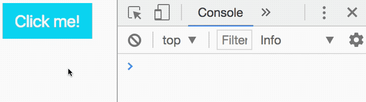
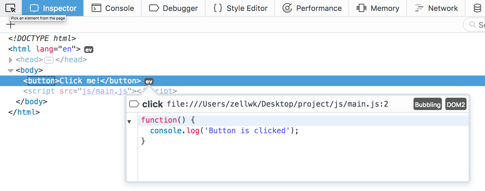
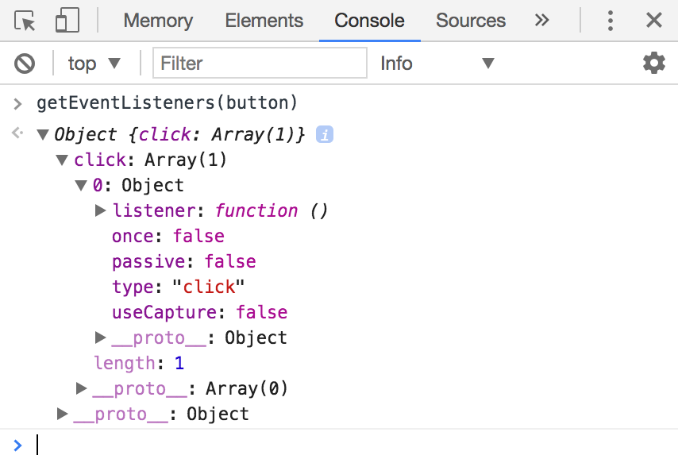
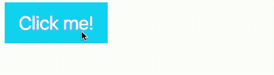

# Listening to events

Events tell you that something has happened in JavaScript. For example, if a user clicks on something, a `click` event fires. If the user hits a key on their keyboard, the `keydown` and `keyup` events are fired.

You can get a list of all available events at Mozilla Developer Network's (MDN) [Event Reference](https://developer.mozilla.org/en-US/docs/Web/Events) . Don't worry about knowing everything on the list now; you'll learn them as you go through the course.

## Listening for events

If a tree falls in the forest and nobody hears it, did the tree fall? The same question can be applied to events—if an event fired and nobody hears it, did the event fire at all?

You need **event listeners** to listen to events. You can add event listeners to any element in the DOM like this:

```js
Element.addEventListener('event-name', function () {

})
```

`event-name` is the name of the event you want to listen to. You can see a complete list in MDN's [Event Reference](https://developer.mozilla.org/en-US/docs/Web/Events).

The function is code you want to execute when the event fires.

Let's go through an example.

## Listening for a click

Let's say you want to listen for a `click` event on a `<button>` element. To do so, you add the `click` event listener to the button.

```js
const button = document.querySelector('button')

button.addEventListener('click', function () {
  // Do something here
})
```

Next, you want to make sure your event listener works. To do so, you can do a `console.log` statement.

```js
const button = document.querySelector('button')

button.addEventListener('click', function () {
  console.log('Button is clicked')
})
```

With this code, JavaScript logs `Button is clicked` into the console whenever you click the button. We know the event listener works.

<figure>
  
  <figcaption>Logging a click</figcaption>
</figure>

## Does the listener exist?

You can verify the existence of event listeners with Chrome's or Firefox's devtools.

**For Firefox devtools**, open up the Inspector tab. If an event is present on the Element, you'll see a tiny `ev` icon on the same line as the opening tag of the Element.

<figure>
  
  <figcaption>Firefox shows you an ev icon for any element that has event listeners attached to it</figcaption>
</figure>

Firefox will tell you more details about the event listeners attached to the element if you click on the `ev` icon.

<figure>
  
  <figcaption>Clicking on the ev shows you details about events attached to the Element</figcaption>
</figure>

You can also click on the event listener if you want to see the code used.

<figure>
  
  <figcaption>Clicking on event listener details shows you the code used</figcaption>
</figure>

The process to check for event listeners in Chrome's devtools isn't as straightforward as the process you see above in Firefox's devtools.

**For Chrome Devtools**, you need to open up the console, and type `getEventListeners(element)`, where `element` is the element you want to check for.

<figure>
  
  <figcaption>getEventListeners tells you the number of listeners attached to an Element.</figcaption>
</figure>

To make the process easier, you can click on the Element you wish to inspect (the button in this case) in the Elements tab.

<figure>
  
  <figcaption>Click on the Element to make the inspection process easier</figcaption>
</figure>

Once you click on an Element, Chrome allows you to access that element with `$0` in the console:

<figure>
  
  <figcaption>You can access the selected Element with $0</figcaption>
</figure>

You can then use `$0` to check the existence of event listeners:

<figure>
  
  <figcaption>Checking the existing of event listeners with $0</figcaption>
</figure>

## Changing the DOM through events

Let's say you have a button in your HTML. You want to change the button's background color to `#bada55`. At the same time, you also want to change the body background color to `#99aefa`.

What's the best way to do this?

Classes.

First, you create classes to contain the required CSS.

```css
body.button-is-clicked {
  background-color: #99aefa;
}

button {
  background-color: #1ce;
}

button.is-clicked {
  background-color: #bada55;
}
```

Second, you create an event listener. In this event listener, you add `.button-is-clicked` to the body and `.is-clicked` to the button.

```js
const button = document.querySelector('button')
button.addEventListener('click', function () {
  // Note: document.body does the same as document.querySelector('body').
  const body = document.body

  body.classList.add('button-is-clicked')
  button.classList.add('is-clicked')
})
```

<figure>
  
  <figcaption aria-hidden>You can change the DOM through event listeners and classes</figcaption>
</figure>

## Click to change, click again to revert

Let's say you want to revert the body background-color to `transparent` and button background-color to `#1ce` when you click on the button a second time.

You can do so by checking for the presence of the `is-clicked` class. If `button` already contains the `is-clicked` class, remove it; if `button` does not contain the `is-clicked` class, add it.

```js
button.addEventListener('click', function () {
  const body = document.body

  if (button.classList.contains('is-clicked')) {
    body.classList.remove('button-is-clicked')
    button.classList.remove('is-clicked')
  } else {
    body.classList.add('button-is-clicked')
    button.classList.add('is-clicked')
  }
})
```

<figure>
  
  <figcaption>Reverting styles with classes</figcaption>
</figure>

Want a shortcut? See if you can understand why the following works :)

```js
button.addEventListener('click', function () {
  const body = document.body
  body.classList.toggle('button-is-clicked')
  button.classList.toggle('is-clicked')
})
```

## Exercise

Practice adding event listeners and getting them to do things. You'll use them a lot when you write components. Do the following:

1. Write an `click` event listener. Log something into the console so you know the listener works.
2. Check the existence of the listener with Firefox's devtools.
3. Check the existence of the listener with Chrome Devtools.
4. Add a class to the component when it is clicked. Remove a class from the component when it is clicked again.

---

- Previous lesson: [Changing classes](16.changing-classes.md)
- Next lesson: [Callbacks](18.callbacks.md)
