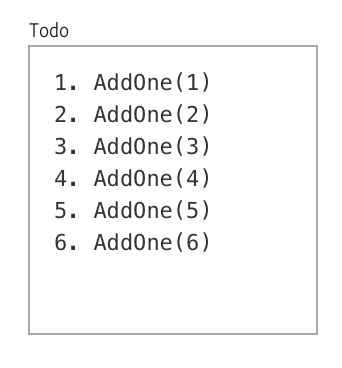
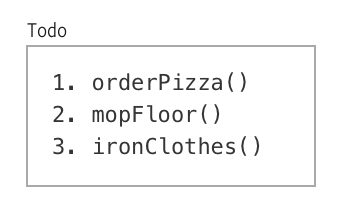
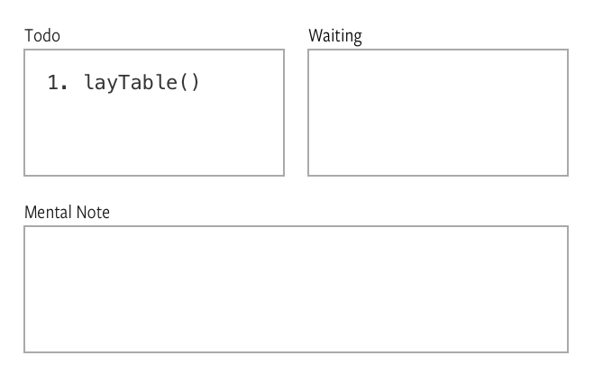
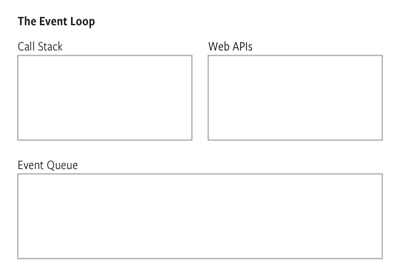

## Callbacks

A callback is a function that is passed into another function as an argument to be executed later.

That sounds complex, but it's really simple. You've already seen callbacks before.

## Example of a callback

An example of a callback in use is the event listener.

```js
button.addEventListener('click', function () {
  // do something
})
```

The event listener can be re-written as follows.

```js
function callback () {
  // do something
}

button.addEventListener('click', callback)
```

See what a callback is now? **It's just a function that is used as an argument** in another function call.

## Why use callbacks?

Callbacks are useful for two situations:

1. They allow code to be swapped easily
2. They prevent blocking operations in asynchronous code

## Allowing code to be swapped easily

Let's say you have written an event listener for a button. This event listener accepts a callback, as you know by now. In the callback, you wrote code to add a `red` class to the button.

```js
button.addEventListener('click', function () {
  button.classList.add('red')
})
```

What if you wanted to create another event listener on the same button element, but this time, logs `hello world` into the console?

Well, you can do it easily by writing another event listener.

```js
button.addEventListener('click', function () {
  console.log('Hello world! *shouts at the top of my lungs*')
})
```

See how callback functions let you swap code easily? Same element, same function (okay, method), but you can execute any code you want.

## Preventing blocking operations in asynchronous code

**Synchronous code is code that executes in a top to bottom, left to right manner**, sequentially, waiting until one code has finished before the next line begins. So far, you've written synchronous code for every lesson prior to this one.

**Asynchronous code is code that doesn't follow the top to bottom, left to right manner.** An example of asynchronous code is an event listener.

```js
button.addEventListener('click', function () {
  // do something
})
```

Consider this click event. Why is it asynchronous? Because the callback doesn't get executed until a user clicks on a button!

### Asynchronous code is critical in JavaScript

Imagine you have a robot helper, Mr. Robot, that can only do one thing at a time. If you tell Mr. Robot to order pizza, it picks up, dials the pizza hotline, orders pizza, and waits at the front door until the pizza arrives.

"Sweep the floor! Clean up the dishes in the kitchen sink! Wash the toilet!", you shout at Mr. Robot. But Mr. Robot doesn't respond. It continues to sit quietly at the front door.

When the pizza arrives, Mr. Robot passes you the pizza and continue with the rest of the chores—sweep floor, clean dishes and wash toilet, in the order you mentioned.

JavaScript is like Mr. Robot. It can only do one thing at a time. It cannot do anything else in the meantime, until the one thing gets completed. This behavior is called **single threading**.

If you ask JavaScript to do something else in the meantime, it doesn't respond. This behavior is called **blocking**. To see blocking operations in action, run the following JavaScript:

```js
while (true) {
  console.log('stuck')
}

console.log('This log never happens')
```

If you try this, your browser will hang. You'll have to delete the code and restart the browser to fix it.

<figure>
  
  <figcaption aria-hidden>The browser hangs and console.log('stuck') executed 24,000 times</figcaption>
</figure>

Let me explain what happened.

The code above uses a `while` block (you'll rarely use a `while` block when you code for real, so don't bother about remembering it. I use it here because it's perfect for explaining a blocking operation).

A `while` block executes code in curly braces if a condition remains true (kind of like an `if/else` statement). In this example, the condition always remains `true`, so the `while` block keeps logging `stuck` in the console.

In this case, JavaScript is like Mr. Robot. It hasn't finished waiting for the pizza to arrive. The unfortunate thing is, the pizza will never arrive...

Imagine this.

Let's say you have a event listener that blocks operations, and you used this listener to listen for click on the button. If you do this, JavaScript stares and waits till a user clicks on the button—that may never happen—before doing anything else... You can imagine the horror, so I'd leave you with the details.

See where it goes? That's why asynchronous programming is such a big thing in JavaScript. That's why we use callbacks.

Asynchronous operations is a really important concept to understand in JavaScript. To make it clearer, let's take some time to dig deeper into the underlying mechanics—the event loop.

## The event loop

To envision the event loop, imagine JavaScript is a butler that carries around a **todo-list**. This list contains everything you tell JavaScript to do.

Upon receiving this todo-list, JavaScript executes the tasks one by one, in the order you've listed.

Let's say you give JavaScript five commands as follows:

```js
function addOne (n) {
  return n + 1
}

addOne(1) // 2
addOne(2) // 3
addOne(3) // 4
addOne(4) // 5
addOne(5) // 6
```

This is what appears on JavaScript's todo-list.

<figure>
  
  <figcaption>Commands appear synchronously on JavaScript's todo list</figcaption>
</figure>

In addition to a todo-list, JavaScript also keeps a **waiting-list** where it tracks things it needs to wait for. If you tell JavaScript to order a pizza, it will call the pizza shop and adds "wait for pizza to arrive" in the waiting list. Meanwhile, it does other things that are already on the todo-list.

So, imagine you have this code:

```js
function orderPizza (flavor, callback) {
  callPizzaShop(`I want a ${flavor} pizza`)

  // Note: these three lines is pseudo code, not actual JavaScript
  whenPizzaComesBack {
    callback()
  }
}

function layTheTable () {
  console.log('The pizza is set for your consumption, master. Please stop playing and start eating.')
}

orderPizza('Hawaiian', layTheTable)
mopFloor()
ironClothes()
```

JavaScript's initial todo-list would be:

<figure>
  
  <figcaption>Order pizza, mop floor and iron clothes! 😄</figcaption>
</figure>

While executing `orderPizza`, JavaScript knows it needs to wait for the pizza to arrive. So, it adds "waiting for pizza to arrive" to its waiting list while it tackles the rest of its jobs.

<figure>
  
  <figcaption>JavaScript waits for pizza to arrive</figcaption>
</figure>

When the pizza arrives, JavaScript gets notified by the doorbell and it makes a **mental note** to execute `layTheTable` when it's done with the other chores

<figure>
  
  <figcaption>JavaScript knows it needs to execute layTheTable by adding the command to its mental note</figcaption>
</figure>

Then, once it's done with the other chores, JavaScript executes the callback function, `layTheTable`.

<figure>
  
  <figcaption>JavaScript lays the table when everything else is completed</figcaption>
</figure>

This system is called the Event Loop. You can substitute our butler analogy with actual keywords in the Event loop to understand everything:

- **Todo-list** -> Call stack
- **Waiting-list** -> Web apis
- **Mental note** -> Event queue

<figure>
  
  <figcaption>JavaScript's event loop</figcaption>
</figure>

I highly recommend you watch [Philip Roberts](https://twitter.com/philip_roberts) JSConf talk about event loops if you got 20 mins to spare. It'll help you understand the nitty gritty of event loops.

[](https://www.youtube.com/watch?v=8aGhZQkoFbQ)

## Let's get back to callbacks and asynchronous code

With callbacks, we can **give JavaScript instructions in advance without stopping the entire operation**.

When you ask JavaScript to watch a button for a click, it puts the "watch button" into the waiting-list and goes on its other chores. When the button finally gets a click, JavaScript activates the callback, then goes on with life.

That's all you need to know about using callbacks. Now, let's talk a little about creating your own callbacks.

## Creating your own callbacks

To create your callback, you need two things: a *callback-accepting function* and a *callback*.

```js
function callbackAcceptingFunction (callback) {
  // Execute callback here
}

function callback () {
  // Do something here
}
```

The `callbackAcceptingFunction` needs to activate the callback, like this:

```js
function callbackAcceptingFunction (callback) {
  callback()
}

function callback () {
  console.log('callback activated!')
}

callbackAcceptingFunction(callback) // callback activated
```

The `callback` can accept any number of arguments. The number, type and value of the arguments passed into `callback` is determined by the `callbackAcceptingFunction`:

```js
function callbackAcceptingFunction (callback) {
  callback('Hello', 'baby brother')
}

function callback (arg1, arg2) {
  console.log(arg1) // Hello
  console.log(arg2) // baby brother
}

callbackAcceptingFunction(callback)
```

When you pass a `callback` as a parameter into a `callbackAcceptingFunction`, you pass only the reference to the `callback`. You don't execute it. The `callbackAcceptingFunction` will help you execute the callback.

```js
// Notice you don't execute the callback with `callback()`
callbackAcceptingFunction(callback)
```

That's how you write a callback-accepting function in a nutshell.

(Note: you won't write callback-accepting functions right now since you're starting out. Focus on learning to use callbacks for now).

## Exercise

No exercise required for this lesson. There's only one thing to know: **a callback is a function that is passed into another function as an argument to be executed later**.

---

- Previous Lesson: [Listening to events](17.listening-to-events.md)
- Next Lesson: [Module 3 (building simple components), lesson 1—How to think like a developer](../03.building-simple-components/01.think-like-dev.md)
