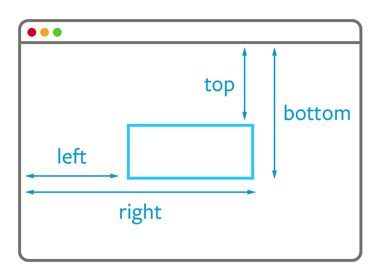

# Getting an Element's position on screen

Sometimes you need to know where your element is located in the viewport. You may also need to know its width and height.

Getting the information is easy with `getBoundingClientRect`.

```js
const domRect = element.getBoundingClientRect();
```

`domRect` is an object that contains 6 values:

1. `top` – the distance from the top of your viewport to the top of the element
2. `bottom` – the distance from the top of your viewport to the bottom of the element
3. `left` – the distance from the left of your viewport to the left of the element
4. `right` – the distance from the left of your viewport to the right of the element
5. `width` – the width of the element
6. `height` – the height of the element

<figure>
  
  <figcaption>getBoundingClientRect returns the distances from the viewport to the element in pixels</figcaption>
</figure>

There are two more values, `x` and `y`, but they mean the same thing as `left` and `top`.

## Exercise

Go to any web page, open up your console and get use `getBoundingClientRect` to get at the DomRect of at least one element.

You should see eight values. Get to know `getBoundingClientRect`; you'll use it soon enough.

---

- Previous Lesson: [How to think like a developer](01.think-like-dev.md)
- Next Lesson: [A starter template](03.starter-template.md)