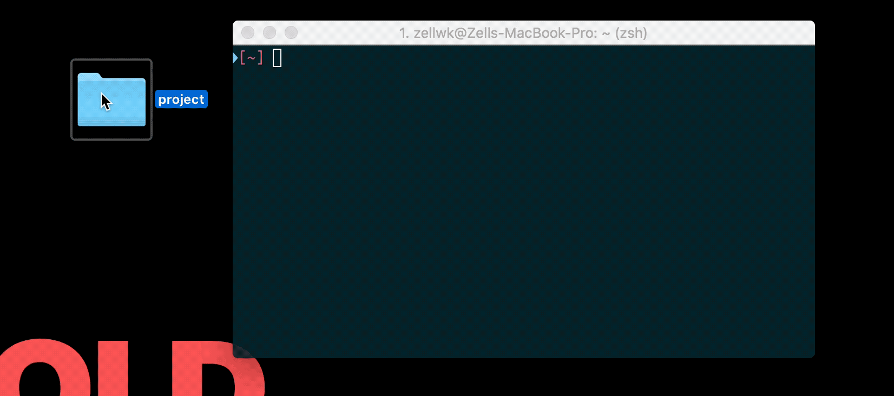
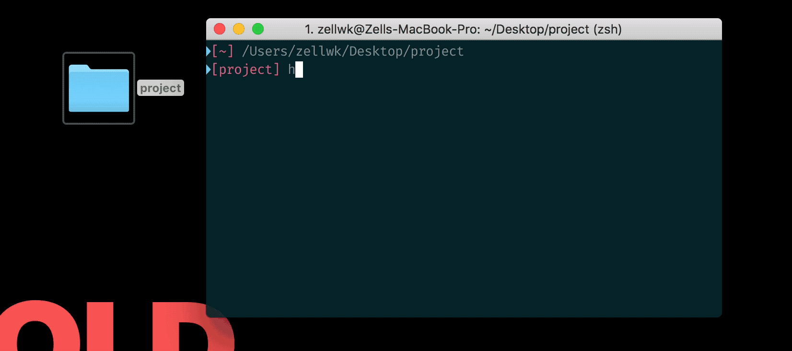

# How to use the starter template

Every component in this course begins with a starter template. You can find the starter template in `components/_starter-template-basic/`

The starter template contains the necessary meta tags, CSS files and JavaScript files you need to begin every project in this course.

It links to three CSS files:

1. `normalize.css`—which irons out CSS differences between browsers
2. `reset.css`—a CSS reset I use as the starting point for all my projects
3. `styles.css`—the CSS file you need to edit your project with.

The startet template also links to two JavaScript files:

1. `prefixfree.js`—which lets us write CSS without worrying about vendor prefixes and workflows
2. `main.js`—the file you use for your JavaScript code

## Don't use the starter template for production

The starter template is built for you to help learn JavaScript without worrying about things like CSS vendor prefixes. It is not production-ready. Please don't use it for your actual website.

If you want to learn how to make a production-ready starter template, read [Automate Your Workflow][1].

## Using the starter template

First, install Node from [Node's website][2]. Get the latest version even if you have Node installed already; it'll prevent most Node-based errors from happening.

Second, run the following command to install `http-server`. (You see why you need http-server in the next section).

```bash
npm -g install http-server
```

For Mac users, you'll need to include a `sudo` keyword before the command:

```bash
sudo npm -g install http-server
```

Third, download the starter template onto your computer, navigate into it in your terminal. If you're on a Mac, you can do this by dragging the folder into your Terminal:

<figure>
  
  <figcaption>To navigate to a folder, you can drag it into the terminal, then hit the enter key. </figcaption>
</figure>

Note: You might have to type `cd` into your terminal first. The end result should be something along the lines of `cd /Users/zellwk/Desktop/project`. 

If you use Visual Studio Code, you can bring up the correct folder in Visual Studio Code's built-in terminal by hitting <code>ctrl + \`</code>. Watch 20 seconds of [this video][3] to see it in action.

You can also do this through the Terminal yourself. [Here are some instructions][4].

When you're in the folder, run `http-server`. Once you do this, you will be able to navigate to `127.0.0.1:8080` to view the project. You can also navigate to the second link (`10.0.1.5:8080` in my case) if you want to view the project through another device, like a phone or tablet.

<figure>
  
  <figcaption>Once you run http-server, you can copy-paste the addresses that appear to see your project.</figcaption>
</figure>

Note: if you run into an error while trying to run `http-server`, it may mean you need to update Node.

## Why use http-server?

There are two reasons.

First, `http-server` lets you see your project through a `http://` address (compared to a `file://` address, which happens if you view the `index.html` directly).

When you view your project through a `http://` address, browsers would treat your project as if it's hosted on a real server somewhere on the internet. That means the inconsistencies between `file://` and `http://` won't affect you.

Second, [prefix-free][5]—JavaScript that lets you write CSS without vendor prefixes—require your website to be served through `http://` address.

We use prefix-free because we want to focus on HTML, CSS and JavaScript without the use of any development tools.

For real projects, you might want to swap out prefix-free for autoprefixer (which adds vendor prefixes directly into your CSS file, without the use of JavaScript on the browser). To do so, you can read [Automate Your Workflow][6].

Note: don't worry about "vendor prefixes" if it confuses you right now; they'll be explained later. Follow along with the instructions to use the starter template. Move on once you get it to work.

---

- Previous Lesson: [How to think like a developer][7]
- Next Lesson: [Do this for every component][8]

[1]:	https://automateyourworkflow.com
[2]:	https://nodejs.org/en/
[3]:	https://youtu.be/Ng5EtzuD0AE?t=1m45s
[4]:	https://zellwk.com/blog/fear-of-command-line/
[5]:	https://leaverou.github.io/prefixfree/
[6]:	https://automateyourworkflow.com
[7]:	01.think-like-dev.md
[8]:	03.do-this.md