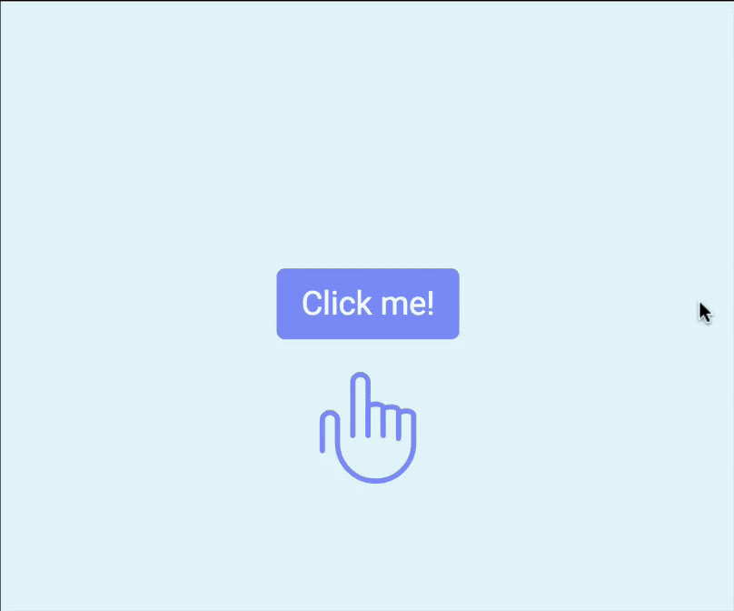
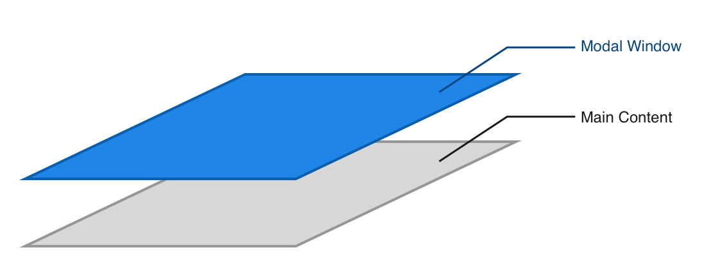
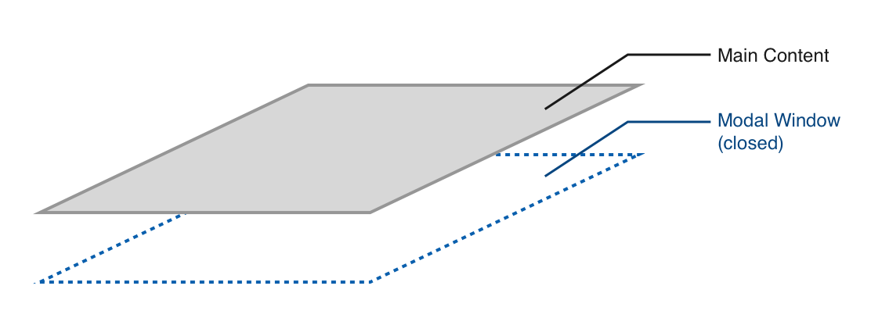
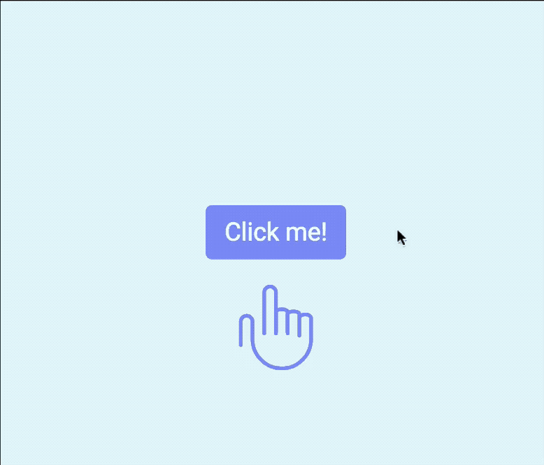
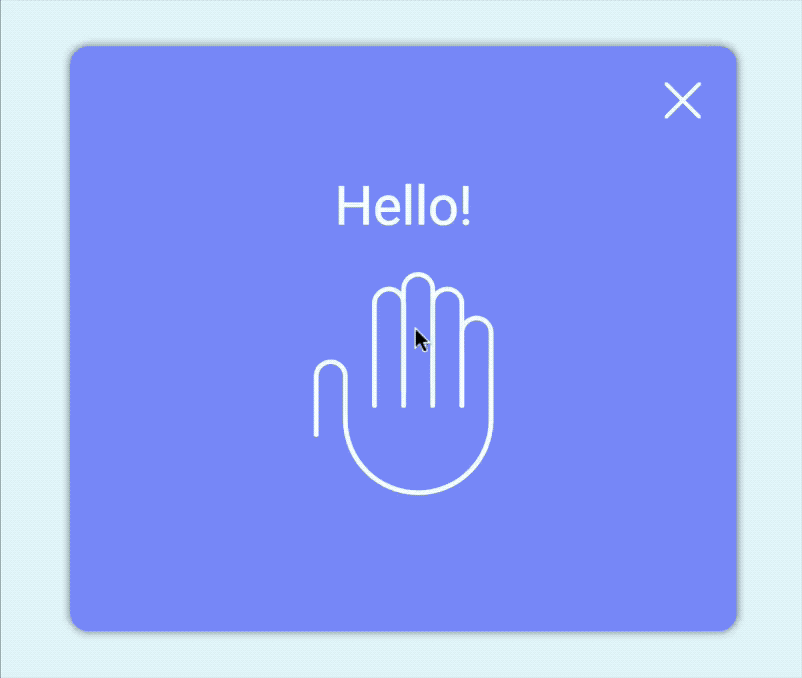

# 🛠 Building a modal window

You're going to build a modal window it this lesson. It looks like this:

<figure>
  
  <figcaption>Completed modal interaction</figcaption>
</figure>

Before continuing, make sure you grab the starter files from the Github repo, in `components/02.modal/01.starter`.

## How to build the modal window—the general idea

A modal window (sometimes also called a dialog) is a component that's invisible to the eyes. It opens up when you click on a button. When the modal opens, it visible and lies at the top of your screen.

<figure>
  
  <figcaption>Modal window appears over main content when it is visible</figcaption>
</figure>

When the modal window is closed, it becomes invisible. At this point, it cannot remain at the top layer, or users won't be able to interact with your actual content. So, the modal window needs to return to a layer beneath the normal content.

<figure>
  
  <figcaption>Modal window appears below main content when it's invisible</figcaption>
</figure>

That means you need to:

1. Add event listeners to open or close the modal
2. When the modal is opened, you need to push the modal to a higher layer and make it visible.
3. When the modal is closed, you need to make the modal invisible and return it to a lower layer.

## Building the modal

The modal needs to appear above the normal content when it is opened. This means the modal must be a separate layer by itself. Your HTML should look like this:

```html
<div class="container"><!-- Normal content --></div>
<div class="modal-container"><!-- Modal content --></div>
```

This structure has already been created for you in the starter folder.

You want to decide how you open the model next.

## Opening and closing the modal manually

**When you change classes in JavaScript, try your best to change one class.** Let that class inform everything else.

In this case, the perfect location for the class is the `<body>` element since it's the parent element for both `.container` and `.modal-container`. Let's call this class `.modal-is-open`.

To simulate a modal that's already opened, you can add the class `modal-is-open` into the `<body>` element. To simulate a modal that's closed, you remove the class `modal-is-open` from the `<body>` element.

```html
<!-- Opening the modal should be as simple as adding a class -->
<body class="modal-is-open"> ... </body>
```

Since the modal needs to be one layer above or below the main content (depending on whether the modal is open or closed), you need to tweak the `z-index` property. For that to happen, you need to add a `position` property to your modal.

```scss
.modal-container {
  position: fixed;
  top: 0;
  bottom: 0;
  left: 0;
  right: 0;
  z-index: -1;
}

.modal-is-open .modal-container {
  z-index: 1;
}
```

You'll also want to hide the modal when it is closed so you can't see anything the modal holds. To do so, you can use the opacity property.

```css
.modal-container {
  opacity: 0;
  /* other properties */
}

.modal-is-open .modal-container {
  opacity: 1;
  /* other properties */
}
```

Optionally, if you may add a subtle change in background color with the `background-color` property too.

```css
.modal-container {
  background-color: rgba(0, 0, 0, 0.25);
  /* other properties */
}
```

Now, if you add the `modal-is-open` class to the `<body>`, you should see opened modal. When you remove the `modal-is-open` class from the `<body>`, you should not see the modal at all.

(Note: For this modal, I did not add a background color since the design didn't call for it).

<figure>
  
  <figcaption>Modal opens when you add a the modal-is-open class to the body element</figcaption>
</figure>

That's how you build a modal window. Next up, let's add event listeners to activate the modal.

## Activating the modal with JavaScript

The modal needs to be activated by the button you see on the screen. Let's give the button a `jsModalToggle` class.

```html
<button class="button jsModalToggle">Click me!</button>
```

```js
const toggleButton = document.querySelector('.jsModalToggle')
```

When you click on the button, you want JavaScript to add the `modal-is-open` class to the `<body>` tag. Here's how the code looks:

```js
toggleButton.addEventListener('click', _ => {
  document.body.classList.add('modal-is-open')
})
```

<figure>
  
  <figcaption>Clicking on the button opens the modal window now</figcaption>
</figure>

Sweet. You've activated the modal window, but how do you close it?

## Closing the modal with JavaScript

One way to close the modal is to wait for a user to click on the X located at the top right of the modal. Let's give the X a `jsModalClose` class.

```html
<div class="modal__close jsModalClose"> ... </div>
```

When the X is clicked, you want to remove the `modal-is-open` class, which closes the modal window.

```js
const closeButton = document.querySelector('.jsModalClose')

closeButton.addEventListener('click', _ => {
  document.body.classList.remove('modal-is-open')
})
```

<figure>
  
  <figcaption>Modal window closes when the close button is clicked</figcaption>
</figure>

## Another way to close the modal

You also want to close the modal when the user clicks outside of the modal content, like this:

<figure>
  
  <figcaption>Modal window closes when the a user clicks outside the modal</figcaption>
</figure>

You can't build this right now, not with the JavaScript you've learned so far. We'll come back in the events module to build this functionality.

## Wrapping up

In this lesson, you learned how a modal window works and how to build one up with vanilla CSS and JavaScript. While building the model, you also ran into a problem—there's a feature you can't build with your current JavaScript knowledge.

## Exercise

Build the model without referring to this lesson.

---

- Previous Lesson: [🛠 Building an off-canvas menu](04.building-off-canvas.md)
- Next Lesson: [Lessons from the building process](06.lessons-from-the-building-process.md)
