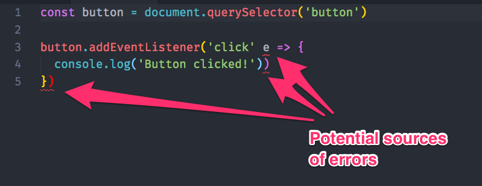

# How to use a linter

You may notice red squiggly lines all around your code when you use a linter. These red squiggly lines point to potential errors that you should take note of.

## Linters show potential errors

If you copy/pasted the exercise in the previous lesson into an editor that has a linter set up, you'll see lines like these:

<figure>
  
  <figcaption>Three potential error sources</figcaption>
</figure>

## Here's how to use a linter properly

But, if you're not used to using a linter yet, you can get overwhelmed easily. That's because linters can give you red squiggly lines that you don't need to care about.

[Watch this video](https://youtu.be/cUTWqapA0Ao). I'll explain how to use a linter properly in 4 minutes :)

## Removing squiggly lines for global variables

Later on, you may use libraries that add variables to your code. Standard will not recognize these libraries; it'll add red squiggly lines to your code even if the variables are present.

Here's an example:

You need to tell Standard that these variables are present if you want to remove the reg squiggly lines. To do so, you write `/* globals */` at the top of your JavaScript file, like this:

```js
/* globals TimelineMax Back */
```

## Exercise

Get yourself a bit more comfortable with seeing red squiggly lines :)

---

- Previous lesson: [Debugging errors](07.debugging-errors.md)
- Next lesson: [Module 4 (Arrays and loops) lesson 1—Intro to arrays](../04.arrays-and-loops/01.arrays.md)
