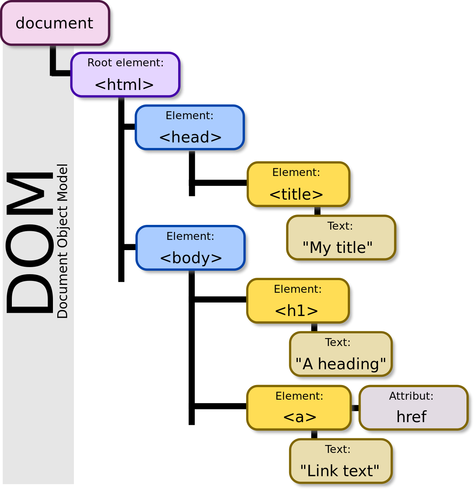

# Nodes vs Elements

If this is the first time you've heard of Nodes, you'll likely be confused. What's the difference between Elements and Nodes? Let's go through them in this lesson.

## Node

If you visualize the DOM as a tree diagram, the DOM represents the entire diagram, while each stem and leaf represents a Node.

<figure>
  
  <figcaption>Visual representation of a DOM tree</figcaption>
</figure>

In this image above, you can see multiple Nodes.

- The `<html>` Element is a Node.
- The `<body>` Element is a Node.
- The `<h1>` Element is a Node.
- The `A heading` text is a Node.
- The `<a>` Element is a Node.
- The `Link text` text is a Node.

There are two types of Nodes here: Element and Text. Here's a complete list of all available Nodes. A few of them are deprecated (which means they obsolete, and you should avoid them)

- Element_node
- Text_node
- Processing_instruction_node
- Comment_node
- Document_node
- Document_type_node
- Document_fragment_node
- Attribute_node (deprecated)
- Cdata_section_node (deprecated)
- Entity_reference_node (deprecated)
- Entity_node (deprecated)
- Notation_node (deprecated)

Nodes have a [set of properties and methods](https://developer.mozilla.org/en/docs/Web/API/Node) you can use. Most of them aren't used, except for these two:

1. Node.parentElement – Returns an Element that is the parent of this node. If the node has no parent, or if that parent is not an Element, this property returns null.
2. Node.textContent - Returns / Sets the textual content of an element and all its descendants.

Should you care about Nodes? Don't worry about them.

Let's move on to Elements.

## Elements

An Element is a specific type of Node. You may have already came to that conclusion on your own when I discussed Node in the earlier section.

Elements are important. They'll have another set of [properties and methods](https://developer.mozilla.org/en-US/docs/Web/API/Element) that you'll often use. We'll go through these methods and properties in the following lessons.

## Exercise

Nothing to do this lesson. Key takeaway is to make sure you know the difference between Elements and Nodes and not get confused between them.
