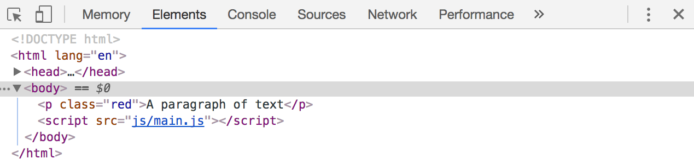

# Changing Classes

Since you can only set inline styles with JavaScript, you want to avoid changing the appearance of your website with JavaScript as much as possible. A better way to change styles is to let CSS do the thing its good at – styles.

To do so, you add or remove classes with JavaScript with `Element.classList`

## Adding a class

To add a class, you use the `add` method in `Element.classList`:

```js
Element.classList.add('className')
```

So, if you have the following HTML and you'd like to add a `red` class to the paragraph tag, you would first select the paragraph, then add the class with `Element.classList.add`:

```html
<p>This is a paragraph of text</p>
```

```js
const p = document.querySelector('p')
p.classList.add('red')
```

If you check your paragraph in the DOM, you should see the `red` class added to it:

<figure>
  
  <figcaption>Adding a class</figcaption>
</figure>

## Adding multiple classes

If you need to add multiple classes, you can do so by passing extra classes as arguments, separating each class with a comma:

```js
Element.classList.add('firstClass', 'secondClass', 'thirdClass')
```

In practice, there's no need to add multiple classes. One class is good enough most of the time.

## Removing a class

To remove a class, you use the `Element.classList.remove` method:

```js
Element.classList.remove('className')
```

So, if you have the following HTML and you'd like to remove the `.red` class from paragraph tag, you would first select the paragraph, then remove the class with `Element.classList.remove`:

```html
<p class="red">This is a paragraph</p>
```

```js
const p = document.querySelector('p')
p.classList.remove('red')
```

If you opened up your console and checked the DOM, you should see the paragraph without the `red` class:

<figure>
  
  <figcaption>Removing a class</figcaption>
</figure>

Note: Whenever you add or remove a class with `Element.classList`, you don't need to add a `.` before your class name. You only need this `.` when you select a class with `querySelector` or `querySelectorAll`.

## Removing multiple classes

If you need to remove multiple classes, you can do so by passing extra classes as arguments, separating each class with a comma:

```js
Element.classList.remove('firstClass', 'secondClass', 'thirdClass')
```

In practice, there's no need to remove multiple classes at the same time as well. Removing a single class usually does the job.

## Checking if a class exists

If you want to check if a class exists, you can use the `classList.contains` method:

```js
Element.classList.contains('className')
```

This method is often used together with the `if` statement to check whether the class exists:

```js
const element = document.querySelector('div')
if (element.classList.contains('superpower')) {
  // Do something if the element has the class '.superpower'
}
```

## Toggling the class

Sometimes, when a class exists, you want to remove it. If it doesn't, you want to add it. (It's like toggling a switch). You can do so with `classList.contains` and `if/else` statements:

```js
if (element.classList.contains('superpower')) {
  element.classList.remove('superpower')
} else {
  element.classList.add('superpower')
}
```

This set of JavaScript is so frequently used that JavaScript provides you with a method called `classList.toggle`. It does what the above code does.

```js
element.classList.toggle('superpower')
```

## Working with multiple Elements

Say you have three paragraphs of text. You want to add the `.red` class to all of them.

```html
<p>Paragraph 1</p>
<p>Paragraph 2</p>
<p>Paragraph 3</p>
```

To do so, you first select them all with `querySelectorAll`. Then, you add the class `red` to each paragraph element through a `forEach` loop:

```js
const paragraphs = document.querySelectorAll('p')
paragraphs.forEach(p => p.classList.add('red'))
```

You need to go through the extra `forEach` step is because `classList` is not available on a NodeList. It's only available on an `Element`.

## Exercise

Practice adding, removing, checking for classes and toggling classes with `Element.classList`. Work through the examples in this HTML:

```html
<div class="add">Add a "red" class to me!</div>

<div class="remove">Remove the class, "remove" from me!</div>

<div class="contains">
  <div>Do I have a "blue" class?</div>
  <div class="blue">Do I have a "blue" class?</div>
</div>

<div class="toggle">Do I have a "red" class? If yes, remove it. If no, add it.</div>
```

When you're done, try adding a class of `superhero` to each hero in following HTML with `querySelectorAll`, `forEach` and `classList.add`.

```html
<ul class="superheroes">
  <li>Wonderwoman</li>
  <li>Superman</li>
  <li>Ironman</li>
  <li>Batman</li>
  <li>The Flash</li>
  <li></li>
</ul>
```
