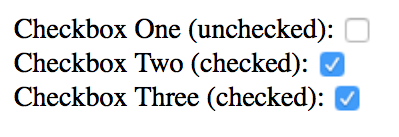

# Changing Attributes

Before you learn to change attributes, let's see what they are first.

## What are attributes?

Attributes are additional values within HTML tags. They help to adjust behaviors of the tag. Here are some examples of attributes in a `<div>` tag.

```html
<div id="" class="" contenteditable data-attr="">Any tag can contain multiple attributes!</div>
```

The first three attributes (`id`, `class` and `contenteditable`) are built directly into HTML. Each serves a different purpose. You can see a list of built-in attributes through the [HTML attribute reference](https://developer.mozilla.org/en-US/docs/Web/HTML/Attributes).

The fourth attribute, `data-attr`, is an example of custom attribute. Custom attributes contain additional information you'd like to store in an element.

You can create any number of custom attributes on a tag. You can also name them anything you want, with three conditions attached:

1. custom attributes always start with a `data-` prefix.
2. custom attributes can only contain lowercase letters, numbers, dashes (`-`), underscores (`_`), dots (`.`) or colons (`:`).
3. custom attributes cannot contain capital letters

Here are some examples of valid custom attributes:

```html
<div
  data-superhero
  data-ball-bearing="27"
  data-clown-cap="red"
> Examples of weird custom attributes :) </div>
```

## True when present

Built-in attributes have a unique behavior. When an attribute is present, they're always in a `true` state. To see this in action, let's say you have three checkboxes as follows:

```html
<input type="checkbox">
<input type="checkbox" checked>
<input type="checkbox" checked="false">
```

The first checkbox would not be checked because it does not contain the `checked` attribute.

The second checkbox will be checked because it contains the `checked` attribute.

The third checkbox will also be checked because it contains the `checked` attribute, even though the attribute stores the string `'false'`.

<figure>
  
  <figcaption>Third checkbox is checked even though it's "false"</figcaption>
</figure>

When you build your custom attributes, remember this unique behavior, so your attributes are consistent with the built-in ones.

## Why use attributes?

Built-in attributes create functionality for HTML elements automatically. One example is the `checked` attribute you've just seen. When the `checked` attribute is added, the checkbox turns blue and gets a check mark automatically.

As such, built-in attributes are especially helpful when you write HTML and CSS. You won't touch these attributes with JavaScript most of the time.

What you'd touch with JavaScript though, are ARIA attributes and custom attributes.

ARIA attributes are a set of attributes that make your website more accessible to users with disabilities. You can find out more about ARIA in this [article](https://www.sitepoint.com/how-to-use-aria-effectively-with-html5/). You'll learn some basics to ARIA attributes when we build stuff together in later lessons.

Custom attributes, as you've learned, are attributes you use to store information in your elements. You'll see how these attributes are helpful in later lessons as well.

For now, you need to learn how to set, get and remove attributes.

## Setting Attributes

To set (add or change) an attribute, you can use the `Element.setAttribute` method:

```js
Element.setAttribute('name-of-attribute', 'value to set')
```

The first argument is the name of the attribute you want to set. The second argument is the value of the attribute you wish to set.

For instance, if you want to set the `aria-collapse` of an element to `true`, you can write the following code:

```js
const element = document.querySelector('element')
element.setAttribute('aria-collapse', true)
```

You can also set custom attributes with `Element.setAttribute`. In the example below, you'll set the attribute `data-color` to a value of `red`.

```js
element.setAttribute('data-color', 'red')
```

## Reading Attributes

To get (or read) an attribute, you can use the `Element.getAttribute` method.

```js
Element.getAttribute('name-of-attribute')
```

You can get the attribute of both built-in and custom attributes with this method:

```html
<div class="clown-hat" data-color="red" data-size="big">A Clown hat</div>
```

```js
const clownHat = document.querySelector('.clown-hat')
const clownHatColor = clownHat.getAttribute('data-color')
const clownHatSize = clownHat.getAttribute('data-size')

console.log(clownHatColor) // => 'red'
console.log(clownHatSize) // => 'big'
```

## Dataset

Both `getAttribute` and `setAttribute` above lets you get and set built-in attributes and custom attributes. There is also a second way that makes getting and setting custom attributes much simpler – dataset.

When you use custom attributes, every attribute is added to `Element.dataset` as a property automatically.

```html
<div class="clown-hat" data-color="red" data-num-stripes="3">A Clown hat</div>
```

<figure>
  
  <figcaption></figcaption>
</figure>

You can then get and set the value of any attribute just like how you'd get or set the property of an Object:

```js
const clownHat = document.querySelector('.clown-hat')

const clownHatColor = clownHat.dataset.color
const clownHatSize = clownHat.dataset.numStripes

console.log(clownHatColor) // => 'red'
console.log(clownHatSize) // => '3'

// Set custom attribute
clownHat.dataset.numStripes = 4
```

(Note: At the time of writing, Opera Mini does not allow you to get attributes with dataset)

## Removing Attributes

The only way to remove attributes is through the `Element.removeAttribue` method:

```js
Element.removeAttribute('attribute-name')
```

You can remove both built-in and custom attributes. Here's an example:

```html
<div class="clown-hat" data-color="red" data-num-stripes="3">A Clown hat</div>
```

```js
const clownHat = document.querySelector('.clown-hat')
clownHat.removeAttribute('data-color')
```

Once you run the above code, you'll end up with this:

```html
<div class="clown-hat" data-num-stripes="3">A Clown hat</div>
```

## Exercise

Practice adding, and removing attributes with `Element.getAttribute`, `Element.setAttribute` and `Element.dataset`.

Try these tasks:

1. Set an attribute with `Element.setAttribute`
2. Get an attribute with `Element.getAttribute`
3. Get an attribute with `Element.dataset`
4. Set an attribute with `Element.dataset`
5. Remove attribute with `Element.removeAttribute`

