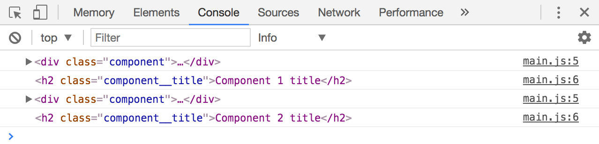
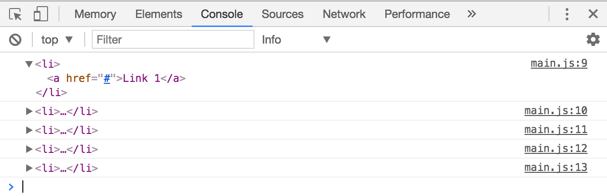

# DOM Traversals

Let's say you want to find your neighbor's house. Which of the two methods below would be more effective?

1. Find your neighbor's house from your house
2. Find your neighbor's house by getting his address, then, looking up on Google for the country, then state, the street, then finally the house number.

Of course it'll be easier and faster to find your neighbor's house from yours!

Likewise, it's easier to find a DOM element from another element instead of trying to zoom out and search for it through `document.querySelector`.

This process of finding an element from another element is called traversing the DOM. In this lesson, you'll learn methods to help you traverse downwards, upwards and sideways.

Let's start with what you're already familiar with, traversing downwards.

## Traversing downwards

There are two methods to traverse downwards:

1. querySelector or querySelectorAll
2. children

### querySelector or querySelectorAll

You already learned how to use `querySelector` and `querySelectorAll` in a previous lesson. The trick here is to start with an Element instead of the `document`.

If you begin with an Element, you'd only be able to select elements within this Element. The elements within it are called *descendant elements*.

This method is very useful for selecting the right element when you work with a NodeList from `querySelectorAll`.

Let's go through an example. Say you have the following HTML.

```html
<div class="component">
  <h2 class="component__title">Component 1 title</h2>
</div>
<div class="component">
  <h2 class="component__title">Component 2 title</h2>
</div>
```

You have already selected these two components with `querySelectorAll`. You want to `console.log` the title of each component.

If you used `querySelector` from each component, you can get their respective titles:

```js
const components = document.querySelectorAll('.component')

components.forEach(component => {
  const title = component.querySelector('.component__title')
  console.log(component)
  console.log(title)
})
```

<figure>
  
  <figcaption>Getting the right title with querySelector</figcaption>
</figure>

`querySelector` and `querySelectorAll` are useful for selecting elements that are multiple layers within the Element itself. If you need to select the direct descendants (children), you can also use the `children` property.

### children

The `children` property allows you to select all direct descendants of any HTML element. It returns a live **HTML Collection** that updates automatically when children elements change.

```js
const childElements = Element.children
```

In the following example, if you've already selected `.list` with `querySelector`, you can get all list items with `children`.

```html
<ul class="list">
  <li><a href="#">Link 1</a></li>
  <li><a href="#">Link 2</a></li>
  <li><a href="#">Link 3</a></li>
  <li><a href="#">Link 4</a></li>
  <li><a href="#">Link 5</a></li>
</ul>
```

```js
const list = document.querySelector('.list')
const listItems = list.children

console.log(listItems)
```

<figure>
  
  <figcaption>Selecting all list items with the children property</figcaption>
</figure>

In case you were wondering, a HTML Collection is a list of HTML Elements. A NodeList is a list of nodes. You can say that a HTML Collection is a subset of a NodeList.

Functions wise, a HTML Collection doesn't contain a `forEach` method, unlike a NodeList. If you want to loop over a HTML Collection, you need to convert it into an array with [Array.from](../../core/03.advanced-arrays/02.from.md) first.

### Selecting a specific child

Both NodeList (from `querySelectorAll`) and HTML Collections (from `children`) are lists that behave similarly to arrays. You can select the nth-item in the list just like how you select the nth-item in arrays.

```html
<ul class="list">
  <li><a href="#">Link 1</a></li>
  <li><a href="#">Link 2</a></li>
  <li><a href="#">Link 3</a></li>
  <li><a href="#">Link 4</a></li>
  <li><a href="#">Link 5</a></li>
</ul>
```

```js
const listItems = document.querySelectorAll('li')

const firstItem = listItems[0]
const secondItem = listItems[1]
const thirdItem = listItems[2]
const fourthItem = listItems[3]
const fifthItem = listItems[4]

console.log(firstItem)
console.log(secondItem)
console.log(thirdItem)
console.log(fourthItem)
console.log(fifthItem)
```

<figure>
  
  <figcaption>Select a specific child with [index]</figcaption>
</figure>

## Traversing upwards

There are two methods to traverse upwards:

1. `parentElement`
2. `Element.closest`

### parentElement

A parent element is the Element that contains the current element. In the following HTML, `.list` is a parent element of all `<li>`. Each `<li>` as a parent element of an `<a>`.

```html
<ul class="list">
  <li><a href="#">Link 1</a></li>
  <li><a href="#">Link 2</a></li>
  <li><a href="#">Link 3</a></li>
  <li><a href="#">Link 4</a></li>
  <li><a href="#">Link 5</a></li>
</ul>
```

You can get the parent element with the `parentElement` property that's available on all Nodes.

```js
const parentElement = Node.parentElement
```

So, if you have selected a list item in the above HTML, you can get `.list` with parentElement like this:

```js
const firstListItem = document.querySelector('li')
const list = firstListItem.parentElement

console.log(list)
// <ul class="list">...</ul>
```

### Element.closest

`parentElement` is great for selecting one level upwards, just like how `children` is great for selecting the direct descendants.

If you want to select multiple layers upwards, you need something like `querySelector` in a different direction. That method is called `Element.closest`.

`Element.closest` lets you select the closest ancestor element that matches a selector. It *starts the search from the current element*, then proceeds upwards until it reaches the `document`.

```js
const closestAncestor = Element.closest(selector)
```

So, with the following HTML, you can select `.list` from the `<a>` effortlessly with `Element.closest`:

```html
<ul class="list">
  <li><a href="#">Link 1</a></li>
  <li><a href="#">Link 2</a></li>
  <li><a href="#">Link 3</a></li>
  <li><a href="#">Link 4</a></li>
  <li><a href="#">Link 5</a></li>
</ul>
```

```js
const firstLink = document.querySelector('a')
const list = firstLink.closest('.list')

console.log(list)
// <ul class="list"> ... </ul>
```

Note that `Element.closest` begins the search on the current element:

```js
const firstLink = document.querySelector('a')
const firstLinkThroughClosest = firstLink.closest('a')

console.log(firstLinkThroughClosest)
// <a href="#">Link 1</a>
```

`Element.closest` is pretty new. It doesn't work on IE Edge 14 and below. It doesn't work on Opera mini too. If you need to support older browsers, you may want to use a [polyfill](https://github.com/jonathantneal/closest).

## Traversing sideways

There are two methods to traverse sideways:

1. nextElementSibling
2. previousElementSibling

### nextElementSibling

You can select the next element with `nextElementSibling`.

```js
const nextElem = Node.nextElementSibling
```

```html
<ul class="list">
  <li><a href="#">Link 1</a></li>
  <li><a href="#">Link 2</a></li>
  <li><a href="#">Link 3</a></li>
  <li><a href="#">Link 4</a></li>
  <li><a href="#">Link 5</a></li>
</ul>
```

```js
const firstListItem = document.querySelector('li')
const secondListItem = firstListItem.nextElementSibling

console.log(secondListItem)
// <li><a href="#">Link 2</a></li>
```

### previousElementSibling

Likewise, you can select the previous element with `previousElementSibling`.

```html
<ul class="list">
  <li><a href="#">Link 1</a></li>
  <li><a href="#">Link 2</a></li>
  <li><a href="#">Link 3</a></li>
  <li><a href="#">Link 4</a></li>
  <li><a href="#">Link 5</a></li>
</ul>
```

```js
const secondListItem = document.querySelectorAll('li')[1]
const firstListItem = secondListItem.previousElementSibling

console.log(firstListItem)
// <li><a href="#">Link 1</a></li>
```

### Selecting a specific sibling

If you want to select a specific sibling, you can combine `parentElement` with `children`.

Let's say you want to select the fourth list item in the following HTML:

```html
<ul class="list">
  <li><a href="#">Link 1</a></li>
  <li><a href="#">Link 2</a></li>
  <li><a href="#">Link 3</a></li>
  <li><a href="#">Link 4</a></li>
  <li><a href="#">Link 5</a></li>
</ul>
```

Here's how you can do it if you already have the first list item:

```js
const firstListItem = document.querySelector('li')
const fourthListItem = firstListItem.parentElement.children[3]

console.log(fourthListItem)
// <li><a href="#">Link 4</a></li>
```

## Exercise

Practice traversing the DOM with the methods taught in this lesson. With the HTML given below, do these tasks:

1. Select `.characters` with `document.querySelector`
2. Select `.humans` from `.characters`
3. Select all humans with `querySelectorAll`, starting from `.humans`
4. Select all hobbits with `children`
5. Select the Merry (the hobbit)
6. Select `.enemies` from Sauron
7. Select the `.characters` div from Nazgûl
8. Select Elrond from Glorfindel
9. Select Legolas from Glorfindel
10. Select Arwen from Glorfindel

```html
<div class="characters">
  <ul class="hobbits">
    <li>Frodo Baggins</li>
    <li>Samwise "Sam" Gamgee</li>
    <li>Meriadoc "Merry" Brandybuck</li>
    <li>Peregrin "Pippin" Took</li>
    <li>Bilbo Baggins</li>
  </ul>
  <ul class="humans">
    <li>Gandalf</li>
    <li>Saruman</li>
    <li>Aragorn</li>
    <li>Boromir</li>
    <li>Faramir</li>
  </ul>
  <ul class="elves">
    <li>Legolas</li>
    <li>Glorfindel</li>
    <li>Elrond</li>
    <li>Arwen Evenstar</li>
  </ul>
  <ul class="enemies">
    <li>Sauron</li>
    <li>Nazgûl</li>
  </ul>
</div>
```

---

- Previous Lesson: [Changing Attributes](08.changing-attributes.md)
- Next Lesson: [ID, Class, Tag, and Attributes](10.id-class-tag-attribute.md)