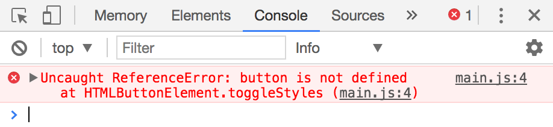
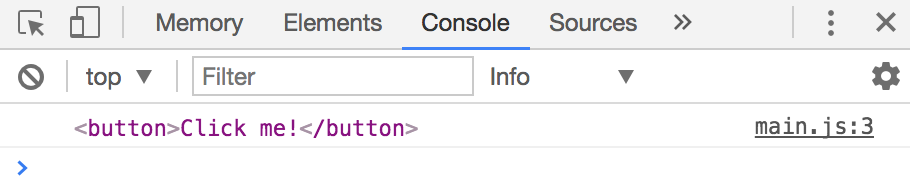
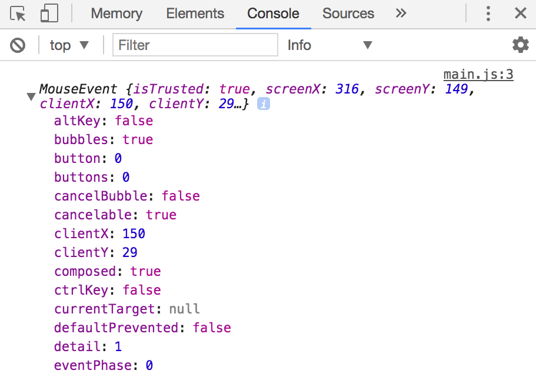

## The listening element

Let's say you restructure your code from the previous lesson such that the callback function gets declared before your button variable, like this:

```js
function toggleStyles () {
  const body = document.body

  if (button.classList.contains('is-clicked')) {
    body.classList.remove('button-is-clicked')
    button.classList.remove('is-clicked')
  } else {
    body.classList.add('button-is-clicked')
    button.classList.add('is-clicked')
  }
}

const button = document.querySelector('button')
button.addEventListener('click', toggleStyles)
```

When you look at the `toggleStyles` function alone, do you know what `button` is?

You won't know what it is. You don't even know where it comes from in the code, but it works.

`toggleStyles` works because `button` is declared before it is used. If you declare `button` as another variable, `toggleStyles` breaks immediately:

```js
function toggleStyles () {
  // Toggle styles code here
}

// declare button as `clickMe` instead of `button`
const clickMe = document.querySelector('button')
clickMe.addEventListener('click', toggleStyles)
```

<figure>
  
  <figcaption>ToggleStyles break when the button variable is not declared</figcaption>
</figure>

To make your functions robust enough to withstand such breakages, you should only use variables that are explicitly declared within them, like this:

```js
function toggleStyles () {
  const body = document.body
  // Declaring the button element
  const button = document.querySelector('button')

  if (button.classList.contains('is-clicked')) {
    body.classList.remove('button-is-clicked')
    button.classList.remove('is-clicked')
  } else {
    body.classList.add('button-is-clicked')
    button.classList.add('is-clicked')
  }
}
```

In an event listener callback, you don't need to use `document.querySelector` to find the Element that the listener is attached to. You have two better ways:

1. The `this` keyword
2. `Event.currentTarget`

Let's call the "the element that the event listener is attached to" the **listening element** from now on.

## The this keyword

`this` is a keyword that JavaScript provides you with. It changes depending on how a function is called. In event listeners, **`this` is refers to the listening element**.

```js
const button = document.querySelector('button')
button.addEventListener('click', function() {
  console.log(this)
})
```

<figure>
  
  <figcaption>this refers to the listening element</figcaption>
</figure>

Since `this` refers to the listening element, you can substute `this` as `button` in `toggleStyles`:

```js
function toggleStyles () {
  const body = document.body

  if (button.classList.contains('is-clicked')) {
    // this === button
    body.classList.remove('button-is-clicked')
    this.classList.remove('is-clicked')
  } else {
    body.classList.add('button-is-clicked')
    this.classList.add('is-clicked')
  }
}
```

## Event.currentTarget

Another way to get the listening element is through the event object, which is an parameter provided to each event-listener callback.

Try to `console.log` the event object and you'll see a lot of properties:

```js
const button = document.querySelector('button')
button.addEventListener('click', function (event) {
  console.log(event)
})
```

<figure>
  
  <figcaption>Properties in an event object</figcaption>
</figure>

You can get the listening element through the `currentTarget` property.

```js
const button = document.querySelector('button')
button.addEventListener('click', function (event) {
  console.log(event.currentTarget)
})
```

<figure>
  
  <figcaption>You can get the listening element through Event.currentTarget</figcaption>
</figure>

So, you can also substitute `this` with `event.currentTarget` in `toggleStyles`.

```js
function toggleStyles (event) {
  const body = document.body
  const button = event.currentTarget

  if (button.classList.contains('is-clicked')) {
    body.classList.remove('button-is-clicked')
    button.classList.remove('is-clicked')
  } else {
    body.classList.add('button-is-clicked')
    button.classList.add('is-clicked')
  }
}
```

## this or event.currentTarget?

Choose either method. They both work.

If you use `this`, make sure to write normal functions (not arrow functions), because `this` takes on a different value in arrow functions.

`Event.currentTarget` works regardless of how you write your functions.

Since I default to writing arrow functions nowadays, I almost always go for `Event.currentTarget`.

## Exercise

1. Get the listening element with `this`.
2. Get the listening element with `Event.currentTarget`.
3. Read the lesson on [arrow functions](../../core/02.es6/02.arrow-functions.md). We'll use arrow functions from the next lesson onwards.
