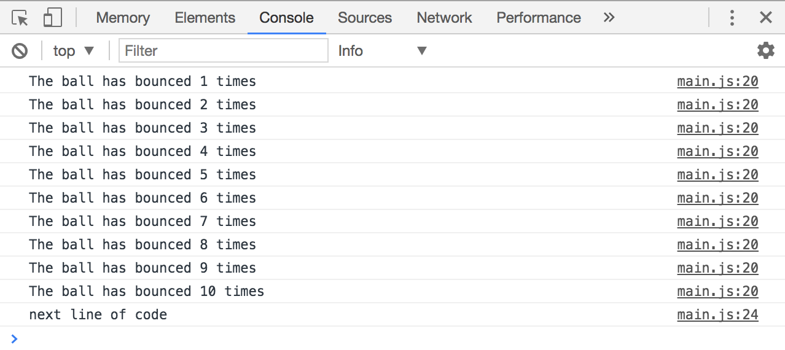

# For loops

Let's say you want to run a function, `bounceBall`, four times. Would you do it like this?

```js
function bounceBall() {
  // bounce the ball here
}

bounceBall()
bounceBall()
bounceBall()
bounceBall()
```

This approach is great if you need to `bounceBall` only for a few times. What happens if you need to `bounceBall` for a hundred times? Like this?

```js
function bounceBall() {
  // bounce the ball here
}

bounceBall()
bounceBall()
bounceBall()
bounceBall()
bounceBall()
//... 95 more lines of bounceBall()
```

The better way is through a `for` loop.

## `for` loop

A `for` loop runs a block of code as many times as you want to. Here's a for loop that runs `bounceBall` ten times:

```js
for (let i = 0; i < 10; i++) {
  bounceBall()
}
```

It's broken down into four parts – the `initialExpression`, the `condition`, the `incrementalExpression` and the `statement`:

```js
for (initialExpression; condition; incrementExpression) {
  statement
}
```

Before you loop, you need to have a **statement**. This statement is the block of code you'd like to run multiple times. You can write any number of lines of code here. You can even use functions.

Here's what the `for` loop looks like with `bounceBall` as its statement:

```js
for (initialExpression; condition; incrementExpression) {
  bounceBall()
}
```

Next, you need an **initial expression** to begin a loop. This is where you declare a variable. For most loops, this variable is called `i`.  It's also set to 0.

Here's how it'll look like when you put the `initialExpression` into the `for` loop:

```js
for (let i = 0; condition; incrementExpression) {
  bounceBall()
}
```

After the statement runs, the variable, `i` is increased or decreased. You increase or decrease the value of `i` in the **increment expression**.

To increase the value of `i` by one, you reassign `i` such that it becomes `i + 1` with `i = i + 1`. The shorthand for this reassignment is `i++`, which is what you'll find in most `for` loops.

To decrease the value of `i` by one, you reassign `i` such that it becomes `i - 1` with `i = i - 1`. The shorthand for this reassignment is `i--`, which is another variation of what you'll find in most `for` loops.

In the `bounceBall` example above, we increased the variable `i` by one each time the code runs:

```js
for (let i = 0; condition; i++) {
  bounceBall()
}
```

But should you increase or decrease `i`?

The answer lies in the **condition**. This condition evaluates either to `true` or `false`. If the condition evaluates to `true`, the statement runs.

After the statement ran, JavaScript runs the increment expression and checks if the condition evaluates to `true` again. It repeats this process until the condition evaluates to `false`.

Once the condition evaluates to `false`, JavaScript skips the loop and moves on with the rest of your code.

So, if you do not want the loop to run, you can set a condition that evaluates to false immediately:

```js
// This loop will not run since the condition evaluates to false
for (let i = 0; i < 0; i++) {
  bounceBall()
  const timesBounced = i + 1
  console.log('The ball has bounced ' + timesBounced + ' times')
}

// You will only see this
console.log('next line of code')
```

<figure>
  
  <figcaption>Next line of code runs immediately since the condition evaluates to false</figcaption>
</figure>

If you want the loop to *run twice*, you change the condition such that it evaluates to false when the increment expression has ran twice.

```js
// This loop will run twice
for (let i = 0; i < 2; i++) {
  bounceBall()
  const timesBounced = i + 1
  console.log('The ball has bounced ' + timesBounced + ' times')
}

console.log('next line of code')
```

<figure>
  
  <figcaption>The loop runs twice. After two times, the condition evaluates to false. </figcaption>
</figure>

If you want the loop to *run ten times*, you change the condition such that it evaluates to false when the increment expression has ran ten times.

```js
// This loop will run once
for (let i = 0; i < 10; i++) {
  bounceBall()
  const timesBounced = i + 1
  console.log('The ball has bounced ' + timesBounced + ' times')
}

// You will only see this
console.log('next line of code')
```

<figure>
  
  <figcaption>The loop runs ten times. After ten times, the condition evaluates to false. </figcaption>
</figure>

## Let's run through the for loop together

Many beginners get confused with a `for` loop, so let's slow down and run through the `for` loop together.

For this section, we're going to use this code:

```js
for (let i = 0; i < 2; i++) {
  const timesBounced = i + 1
  console.log('The ball has bounced ' + timesBounced + ' times')
}

console.log('next line of code')
```

When JavaScript sees the for loop for the first time, declares a variable `i` and sets it to 0. After declaring the variable, it checks if the condition is true.

In this case, `i` is 0; the condition is true; JavaScript executes the block of code within the `for` loop.

<figure>
  
  <figcaption aria-hidden>Javtocript sets `i` as 0</figcaption>
</figure>

Next, JavaScript executes the block of code; it replaces `i` with `0` whenever it sees `i`.

Since `i` is `0`, `timesBounced` is `0 + 1 = 1`.

<figure>
  
  <figcaption aria-hidden>JavaScript sets every `i` value in the for loop to 0</figcaption>
</figure>

After running through the block, JavaScript runs the `incrementExpression`. Here, JavaScript recognizes that the current value of `i` is 0, and it needs to add one to `i`. The new value of `i` becomes one.

<figure>
  
  <figcaption>JavaScript sets `i` to 1 for next iteration</figcaption>
</figure>

Next, JavaScript runs the condition again. This time, it replaces `i` with one because the new value of `i` is one.

<figure>
  
  <figcaption aria-hidden>JavaScript sets `i` to 1`</figcaption>
</figure>

Since `1 < 2` evaluates to true, JavaScript runs the block of code within the `for` loop once more. This time, it sets `i` as `1`. Because `i` is `1`, `timesBounced` will be 2.

<figure>
  
  <figcaption aria-hidden>JavaScript runs block of code again</figcaption>
</figure>

Next, JavaScript runs the `incrementExpression` and increases `i` to `2`.

<figure>
  
  <figcaption>JavaScript sets `i` to 2 in the `incrementExpression`</figcaption>
</figure>

Then, JavaScript runs the condition again. This time, `i` is 2.

<figure>
  
  <figcaption>JavaScript sets `i` to 2 in the condition</figcaption>
</figure>

Since `2 < 2` evaluates to false, JavaScript skips the for loop and executes the next line, which logs "next line of code".

<figure>
  
  <figcaption aria-hidden>JavaScript skips the block since the condition evaluates to false</figcaption>
</figure>

## Logic within for loops

You can use `if/else` or any other conditions within a `for` loop.

```js
const numbers = [25, 22, 12, 56, 8, 18, 34];

for (let i = 0; i < numbers.length; i++) {
  const num = numbers[i]
  if (num < 20) {
    console.log(num + ' is less than 20!')
  }
}
```

## Infinite loops

Infinite loops occur when the condition for a loop always return `true`. Your browser will hang if you run an infinite loop.

Here's an example of an infinite loop.

```js
for (let i = 0; i < 1; i--) {
  console.log('HAHA! You are stuck!')
}
```

To recover from an infinite loop, you need to quit your browser forcefully. On a Mac, this means you right click on your browser icon and select "force quit". On a Window's machine, you open the Windows Task manager with `ctrl` + `alt` + `del`, select your browser, and click "End task".

## Looping through arrays

In practice, you almost never write a loop that runs ten times like in the `bounceBall` example above. You'd always loop through an array or a object.

When you loop (or iterate) through an array, you go through each item in the array once. To do so, you can use the length or the array as a condition:

```js
const fruitBasket = ['banana', 'pear', 'guava']

// fruitBasket.length is 3
for (let i = 0; i < fruitBasket.length; i++) {
  console.log("There's a " + fruitBasket[i] + " in the basket")
}

// => There's a banana in the basket
// => There's a pear in the basket
// => There's a guava in the basket
```

You can also write a `for` loop with a negative `incrementExpression`. It runs faster than the positive `incrementExpression` version, but loops from the last item. Use this if you need to run a super performant app. (Usually, you don't have to worry about loop performance).

```js
for (let i = fruitBasket.length - 1; i >= 0; i--) {
  console.log("There's a " + fruitBasket[i] + " in the basket")
}

// => There's a guava in the basket
// => There's a pear in the basket
// => There's a banana in the basket
```

## The "for of" loop

A (much better) way to loop through an array to use a `for...of` loop. This is a new loop syntax that comes with ES6. It looks like this:

```js
const fruitBasket = ['banana', 'pear', 'guava']
for (let fruit of fruitBasket) {
  console.log("There's a " + fruit + " in the basket")
}

// => There's a banana in the basket
// => There's a pear in the basket
// => There's a guava in the basket
```

The `for...of` loop is preferable to the standard `for` loop because it always loops through the array once. It makes your code easier to read and maintain because you don't have to worry about the increment expression nor the number of loops (with `array.length`)

You can use `for...of` with any iterable object. These are objects that contain the `Symbol.iterator` property. Arrays are one of such objects. If you `console.log` an empty array, you'll see that it has the `Symbol.iterator` as one of its keys (within the Array `__proto__` key):

<figure>
  
  <figcaption>Any object that contains the Symbol.iterator key can be iterated through with a for...of loop</figcaption>
</figure>

## Exercise

Practice using the `for` and `for of` to loop through an array of numbers (given below). Do the following tasks:

1. Loop through the numbers and `console.log` each number within
2. Loop through the numbers. If the numbers are greater than 5, `console.log` them.
3. Create a new array. Add all numbers that are greater than 10 into this new array. (Hint: You have to loop through the `numbers` array first)
4. Create a new array. Multiply all numbers by 5 and put them into the new array. (Hint: You have to loop through the `numbers` array first).

Here's the array of numbers to use for this exercise:

```js
const numbers = [1, 12, 4, 18, 9, 7, 11, 3, 50, 5, 6]
```

---

- Previous Lesson: [Intro to arrays](01.arrays.md)
- Next Lesson: [The ForEach Loop](03.foreach.md)
