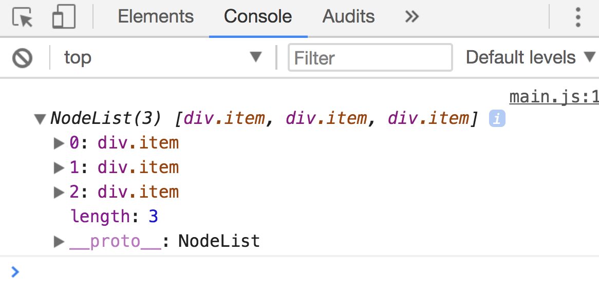

# Selecting multiple elements

Sometimes, you need to select many elements at once, to do so, you can use `querySelectorAll`.

## querySelectorAll

`querySelectorAll` lets you select multiple elements at once. The syntax of `querySelectorAll` is similar to `querySelector`.

```js
const NodeList = Element.querySelectorAll(selector)
```

The `selector` object in `querySelectorAll` is the same `selector` object in `querySelector`:

- **To select elements with a specific class**, you prepend the class with `.`
- **To select elements with a specific tag**, you write the tag name directly
- **To select elements with a specific attribute**, you write the attribute in square (`[]`) brackets.

```html
<p>Paragraph 1</p>
<p>Paragraph 2</p>
<p>Paragraph 3</p>
```

```js
const paragraphs = document.querySelectorAll('p')
```

<figure>
  
  <figcaption>Selecting three paragraphs at once with `querySelectorAll`</figcaption>
</figure>

`querySelectorAll` returns a **NodeList**. A NodeList is a list of nodes. An Element is a specific type of Node. (See the next lesson on nodes vs elements if you want more clarification).

## Acting on each element

A NodeList is an array-like object—objects that look like arrays. Array-like objects have a `length` properties and has numbers as keys.

```html
<div class="item">Item 1</div>
<div class="item">Item 2</div>
<div class="item">Item 3</div>
```

```js
const items = document.querySelectorAll('.item')
console.log(items)
```

<figure>
  
  <figcaption>A NodeList is an array-like object</figcaption>
</figure>

If you want to do something with each element in a NodeList, you need to loop through the NodeList. The code  below adds a `red` class to each element in the NodeList.

```js
const items = document.querySelectorAll('.item')
for (item of items) {
  item.classList.add('red')
}
```

You can also use the `forEach` loop if you don't want to use the `for...of` loop.

```js
const items = document.querySelectorAll('.item')
items.forEach(item => item.classList.add('red'))
```

Note: NodeLists may not have the `forEach` method in older browsers. If you encounter this scenario, you can convert your NodeList into an Array with `Array.from`.

```js
const elementArray = Array.from(NodeList)
```

## Getting a specific Element from a list of NodeList

You can get items through NodeLists as if you're getting items through arrays. To get the first item, you use an index of 0; to get the second item, you use an index of 1, and so on.

```js
const items = document.querySelectorAll('.item')

const firstItem = items[0]
console.log(firstItem) // <div class="item">Item 1</div>

const secondItem = items[1]
console.log(secondItem) // <div class="item">Item 2</div>
```

Note: Do you see that we're actually using the bracket notation to get items from objects? (Hint: NodeList is an array-like object, and array-like objects uses numbers as keys).

## Alternate methods to select multiple elements

You may have heard of methods like `getElementsByClassName` and `getElementsByTagName`. You can use them if you wish to, but there's no need for them most of the time.

They're slightly quicker than `querySelectorAll` (but the speed difference is negligible most of the time), and they return live collections (live lists).

To get a more informed opinion, it may make sense to look at live vs non-live collections.

## Live vs non-live collections

Lets say you have the following HTML:

```html
<p>Paragraph 1</p>
<p>Paragraph 2</p>
<p>Paragraph 3</p>
```

And you've selected the paragraphs with both `querySelectorAll` and `getElementsByTagName`.

```js
const liveCollection = document.getElementsByTagName('p')
const staticCollection = document.querySelectorAll('p')
```

At this point, both `liveCollection` and `staticCollection` refer to the same thing – the three paragraphs.

If you add another paragraph through JavaScript sometime later, `liveCollection` will update itself and include the fourth paragraph. `staticCollection`, on the other hand, will remain as the three paragraphs you selected initially.

That's the difference between live and non-live collections.

## Exercise

Practice selecting Elements with `querySelectorAll`.

```html
<div id="star-wars">
  <div class="character" data-type="good-guy">Luke Skywalker</div>
  <div class="character" data-type="good-guy">Yoda</div>
  <div class="character" data-type="villain">Darth Vader</div>
</div>
```

Do the following:

1. Select all good guys with attributes
2. Give good guys a `yay` class
3. Select all villains with attributes
4. Give villains a `nay` class
5. Select all characters through the `character` class.
6. Give all characters a `star-wars` class

---

- Previous Lesson: [forEach](03.foreach.md)
- Next Lesson: [Nodes vs. Elements](05.nodes-vs-elements.md)
