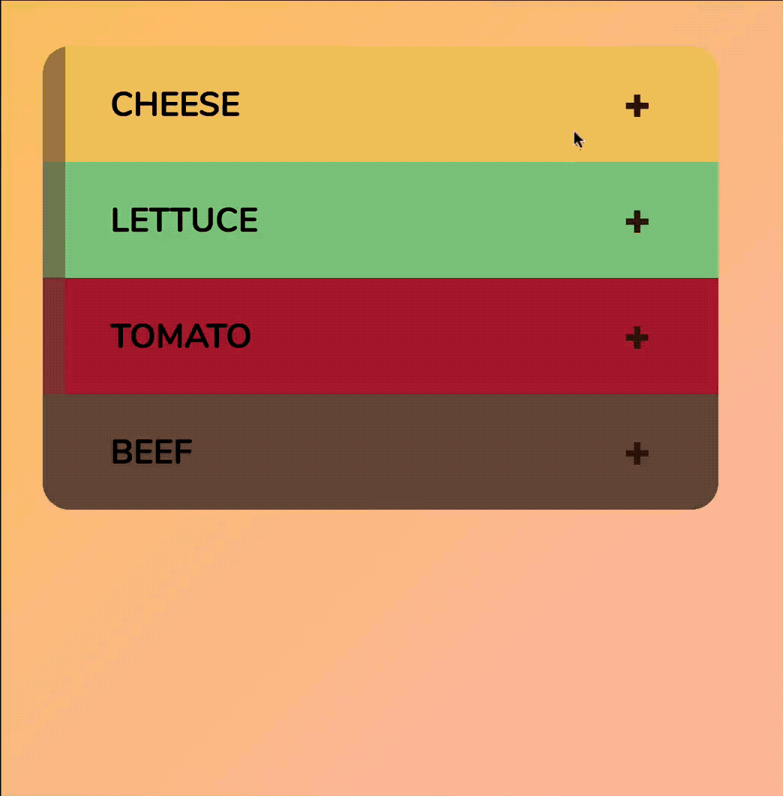
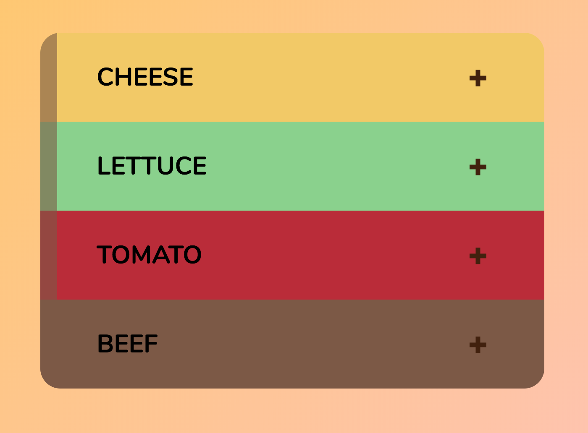
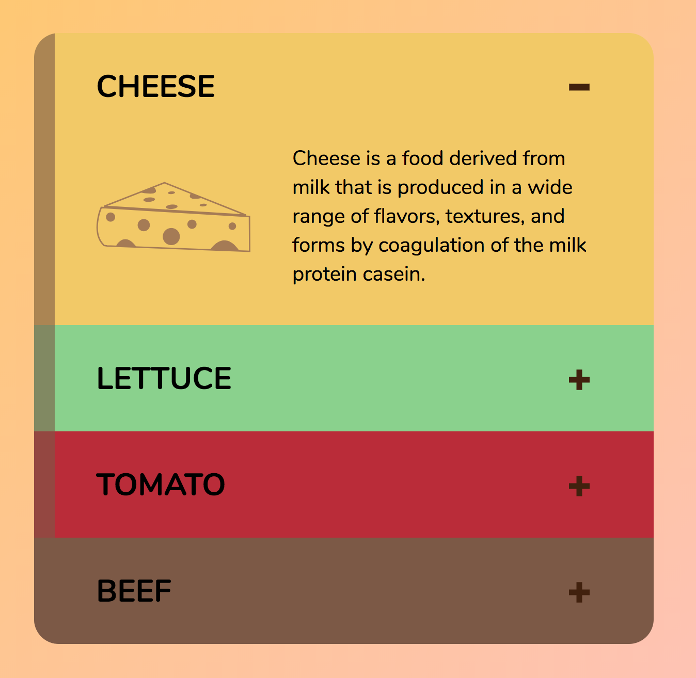
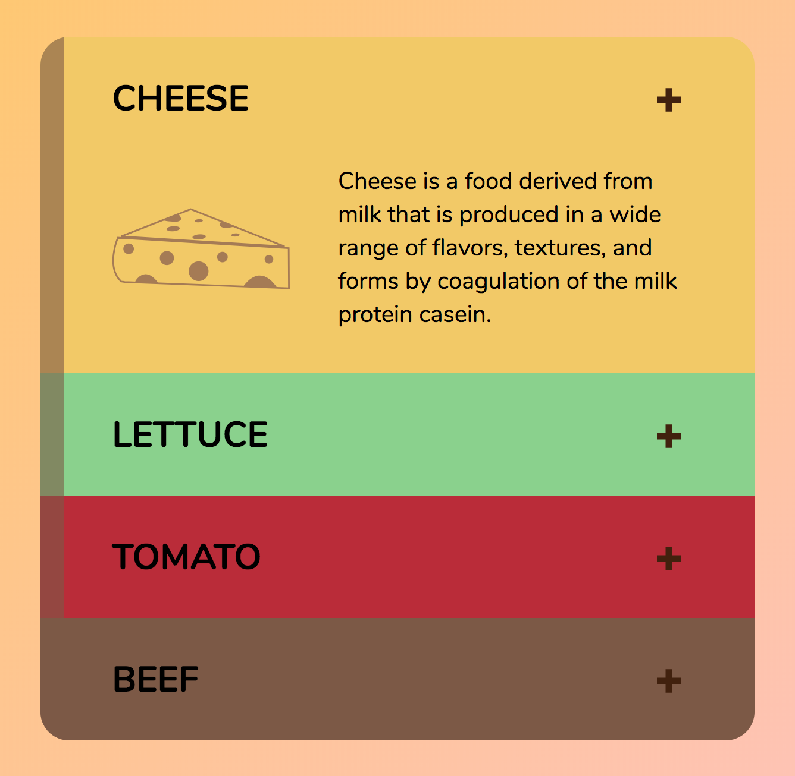
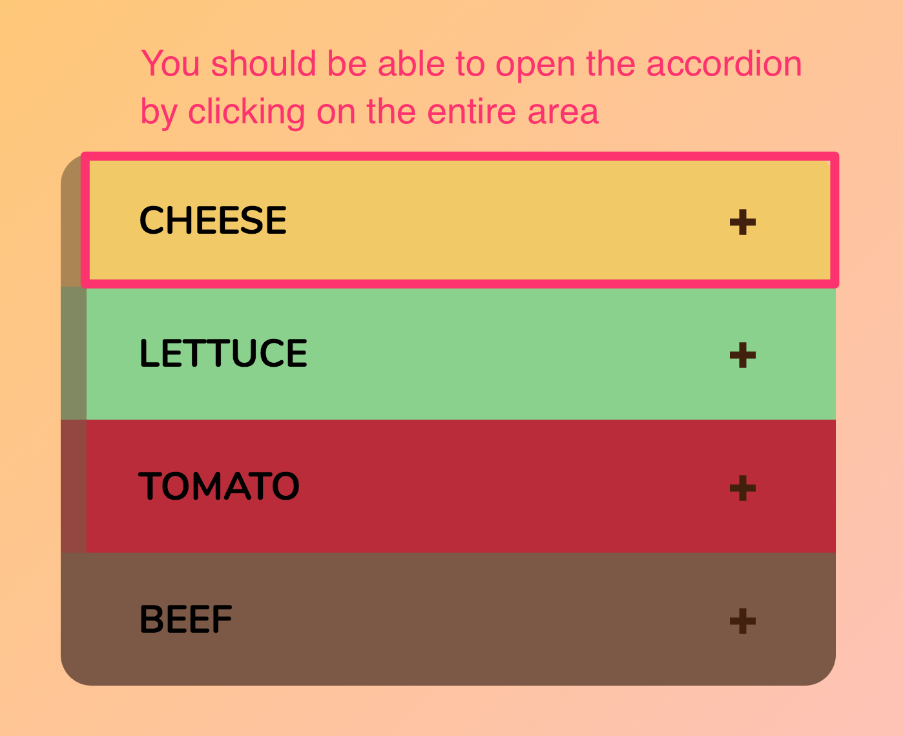
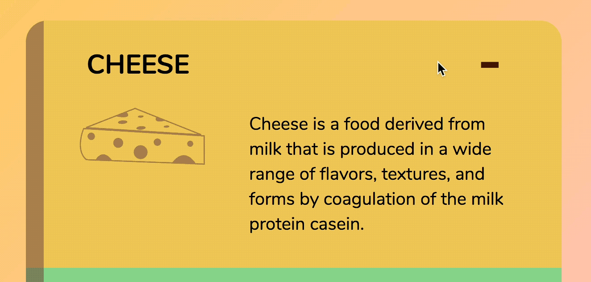

# 🛠 Building an accordion

You'll learn to build an accordion in this lesson. Accordions are components that lets show or hide sections of information. They look like this:

<figure>
  
  <figcaption>Completed accordion</figcaption>
</figure>

Before continuing, make sure you grab the starter files from the Github repo, in `components/03.accordion/01.starter`.

## Building the accordion

When accordions are closed, only their header is revealed. You don't see anything else.

<figure>
  
  <figcaption>When accordions are closed, you only see the accordion header</figcaption>
</figure>

When you click on the header of an accordion, you need to reveal the contents.

<figure>
  
  <figcaption>When accordions are opened, the details are revealed</figcaption>
</figure>

This means you should keep your accordion header and content elements close to each other. An easy way to do this is to create a enclosing `<div>`, give it the `accordion` class and set the header and contents as children elements to this enclosing div.

```html
<div class="accordion">
  <header class="accordion__header">...</header>
  <div class="accordion__content">...</div>
</div>
```

Before you move on, think about what changes you need to make to open up the correct accordion. Ideally, you want to make the change with one class.

One way to do so is to add a class called `.is-open` on the `.accordion` element.

```html
<!-- Opening the accordion -->
<div class="accordion is-open"> ...</div>
```

At this point, you may think, "why `.is-open` and not `.accordion-is-open`?"

When we built the modal (and also off canvas menu), we added `modal-is-open` to the `<body>` element because we want to be explicit with the component that is opened. If we don't add the name of the component, we won't know what is opened.

```html
<!-- What is open? -->
<body class="is-open"> <!--...--> </body>
```

In the case of accordions, `is-open` is sufficient because it's pretty obvious you're opening the accordion itself.

```html
<!-- This is obvious you're opening the accordion, yeah? -->
<div class="accordion is-open"> ...</div>
```

When the accordion is closed, you want to hide the content.

To make things simple, let's set the accordion content's `display` to `none` when the accordion is closed. When the accordion is open, we want to set the `display` to something other than none. For this specific component, we'll use `grid` because I styled the contents with CSS Grid.

```css
.accordion__content {
  display: none;
}

.accordion.is-open .accordion__content {
  display: grid;
}
```

Try it. Add the `is-open` class to an accordion. You'll see the content.

<figure>
  
  <figcaption aria-hidden>Open the content up by adding the is-open class</figcaption>
</figure>

In addition showing and hiding the content, you also need to change the indicator icon from a plus to a minus. The plus and minus icons used in the starter file are SVGs, as you can see:

```html
<div class="accordion__indicator">
  <svg class="indicator__plus" viewBox="0 0 80 80"><use xlink:href="images/sprite.svg#plus"/></svg>
  <svg class="indicator__minus" viewBox="0 0 80 80"><use xlink:href="images/sprite.svg#minus"/></svg>
</div>
```

When the accordion is closed, you want to hide the minus icon and show the plus icon. When the accordion is open, you want to hide the plus icon and show the minus icon.

```css
.indicator__plus {
  display: block;
}

.indicator__minus {
  display: none;
}

.accordion.is-open .indicator__plus {
    display: none;
}

.accordion.is-open  .indicator__minus {
    display: block;
}
```

If you do this, you should see the minus indicator when the accordion is open:

<figure>
  
  <figcaption>Changing the indicator</figcaption>
</figure>

That's it for building the accordion. Now, let's look at adding some JavaScript functionality to open and close the accordion.

## Opening the accordion with JavaScript

One way to open the accordion is to listen for a click on the accordion indicator (the plus/minus sign). That's what you may think of immediately, but that's not the best way.

From a UX point of view, a user may want to click the header text to open/close the accordion. Hence, it's better to let the user trigger the opening and closing by clicking on the header.

<figure>
  
  <figcaption>Clicking on the accordion header should open up the accordion.</figcaption>
</figure>

We need to put the contents in a `<button>` since we are revealing contents with JavaScript.

```html
<header class="accordion__header">
  <h2>
    <button>
      <span>Cheese</span>
      <div class="accordion__indicator">
        <svg class="indicator__plus" viewBox="0 0 80 80"><use xlink:href="images/sprite.svg#plus"/></svg>
        <svg class="indicator__minus" viewBox="0 0 80 28"><use xlink:href="images/sprite.svg#minus"/></svg>
      </div>
    </button>
  </h2>
</header>
```

We can listen to a click event on an accordion header by attaching a listener to it. Here's how you can attach a listener to the first accordion's header.

```js
const firstAccordion = document.querySelector('.accordion')
const firstAccordionHeader = firstAccordion.querySelector('.accordion__header')

firstAccordionHeader.addEventListener('click', e => {
  // Do something
})
```

Note: Although it's a good practice to add a `js` class for every element that requires JavaScript to work, we are not going to it for the rest of the components you'll build in this course.

To open/close the first accordion, we need to toggle the `is-open` class.

```js
firstAccordionHeader.addEventListener('click', e => {
  firstAccordion.classList.toggle('is-open')
})
```

<figure>
  
  <figcaption>First accordion opens and closes successfully</figcaption>
</figure>

If you want all accordions to work, you need to add event listeners to every accordion header. To do so, you need to find the accordion header in each accordion. You can do this with `querySelectorAll`.

```js
const accordions = Array.from(document.querySelectorAll('.accordion'))

accordions.forEach(accordion => {
  const accordionHeader = accordion.querySelector('.accordion__header')

  accordionHeader.addEventListener('click', e => {
    accordion.classList.toggle('is-open')
  })
})

```

<figure>
  
  <figcaption>Completed accordion</figcaption>
</figure>

## Wrapping up

You learned how to use `querySelectorAll` to build the accordion in this lesson.

---

- Previous Lesson: [Nodes vs Elements](05.nodes-vs-elements.md)
- Next Lesson: [Module 5 (Dom Basics), Lesson 1—Id, classes, attributes and tags](../05.dom-basics/01.id-class-attribute-tag.md)
