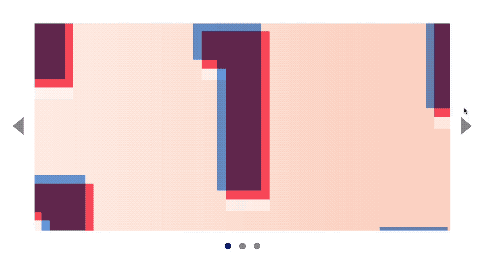
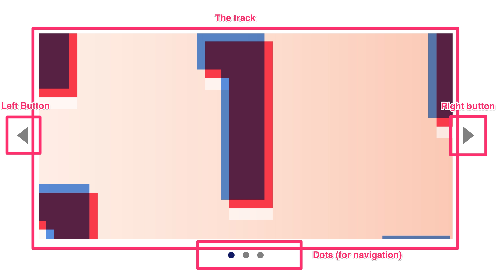
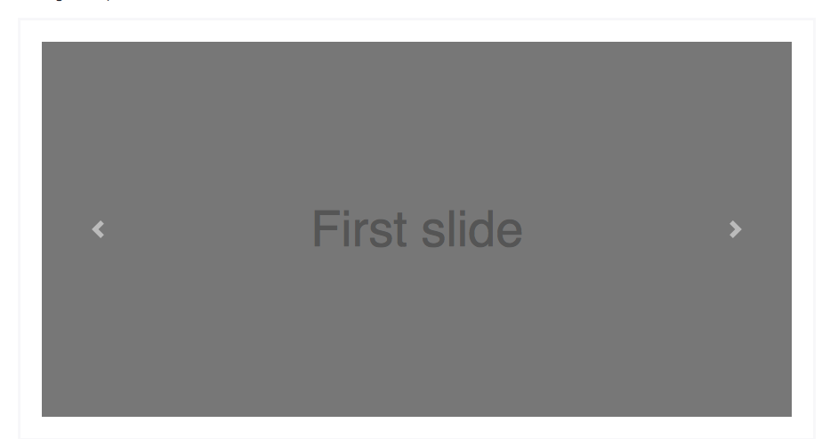
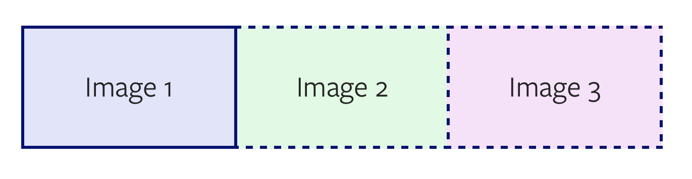
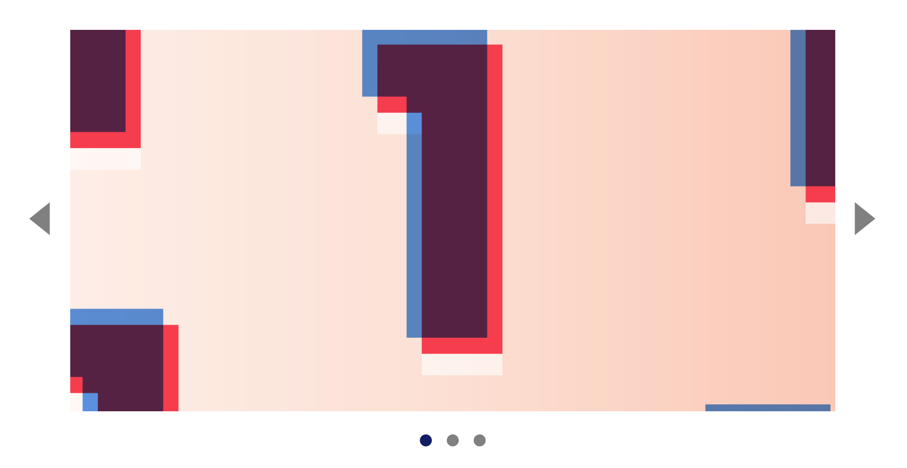
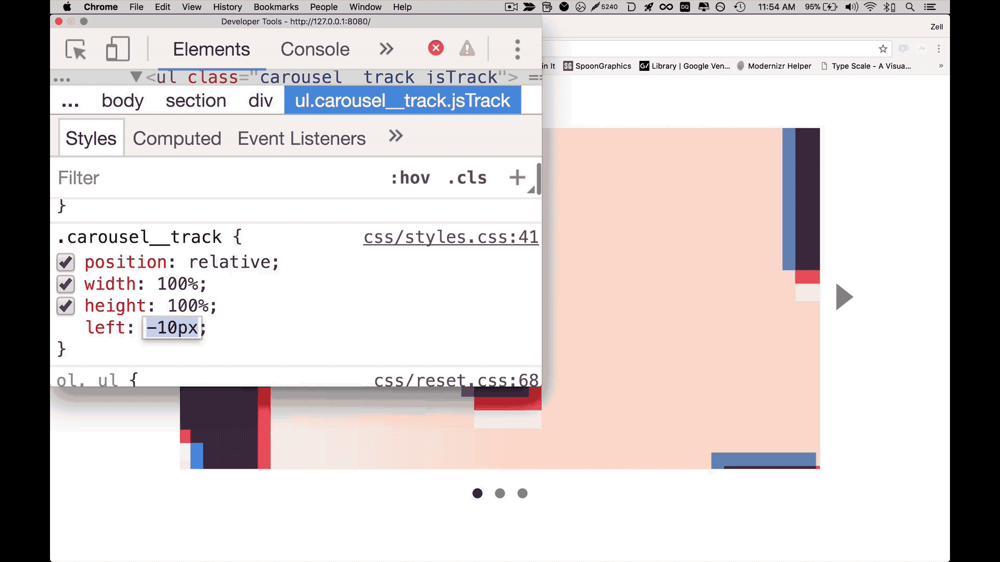
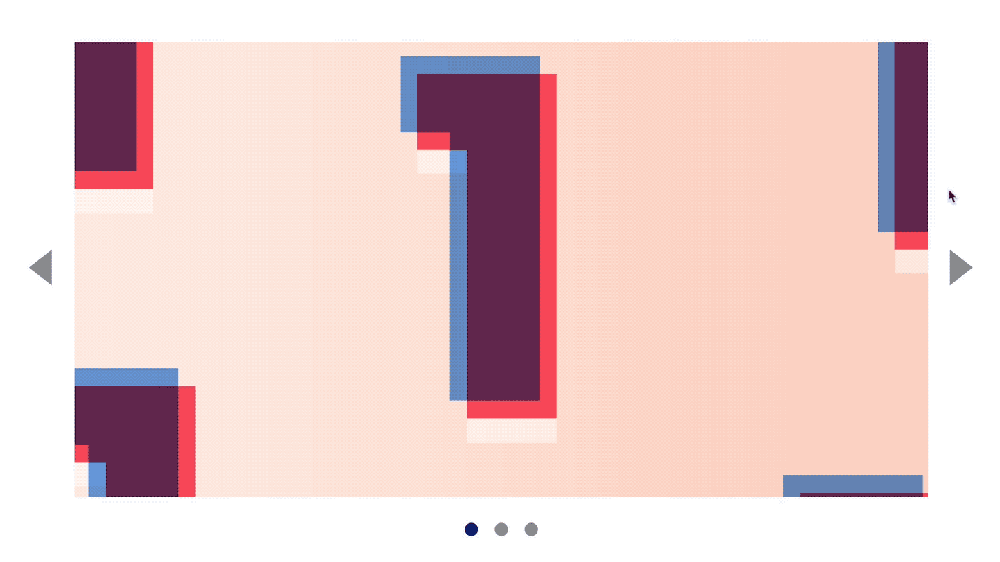
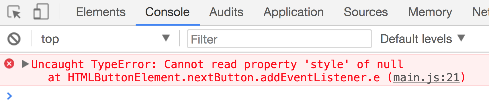
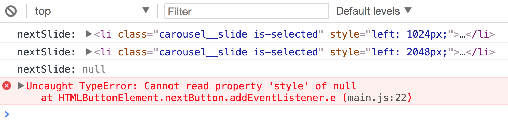

# 🛠 Building a carousel (part 1)

You'll learn to build a carousel in this lesson. Here's what it looks like:

<figure>
  
</figure>


Before continuing, make sure you grab the starter files from the Github repo, in `components/04.carousel/01.starter`.

## Anatomy of a carousel

Carousels, also called sliders, contain a list of content that's often laid in a horizontal manner. They contain four things:

1. A left button
2. A main content area for the carousel—we'll call this a track-container
3. A right button
4. Dots

<figure>
   
   <figcaption>Anatomy of a carousel</figcaption>
 </figure>

To build these four parts, you'll need the following HTML:

```html
<div class="carousel">
  <button class="carousel__button">Left</button>
  <div class="carousel__track-container"> ... </div>
  <button class="carousel__button">Right</button>
  <nav class="carousel__dots">...</nav>
</div>
```

### The track-container

The track container contains a list of content. Let's call each piece of content a **slide**.

Since there's a list of content, you should use a list element (either `<ul>` or `<ol>`).

```html
<div class="carousel__track-container">
  <ul class="carousel__track">
    <li class="carousel__slide"> ... </li>
    <li class="carousel__slide"> ... </li>
    <li class="carousel__slide"> ... </li>
  </ul>
</div>
```

The contents of each slide differs from carousel to carousel. Some carousels, like the example you're going to build, contains images only. Each slide should link to a different page when they're clicked.

Since slides should link to a different page, they should be wrapped with an anchor tag.

```html
<li class="carousel__slides">
  <a href="#link-to-somewhere">
    <!-- Content within the carousel -->
  </a>
</li>
```

### The dots

Dots of a carousel indicate two things:

1. The total number of slides
2. The currently selected slide.

Usually, you can click on a dot to change the currently selected slide. This means each dot should be created with a `<button>` element.

```html
<div class="carousel__dots">
  <button class="carousel__dot"></button>
  <button class="carousel__dot"></button>
  <button class="carousel__dot"></button>
</div>
```

### The selected slide

The carousel has one slide that's always selected. This should be the first slide when your website is loaded; the corresponding dot should be selected too.

```html
<ul class="carousel__track">
  <li class="carousel__slide is-selected"> ... </li>
  <li class="carousel__slide"> ... </li>
  <li class="carousel__slide"> ... </li>
</ul>
```

```html
<div class="carousel__dots">
  <button class="carousel__dot is-selected"></button>
  <button class="carousel__dot"></button>
  <button class="carousel__dot"></button>
</div>
```

## Styling the carousel

CSS for carousels vary depending on how arrows and dots are positioned.

Some carousels have arrows and dots that are positioned above the track. To accomplish this affect, you need set `position: absolute` for dots and arrows.

<figure>
  
  <figcaption>Arrows are positioned on the image for Bootstrap's carousel</figcaption>
</figure>

For the carousel we're building, we'll position arrows outside of the image. The styles have already been done for you.

### Positioning the slides

Slides of a carousel are often placed side by side, as shown in the picture below:

<figure>
  
  <figcaption>Slides are often positioned side by side</figcaption>
</figure>

There are many techniques to position the slides side by side—you can `float` each slides to the left and set a large `width` property on the track; use `flexbox` to create the slides; set `position: absolute` on each slide; etc. There's no best way, so pick the one you like.

In this example, we'll set `position: absolute` on each slide.

```css
.carousel__slide {
  position: absolute;
  top: 0;
  bottom: 0;
  left: 0;
  right: 0;
  width: 100%;
  height: 100%;
}
```

To position the second slide properly, you set the `left` property of the second slide as the width of a slide (let's call this `slideWidth`). If the width is 800px, the `left` property should be 800px.

To position the third slide, you set the `left` property to two `slideWidth`s.

```css
/* The following code applies only if the width of one slide is 800px */
.carousel__slide:nth-child(2) {
  left: 800px;
}

.carousel__slide:nth-child(3) {
  left: 1600px;
}
```

The carousel we built so far is `800px` wide. It doesn't work on a real project because we need the carousel to respond to the width of the browser.

To make carousels responsive, we need to position the slides with JavaScript. We'll get to that in a later lesson.

### Styling the slide content

Since each carousel is a link that can be clicked on, you'll want to make each `<a>` tag fill a slide. You can do so by setting `width` and `height` to inherit since `width: 100%` and `height: 100%` is already present on `.carousel__slide`.

Furthermore, each slide contains images that fills the entire slide. For these images, you can set a `background-image` with a `background-size` of `cover`.

```html
<li class="carousel__slide is-selected">
  <a href="#" style="background-image: url('images/image1.jpg')"> </a>
</li>
```

```css
.carousel__slide > a {
  display: block;
  width: inherit;
  height: inherit;
  background-size: cover;
  background-repeat: no-repeat;
  background-position: center center;
}
```

### Preventing overflow

We know the carousel should only show one slide at a time. You can cut off the second, third, and following slides visually by setting `overflow: hidden` on `.carousel__track-container`.

```css
.carousel__track-container {
  /* ... */
  overflow: hidden;
}
```

<figure>
  
  <figcaption>Carousel is finally styled properly!</figcaption>
</figure>

## Moving the slides

When you click on the next button, the carousel should change to the second slide. Ideally, there should be an animation that moves the second slide from the right to the left. We'll work on the animation in a later module. For now, you need to know how to get the correct slide.

To move the slides, you can change `.carousel__track`'s `left` property. A negative value moves the track to the left and reveals the next slide.

<figure>
  
  <figcaption>You can change the `left` property to reveal subsequent slides</figcaption>
</figure>

To move to the second slide, the `left` property should be set to one `slideWidth` (or `-800px`). To move to the third slide, the `left` property should be set to two `slideWidth`s (or `-1600px`).

## Clicking on the next button

What should happen when a user clicks on the next button?

Let's take time to write down the information you have at this point.

1. You need a user to click the next button, so you need an event listener.
2. When the next button is clicked, carousel should move one slide.
3. When the next button is clicked again, carousel should move to the third slide.

But how does the event listener know whether it should move the carousel to the second slide, or the third slide? You need a clue—you need to know the current slide.

Once you know the current slide, you can determine the next slide and hence change the carousel accordingly.

That's how you think through a development problem that's slightly more complicated.

### Crafting the event listener

First of all, let's add an event listener to the next button.

```html
<button class="carousel__button jsNext">...</button>
```

```js
const nextButton = document.querySelector('.jsNext')
nextButton.addEventListener('click', e => {
  // Move to next slide
})
```

### Finding the next slide

Before continuing, let's use `querySelectorAll` to select the slides in the carousel.

```js
const track = document.querySelector('.carousel__track')
const slides = track.querySelectorAll('li')
```

We know `querySelectorAll` returns a NodeList. We can use the bracket notation to get the nth-item in the list.

- `slides[0]` will be the first slide
- `slides[1]` will be the second slide
- `slides[2]` will be the third slide

From the above, we can see that the next slide (let's call it `nextSlide`) will have an index of 1 if the current slide (let's call it `currentSlide`) has an index of 0.

To get the current index (let's call this `currentIndex`), you can loop through `slides` and search for the slide that contains `.is-selected`.

```js
nextButton.addEventListener('click', e => {
  let currentIndex

  for (let i = 0; i < slides.length; i++) {
    const slide = slides[i]
    if (slide.classList.contains('is-selected')) {
      currentIndex = i
    }
  }

  const currentSlide = slides[currentIndex]
  const nextSlide = slides[currentIndex + 1]
})
```

### Moving to the second slide

To move the carousel to the second slide, we need to move the carousel to the left by `800px`. This `800px` is

The `nextSlide`'s left property is amount you're looking to move the carousel by. Can you figure out why?

```js
nextButton.addEventListener('click', e => {
  // ...
  const amountToMove = nextSlide.style.left
})
```

Then, you move the `track` by the amount. Remember, you need a negative pixel value. To get the negative value, a simple way is to add `-` before `amountToMove`.

```js
nextButton.addEventListener('click', e => {
  // ...
  track.style.left = '-' + amountToMove
})
```

If you click on the next button now, you should get the second slide.

<figure>
  
  <figcaption>Clicking on the next button brings us to the second slide</figcaption>
</figure>

### Moving to the third slide

If you click on the next button again, you'll notice you'll still stay on the second slide. Why?

In the code above, we found the current slide by searching for the `is-selected` class. Even though we've updated the slides visually, we forgot to set `nextSlide` as the selected slide, which is why the event handler thinks the first slide is still the current slide.

We want to update the selected slide by removing `.is-selected` from `currentSlide` and adding it to `nextSlide`.

```js
nextButton.addEventListener('click', e => {
  // ...
  currentSlide.classList.remove('is-selected')
  nextSlide.classList.add('is-selected')
})
```

Now, the carousel moves to the third slide as expected:

<figure>
  
  <figcaption>Clicking on the next button twice brings us to the third slide</figcaption>
</figure>

### Hiding the next button

If you click on the next button a few more times, you'll run into an error (if you're watching the console).

<figure>
  
  <figcaption>An error occurs when you click on the next button more than twice!</figcaption>
</figure>

This error occurs when you're on final slide of the carousel—there are no more slides after the `currentSlide`, so `nextSlide` is `null`. You can change the `style` property of a `null` primitive.

You can verify it easily by logging `nextSlide`.

```js
nextButton.addEventListener('click', e => {
  // ...
  console.log('nextSlide: ', nextSlide)
})
```

<figure>
  
  <figcaption>Logging the error</figcaption>
</figure>

We want to prevent the user from clicking the next button when the carousel gets on the final slide. That means we need to hide the button when `nextSlide` is the final slide.

To check if the nextSlide is the final slide, you can test if there's another `nextElementSibling`. If there is another `nextElementSibling`, `nextSlide` is the not the final slide.

```js
nextButton.addEventListener('click', e => {
  // ...
  let isFinalSlide = false

  if (!nextSlide.nextElementSibling) {
    isFinalSlide = true
  }
})
```

Since you only need a truthy or falsey value, you can shorten `isFinalSlide` to the following, which is easier on the eyes:

```js
nextButton.addEventListener('click', e => {
  // ...
  const isFinalSlide = !nextSlide.nextElementSibling
})
```

If the next slide is the final slide, you want to hide the next button. To do so, you can add a `is-hidden` class.

```js
nextButton.addEventListener('click', e => {
  // ...
  if (isFinalSlide) {
    nextButton.classList.add('is-hidden')
  }
})
```

```css
.is-hidden {
  display: none;
}
```

### Updating the dots

The final thing you need to do is update the selected dot when the next button is clicked. To do so, you remove the `is-selected` class from the current dot and add it to the next dot.

```html
<div class="carousel__nav jsDotContainer">...</div>
```

```js
nextButton.addEventListener('click', e => {
  // ...
  const dotContainer = document.querySelector('.jsDotContainer')
  const currentDot = dotContainer.querySelector('.is-selected')
  const nextDot = currentDot.nextElementSibling
  currentDot.classList.remove('is-selected')
  nextDot.classList.add('is-selected')
})
```

## Let's take a pause

We've covered a lot in this lesson. You learned to build the carousel, style it the make sure it looks right initially, and implement the functionality for the next button.

But we're not done yet. In the next lesson, you'll learn to add functionality to the previous button and the dots.

Before jumping into the next lesson, take time to build what you've learned here yourself. Redo the lesson until you're able to create the next button functionality on your own.

Then, give yourself a chance to try building the interaction for the previous button and the dots.

---

- Previous Lesson: [Building tabs](08.building-tabs.md)
- Next Lesson: [Building carousel (part 2)](09.building-carousel-2.md)
