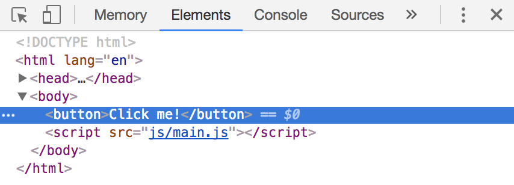

# Events in JavaScript

An event in JavaScript tells you that something has happened. For example, if a user clicks on something, a `click` event is triggered. If a hits a key on their keyboard, `keydown` and `keyup` events are triggered.

Mozilla Developer Network (MDN) contains an [Event Reference](https://developer.mozilla.org/en-US/docs/Web/Events) that lists all possible events you can trigger.

Don't worry about knowing everything on the list right now. You'll learn to use them as you go through the course.

## Listening for events

To know if an event is triggered, you need to **listen** for an event. To do so, you need an **event listener**.

You can add (or attach) event listeners with the following syntax:

```js
Element.addEventListener('event-name', callback)
```

`Element` refers to the HTML Element you've selected. It can also be `document`.

`event-name` refers to the name of the event you're listening for. You can see a complete list in MDN's [Event Reference](https://developer.mozilla.org/en-US/docs/Web/Events).

`callback` refers to the function you execute when the event gets triggered.

Let's go through an example.

## Listening for a click

Let's say you want to know when a user clicks on a button.

<figure>
  
  <figcaption>A button</figcaption>
</figure>

To know when the event is triggered, you need to attach a `click` event listener to the button. For now, let's log a message into the console when the button is clicked.

```js
const button = document.querySelector('button')
button.addEventListener('click', function () {
  console.log('Button is clicked')
})
```

Now, whenever you click on the button, JavaScript logs `Button is clicked` into the console.

<figure>
  
  <figcaption>Logging a click</figcaption>
</figure>

## Does the listener exist?

You can verify the existence of event listeners with Chrome's or Firefox's devtools.

**For Chrome Devtools**, you can use `getEventListener(node)`. This function is only available within the console.

If you open up the console and looked for the button element, you should be able to see the number and type and attached to the node.

<figure>
  
  <figcaption>getEventListeners tells you the number an listeners attached to an Element.</figcaption>
</figure>

To make the process easier, you can click on the Element you wish to inspect (the button in this case) in the Elements tab.

<figure>
  
  <figcaption>Click on the Element to make the inspection process easier</figcaption>
</figure>

Once you click on an Element, Chrome allows you to access that element with `$0` in the console:

<figure>
  
  <figcaption>You can access the selected Element with $0</figcaption>
</figure>

You can then use `$0` to check the existence of event listeners:

<figure>
  
  <figcaption>Checking the existing of event listeners with $0</figcaption>
</figure>

**For Firefox devtools**, open up the Inspector tab. If an event is present on the Element, you'll see a tiny `ev` icon on the same line as the opening tag of the Element.

<figure>
  
  <figcaption>Firefox has shows you an ev icon for any element that has event listeners attached to it</figcaption>
</figure>

When you click on the `ev` icon, Firefox tells you more details about the event listeners attached to it.

<figure>
  
  <figcaption>Clicking on the ev shows you details about events attached to the Element</figcaption>
</figure>

You can then click on it again to see the code used for the event listener.

<figure>
  
  <figcaption>Clicking on event listener details shows you the code used</figcaption>
</figure>

## Changing the DOM through events

Let's say you want to change the body background-color to `#99aefa` and the button background-color to `#bada55`.

You can do this:

```js
const button = document.querySelector('button')
button.addEventListener('click', function () {
  const body = document.body
  body.style.backgroundColor = '#99aefa'
  button.style.backgroundColor = '#bada55'
})
```

<figure>
  
  <figcaption>Changing the DOM through events</figcaption>
</figure>

## Click to change, click again to revert

Let's say you want to revert the body background-color to `transparent` and button background-color to `#1ce` when you click on the button a second time.

One way is to create a variable that tracks if the button has been clicked.

If the button gets clicked once, this variable is set to true. If the button gets clicked a second time, this variable is set to false.

```js
const button = document.querySelector('button')
let isClicked = false

button.addEventListener('click', function () {
  const body = document.body

  if (isClicked) {
    // Reverts styles if isClicked is true
    body.style.backgroundColor = 'transparent'
    button.style.backgroundColor = '#1ce'
    isClicked = false
  } else {
    // Sets styles if isClicked is false
    body.style.backgroundColor = '#99aefa'
    button.style.backgroundColor = '#bada55'
    isClicked = true
  }
})
```

<figure>
  
  <figcaption>Sets body background-color and button background-color when the button is clicked. Revert these styles when the button is clicked again.</figcaption>
</figure>

The code above is a great start. You can improve it in two ways:

First, you can avoid an externally-declared variable like `isClicked` and find a way to determine the status of the button directly within the callback.

Second, you can revert the background-color of both the body and button without having to explicitly write them in JavaScript since they're already declared in the CSS.

## A better way to revert changes

A better way is use classes to tell the state of the component. When the button gets clicked for the first time, you can add a class to it, and let CSS take care of the styles.

When you do so, you separate functionality with presentation, which is a good practice when creating components.

```css
body.button-is-clicked {
  background-color: #99aefa;
}

button.is-clicked {
  background-color: #bada55;
}
```

```js
const button = document.querySelector('button')

button.addEventListener('click', function () {
  const body = document.body
  body.classList.add('button-is-clicked')
  button.classList.add('is-clicked')
})
```

<figure>
  
  <figcaption>You can use classes to separate functionality and presentation</figcaption>
</figure>

When the button gets clicked for a second time, you check whether the button already has the `is-clicked` class.

If it does, you remove the `is-clicked` class to revert the background colors to their original state.

If it doesn't you add the `is-clicked` class to set the new state.

```js
button.addEventListener('click', function () {
  const body = document.body

  if (button.classList.contains('is-clicked')) {
    body.classList.remove('button-is-clicked')
    button.classList.remove('is-clicked')
  } else {
    body.classList.add('button-is-clicked')
    button.classList.add('is-clicked')
  }
})
```

<figure>
  
  <figcaption>Reverting styles with classes</figcaption>
</figure>

## Exercise

Practice adding event listeners and getting them to do things. You'll use them a lot when you write components. Do the following:

1. Write an `click` event listener. Log something into the console so you know the listener works.
2. Check the existence of the listener with Chrome Devtools
3. Check the existence of the listener with Firefox's devtools
4. Add a class to the component when it is clicked. Remove a class from the component when it is clicked again.
5. Add a custom attribute to the component when it is clicked. Remove the custom attribute when the component is clicked again.
