# Event propagation

When an event triggers, three phases occur:

1. The capturing phase
2. The target phase
3. The bubbling phase

Together, they're called **event propagation**.

## The capturing phase

The capturing phase comes first. In this phase, JavaScript goes through `Window`, `document`, followed by every HTML Element until it reaches the target of the event.

<figure>
  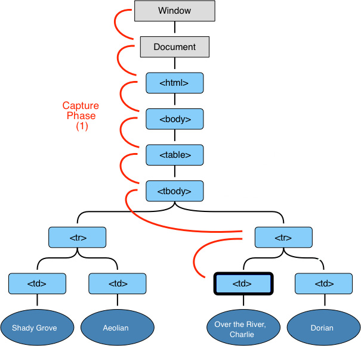
  <figcaption>The capturing phase</figcaption>
</figure>

In the capturing phase, only event listeners with the `useCapture` flag (an optional boolean) will trigger.

You didn't learn about the `useCapture` flag previously since it's rarely used in production.

```js
Element.addEventListener('event-name', callback, true)
```

To verify the occurrence of the capturing phase, you can build a demo with three nested `<div>`, like this:

<figure>
  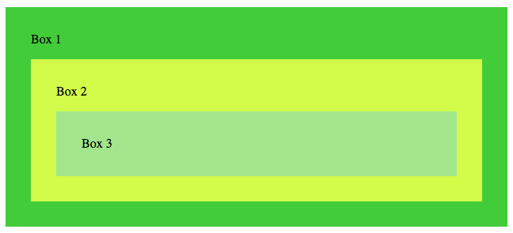
  <figcaption>A demo for understanding event propagation</figcaption>
</figure>

```html
<div class="box box1">
  <span>Box 1</span>
  <div class="box box2">
    <span>Box 2</span>
    <div class="box box3"> <span>Box 3</span> </div>
  </div>
</div>
```

If you add event listeners to every `<div>` element, you can use the `Event.currentTarget` and `Event.eventPhase` properties to check that the capturing phase occurs.

```js
const listener = e => console.log(e.eventPhase, e.currentTarget)

const boxes = document.querySelectorAll('.box')
boxes.forEach(box => box.addEventListener('click', listener, true))
```

If `Event.eventPhase` returns 1, you're in the capturing phase. If it returns 2, you're in the target phase. If it returns 3, you're in the bubbling phase.

Try clicking on any of the boxes and notice what comes up in your console.

<figure>
  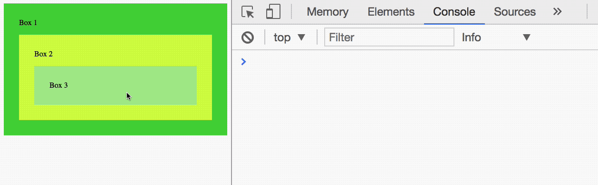
  <figcaption>Capturing events trigger event listeners with useCapture</figcaption>
</figure>

I clicked on `.box3` in the gif above. You can see that the events are fired such in this order:

1. Box 1, capturing phase
2. Box 2, capturing phase
3. Box 3, target phase

## The target phase

The target phase comes right after the capturing phase. In this phase, JavaScript reaches the target Element and triggers all event listeners attached to it, regardless of whether the useCapture flag is present.

<figure>
  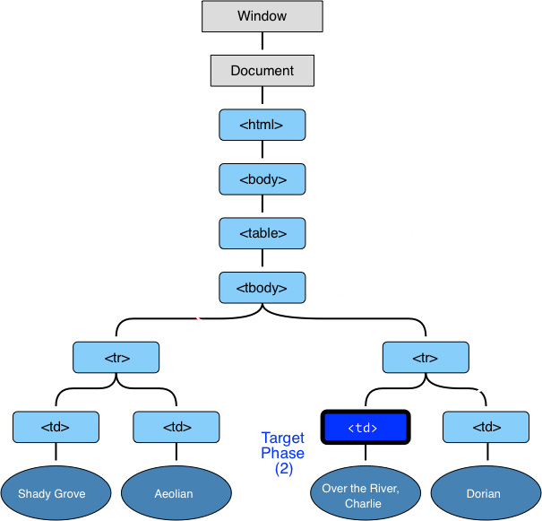
  <figcaption>The target phase</figcaption>
</figure>

```js
const box3 = document.querySelector('.box3')
box3.addEventListener('click', listener, true)
box3.addEventListener('click', listener)
```

<figure>
  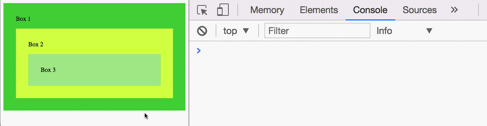
  <figcaption>The target phase triggers all events regardless of useCapture</figcaption>
</figure>

In gif above, you can see that the target phase activates event listeners regardless of whether `useCapture` is present.

## The bubbling phase

The **bubbling phase** comes last. In this phase, JavaScript goes through every HTML Element, starting from the target, back to `Window`.

<figure>
  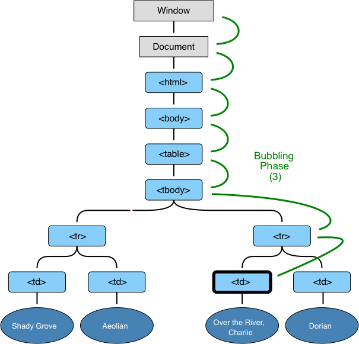
  <figcaption>The bubbling phase</figcaption>
</figure>

In this phase, only event listeners *without* the `useCapture` flag will trigger:

```js
const listener = e => console.log(e.eventPhase, e.currentTarget)

const boxes = document.querySelectorAll('.box')
boxes.forEach(box => box.addEventListener('click', listener))
```

<figure>
  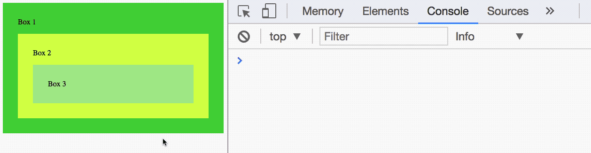
  <figcaption>Bubbling events trigger event listeners without useCapture</figcaption>
</figure>

You can see from the gif above that the events follow in this sequence:

1. Box 3, target phase
2. Box 2, bubbling phase
3. Box 1, bubbling phase

## Events that bubble

Events that bubble have a `bubbles` property set to `true`. An example is a `click` event:

<figure>
  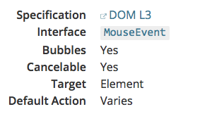
  <figcaption>Information on the click event on MDN</figcaption>
</figure>

Not all events bubble. Examples of such events are `blur` and `focus`.

<figure>
  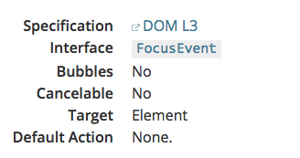
  <figcaption>Information on the focus event on MDN</figcaption>
</figure>

## Event firing sequence

If multiple event listeners are attached to the same Element, the event listener that is attached first fires first.

```js
const button = document.querySelector('button')
button.addEventListener('click', e => console.log('First event'))
button.addEventListener('click', e => console.log('Second event'))
```

<figure>
  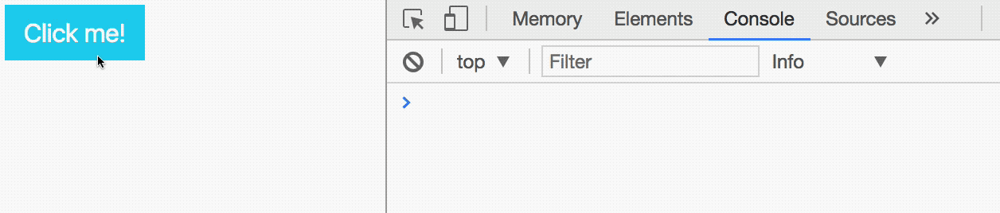
  <figcaption>Event Listeners are fired in the order they are attached</figcaption>
</figure>

## Preventing bubbling

If you want to prevent an event from bubbling upwards, you can use `Event.stopPropagation` or `Event.stopImmediatePropagation`.

```js
// Stopping propagation
const box2 = document.querySelector('.box2')
const box3 = document.querySelector('.box3')

box2.addEventListener('click', e => consol.log('box 2 clicked!'))
box3.addEventListener('click', e => e.stopPropagation())
```

<figure>
  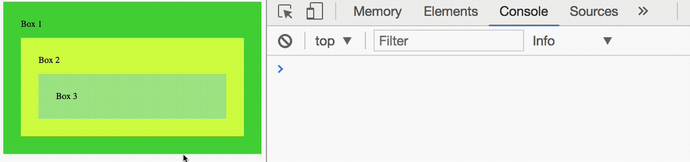
  <figcaption>Propagation stopped for box 3</figcaption>
</figure>

In the gif above, the `click` event will not bubble up from `.box3` to `.box2` because you stopped the event from propagating with `Event.stopPropagation`.

`Event.stopImmediatePropagation` is similar to `Event.stopPropagation`. In addition to preventing events from bubbling upwards, `Event.stopImmediatePropagation` also prevents subsequent event listeners on the listening element from firing.

## Exercise

Familiarize yourself with the sequence of events that occur.

1. Try adding an event listener in the capturing phase
2. Try adding an event listener in the bubbling phase

Answer these questions:

1. Which phase comes first? The capturing phase or the bubbling phase?
2. What event listeners are fired in the capturing phase?
3. What event listeners are fired in the target phase?
4. What event listeners are fired in the bubbling phase?