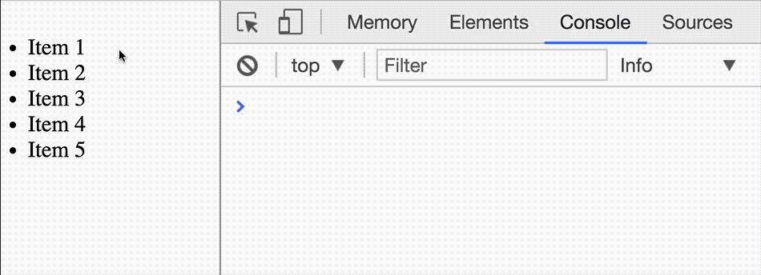
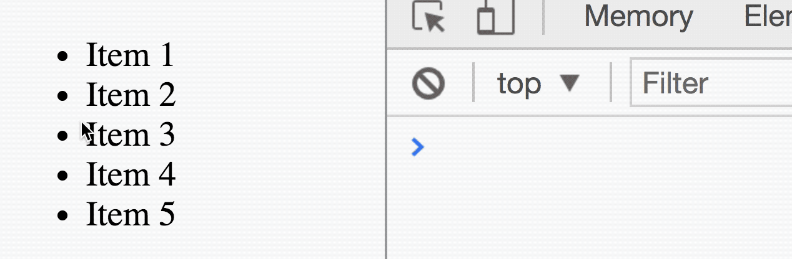

# Event delegation

Lets say you have a list of items. How would you listen for a `click` event on each item?

One possible way is to attach an event listener to each item in the list. This method works great if you only monitor a small number of items. (since Event listeners take up memory).

If you need to monitor a large number of items, you'll want to use the event delegation pattern instead.

## Event delegation pattern

The event delegation pattern is a pattern where you attach one event listener to an ancestor element. This listener listens for events in descendant elements. This pattern only works for events that bubble.

For example, let's say you have a list of items. To listen for the `click` event on each item, you can attach an event listener to the list container.

```html
<ul>
  <li>Item 1</li>
  <li>Item 2</li>
  <li>Item 3</li>
  <li>Item 4</li>
  <li>Item 5</li>
</ul>
```

```js
const list = document.querySelector('ul')
list.addEventListener('click', e => {
  // Do something when list is clicked on
})
```

The element that fires the event (the target that was clicked on) can be found with `event.target`.

```js
list.addEventListener('click', e => console.log(e.target))
```

<figure>
  
  <figcaption>The clicked target can be found with event.target</figcaption>
</figure>

Since you added the event listener on the `ul` element, the `event.target` can also point to the `ul` element if it was clicked.

<figure>
  
  <figcaption>You might get the wrong element when you use event.target</figcaption>
</figure>

What you can to do is verify that the target is indeed the list element with `Element.matches`. `Element.matches` takes in a selector and checks if the selected element contains the selector.

```js
Element.matches(selector)
```

This way, you can ensure you only do something when the target you're interested in is clicked on.

```js
list.addEventListener('click' e => {
  if (e.target.matches('li')) {
    console.log(e.target)
  }
})
```

## Nested elements in the target

If you have nested elements in your intended target, `e.target` will trigger on these nested elements instead. For example, let's say you have a button with an icon:

```html
<button>
  <svg> <!-- Gear icon --> </svg>
  <span>Click me!</span>
</button>
```

```js
const button = document.querySelector('button')
button.addEventListener('click', e => console.log(e.target))
```

If you click on the gear icon, `event.target` would be the gear icon. If you click on the "Click me!" word, the `event.target` would be the word. That's not good.

<figure>
  
  <figcaption>event.target can fire for inner elements if you're not careful</figcaption>
</figure>

One way to fix this is to use `Element.closest` to search for the Element you intend to target:

```js
button.addEventListener('click', e => {
  const button = e.target.closest('button')
  if (button) {
    // Do something with button
  }
})
```

Alternatively, you can also set `pointer-events: none;` all children of the button element. This way, they will never become the target for any mouse event.

```css
button > * {
  pointer-events: none;
}
```

```js
button.addEventListener('click', e => console.log(e.target))
```

## Exercise

Here's a list of famous people. Create an event listener that uses the event delegation pattern. Log the `li` element of the person you've clicked into the console.

```html
<ul>
  <li><a href="#">Benjamin Franklin</a></li>
  <li><a href="#">Thomas Edison</a></li>
  <li><a href="#">Franklin Roosevelt</a></li>
  <li><a href="#">Napolean Bonaparte</a></li>
  <li><a href="#">Abraham Lincoln</a></li>
</ul>
```

