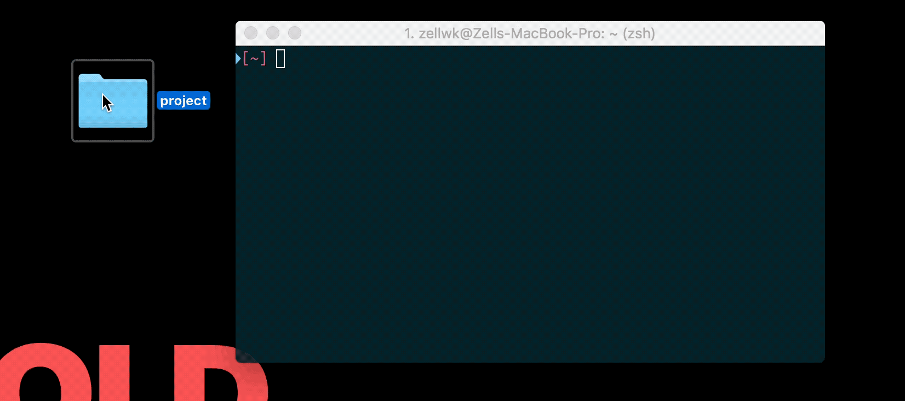
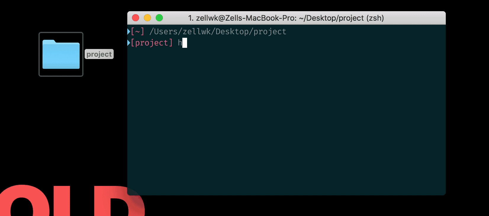

# A starter template

I've built a starter-template for you for the projects in this course. You can find it under `components/_starter-template-basic/` in the Github folder.

This starter template contains the necessary `<meta>` tags you need, like `<meta charset="UTF-8">` (which sets the default character encoding) and `<meta name="viewport" content="width=device-width, initial-scale=1">` (which allows hi-density devices to display screens at their device width), amongst others.

Besides the `<meta>` tags, the starter template also links to `normalize.css` (which irons out differences in CSS by different browsers), `reset.css` (which is the base CSS where I start all my projects with) and `styles.css` (which is the file you'll use for your projects).

Finally, it links to two JavaScript files—`prefixfree.js` (which lets you write CSS without writing vendor prefixes) and `main.js` (where you write your JavaScript).

## Don't use this starter template for production

The starter template doesn't help you minify and join like CSS or JavaScript files into a single package, which is one of the best practices for building fast-loading sites.

To create an automated workflow for production, I recommend you read [Automate Your Workflow](https://automateyourworkflow.com).

## Using the Simple Starter Template

You need to have Node installed onto your system before you use this. If you don't have it yet, you can grab it over on [Node's website](https://nodejs.org/en/) (get the current version).

Once you have Node installed, run the following command to install `http-server`. (You see why you need http-server in the next section).

```bash
npm -g install http-server
```

For Mac users, you'll need to include a `sudo` keyword before the command:

```bash
sudo npm -g install http-server
```

Then, download the template onto your computer, navigate into it in your terminal. If you're on a Mac, you can do this by dragging the folder into your Terminal:

<figure>
  
  <figcaption>To navigate to a folder, you can drag it into the terminal, then hit the enter key. </figcaption>
</figure>

Alternatively, you can learn to use the Command (the `cd` command would do) line via [this tutorial](https://zellwk.com/blog/fear-of-command-line/).

Once you're in the folder, run `http-server`, and you'll be able to navigate to `127.0.0.1:8080` to view the project; you can navigate to the second link (`10.0.1.5:8080` in my case) if you want to view the project through another device, like a phone or tablet.

<figure>
  
  <figcaption>Once you run http-server, you can copy-paste the addresses that appear to see your project.</figcaption>
</figure>

## Why use http-server?

There are two reasons.

First, `http-server` lets you see your project through a `http://` address (compared to a `file://` address if you view the `index.html` directly).

When you view your project through a `http://` address, browsers would treat your project as if it's hosted on a real server somewhere on the internet. That means the inconsistencies between `file://` and `http://` won't affect you.

Second, [prefix-free](https://leaverou.github.io/prefixfree/)—the JavaScript that lets you write CSS without vendor prefixes—require your website to be served through `http://` address.

We use prefix-free because we want to focus on HTML, CSS and JavaScript without the use of any development tools.

For real projects, you might want to swap out prefix-free for autoprefixer (which adds vendor prefixes directly into your CSS file, without the use of JavaScript on the browser). To do so, you can consult [Automate Your Workflow](https://automateyourworkflow.com).