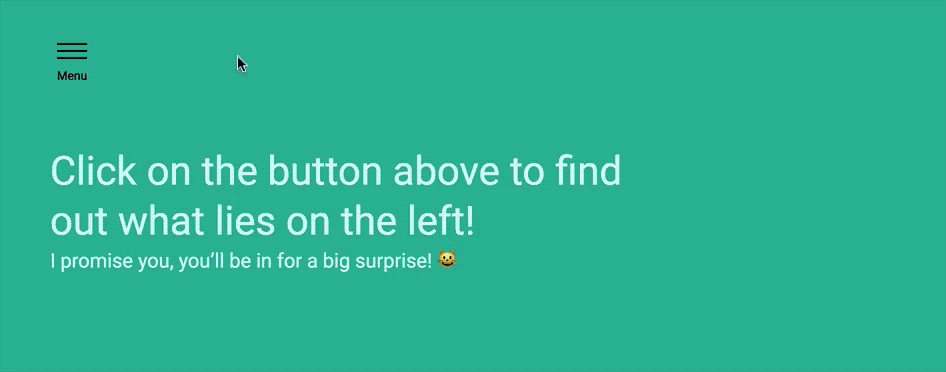

# 🛠️ Building an off-canvas menu

In this lesson, you'll learn to build an off-canvas menu. Here's what you're going to build:

<figure>
  
</figure>

Before continuing, make sure you grab the starter files in the Github repo, under `components/01.off-canvas-menu/01.starter`.

## How to build this component – the general idea

An off-canvas menu is a menu that is placed outside the screen (or the canvas). It looks like this:

<figure>
  
  <figcaption>Off-canvas menu is placed outside the visible viewport</figcaption>
</figure>

To make this menu work, you need to push the screen to the right when the button is clicked.

When the button is clicked again, you want to push the screen back to the left.

That means you need to:

1. Add an event listener to the button.
2. Event listener must push screen to the right when button is clicked.
3. Event listener must push screen back to the left when the button is clicked again.

## Adding the event listener

Begin by writing the event listener. To do so, you need to select the button with `querySelector`.

```js
const button = document.querySelector('.menu-button')
```

Getting the button with `.menu-button` is okay at this point. As you work with other developers, you might want to use a dedicated JavaScript class, like `.jsOffsiteToggle`, to ensure they don't break the component accidentally when they refactor the code.

```html
<button class="menu-button jsOffsiteToggle"> ... </button>
```

```js
const offsiteToggle = document.querySelector('.jsOffsiteToggle')
offsiteToggle.addEventListener('click' e => console.log('push the screen!'))
```

## Pushing the screen

When the button is clicked, you want to push the screen to the right. The easiest way to do so is to add a class to the `<body>` element. When the class is present, you know the menu is open. And when the menu is open, you want to push the screen to the right.

Let's call this class `.offsite-is-open`.

```js
// document.body is the same as document.querySelector('body')
offsiteToggle.addEventListener('click' e => document.body.classList.add('offsite-is-open'))
```

Pushing the screen to the right is tricky. What comes to your mind immediately might be to set a `left` property on the body, like this:

```css
body.offsite-is-open {
  position: relative;
  left: 14rem;
}
```

This doesn't work, as you can tell.

<figure>
  
  <figcaption>Setting the left property doesn't reveal the off-canvas menu</figcaption>
</figure>

Instead of pushing the body, you need to push the containing elements – both the canvas and the offsite canvas – simultaneously to the right. The best way to push elements is to use the `transform` property.

```css
/* The canvas */
.offsite-is-open .site-container {
  transform: translateX(14rem);
}

/* The offsite canvas */
.offsite-is-open .offsite-container {
  transform: translateX(14rem);
}
```

This works!

<figure>
  
  <figcaption>Pushing the containers reveal the off-canvas menu</figcaption>
</figure>

## Pushing the containers back

Now, when the button is clicked again, you want to push the screen back to the left. Here, you need to remove the `.offsite-is-open` class.

To do this, you can check if the body already has the `offsite-is-open` class. If the class is present, you want to remove it, reverting the screen back to its original position. If the class is not present, you want to add it so the button can push the screen to the right.

```js
offsiteToggle.addEventListener('click' e => {
  const bodyClass = document.body.classList
  if (bodyClass.contains('offsite-is-open')) {
    bodyClass.remove('offsite-is-open')
  } else {
    bodyClass.add('offsite-is-open')
  }
})
```

Alternatively, you can use the `toggle` method.

```js
offsiteToggle.addEventListener('click' e => document.body.classList.toggle('offsite-is-open'))
```

And it works!

<figure>
  
</figure>

You're done for this lesson, but what you have isn't the best code yet. You'll learn to improve as you go through the course. Stick to what's good enough for now and move on.