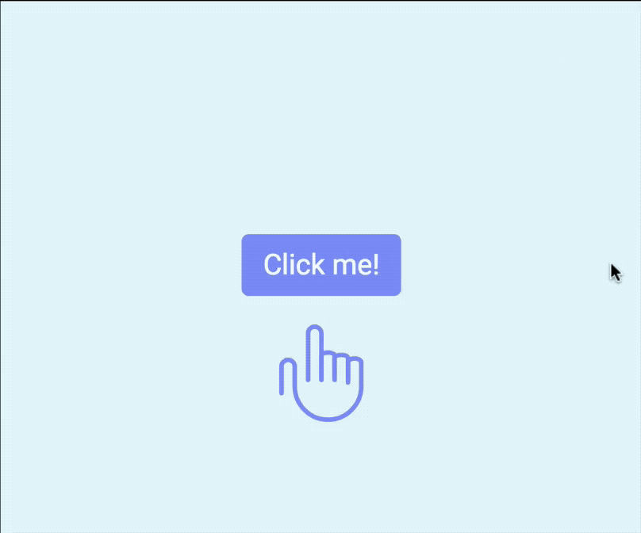
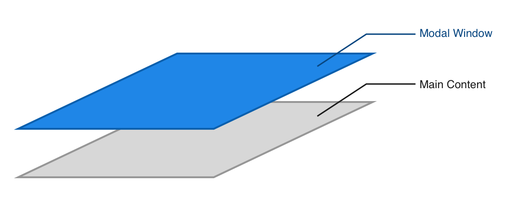

# 🛠 Building a modal window

In this lesson, you'll learn to build a modal window. Here's what you're going to build:

<figure>
  
  <figcaption>Completed modal interaction</figcaption>
</figure>

Before continuing, make sure you grab the starter files in the Github repo, under `components/02.modal/01.starter`.

## ## How to build the modal window – the general idea

A modal window is a component that's invisible to the eyes. It opens up when an event occurs. When it opens, the modal window becomes visible and lies at the top of your screen.

<figure>
  
  <figcaption>Modal window appears over main content when it is visible</figcaption>
</figure>

When the modal window is closed, it becomes invisible. At this point, it cannot remain at the top layer, or users won't be able to interact with your actual content. So, the modal window needs to return to a layer beneath the normal content.

<figure>
  
  <figcaption>Modal window appears below main content when it's invisible</figcaption>
</figure>

That means you need to:

1. Add event listeners to open or close the modal
2. When the modal is opened, you need to push the modal to a higher layer and make it visible.
3. When the modal is closed, you need to make the modal invisible and return it to a lower layer.

Adding the event listener is the easy part in this lesson. The harder part is to consider what happens to the HTML and CSS when the modal is opened or closed. Let's start there.

## Building the modal

The modal needs to appear above the normal content when it is opened. This means the modal must be a separate layer by itself. Your HTML should look like this:

```html
<div class="container"><!-- Normal content --></div>
<div class="modal-container"><!-- Modal content --></div>
```

This structure has already been created for you in the starter file.

Before moving on, you'll want to decide on how you'll open the modal. As much as possible, you want to *change a single class* in your HTML and let that class inform everything else. In this case, the perfect location for this class change is the `<body>` element because it's the parent of both `.container` and `.modal-container`. Let's call this class `modal-is-open`.

To simulate a modal that's already opened, you can add the class `modal-is-open` into the `<body>` element. To simulate a modal that's closed, you remove the class `modal-is-open` from the `<body>` element.

```html
<!-- Opening the modal should be as simple as adding a class -->
<body class="modal-is-open"> ... </body>
```

Since the modal needs to be one layer above or below the main content (depending on whether the modal is open or closed), you need to tweak the `z-index` property. For that to happen, you need to add a `position` property to your modal.

```scss
.modal-container {
  position: fixed;
  top: 0;
  bottom: 0;
  left: 0;
  right: 0;
  z-index: -1;
}

.modal-is-open .modal-container {
  z-index: 1;
}
```

You'll also want to hide the modal when it is closed so you can't see anything the modal holds. To do so, you can use the opacity property.

```css
.modal-container {
  opacity: 0;
  /* other properties */
}

.modal-is-open .modal-container {
  opacity: 1;
  /* other properties */
}
```

Optionally, if you may add a subtle change in background color with the `background-color` property too.

```css
.modal-container {
  background-color: rgba(0, 0, 0, 0.25);
  /* other properties */
}
```

Now, if you add the `modal-is-open` class to the `<body>`, you should see the modal open up. When you remove the `modal-is-open` class from the `<body>`, you should see the modal window close.

(Note: For this modal, I did not add a background color since the design didn't call for it).

<figure>
  
  <figcaption>Modal opens when you add a the modal-is-open class to the body element</figcaption>
</figure>

That's how you build a modal window. Next up, let's add event listeners to activate the modal.

## Activating the Modal

The modal needs to be activated by the button you see on the screen. Let's give it a `jsModalToggle` class.

```html
<button class="jsModalToggle">Click me!</button>
```

```js
const toggleButton = document.querySelector('.jsModalToggle')
```

When you click on the button, you want JavaScript to add the `modal-is-open` class to the `<body>` tag just like how we've created the modal so far.

```js
toggleButton.addEventListener('click', _ => {
  document.body.classList.add('modal-is-open')
})
```

<figure>
  
  <figcaption></figcaption>
</figure>

Sweet. You've activated the modal window. How do you close it now, since the button is now covered?

## Closing the modal

One way to close the modal is to wait for a user to click on the X located at the top right of the modal. Let's give the X a `jsModalClose` class.

```html
<div class="modal__close jsModalClose"> ... </div>
```

When the X is clicked, you want to remove the `modal-is-open` class, which closes the modal window.

```js
const closeButton = document.querySelector('.jsModalClose')

closeButton.addEventListener('click', _ => {
  document.body.classList.remove('modal-is-open')
})
```

<figure>
  
  <figcaption>Modal window closes when the close button is clicked</figcaption>
</figure>

## Closing the modal (part 2)

Another way (if you wish to allow it) is to close the modal when the user clicks outside the modal content, like this:

<figure>
  
  <figcaption>Modal closes when the a user clicks outside the modal</figcaption>
</figure>

To do so, you need to add a `click` event listener to the `.modal-container`. Since JavaScript is involved, let's also give a `jsModalContainer` class to the `.modal-container`.

```html
<div class="modal-container jsModalContainer">...</div>
```

```js
const overlay = document.querySelector('.jsModalContainer')

overlay.addEventListener('click', _ => {
  document.body.classList.remove('modal-is-open')
})
```

This works. The modal window closes when you click on the overlay (`.modal-container`).

Unfortunately, the modal window also closes when you click on the modal content! This is unexpected and highly disruptive. You don't want the modal to close when someone clicks on the content because people tend to click around when they read.

<figure>
  
  <figcaption>Modal closes when content is clicked, but this should not happen!</figcaption>
</figure>

Can you guess why the modal window closes with the current code?

The reason is because `click` is an event that bubbles upwards. It bubbles from the `.modal__content` up to the `.modal-container`.

To prevent the `click` event from bubbling upwards, you need to stop its propagation. You can stop its propagation anywhere on the target itself or any of its ancestor elements. In this case, stopping the propagation on `.modal` is ideal because `.modal` is the container that creates the visual modal window.

```html
<div class="modal jsModal"> ... </div>
```

```js
const modal = document.querySelector('.jsModal')

modal.addEventListener('click', e => e.stopPropagation())
```

## Cleaning up the code

At this point, you may have realized that the event listeners added to `closeButton` and `overlay` are exactly the same:

```js
closeButton.addEventListener('click', _ => {
  document.body.classList.remove('modal-is-open')
})

overlay.addEventListener('click', _ => {
  document.body.classList.remove('modal-is-open')
})
```

This is not ideal because you're repeating yourself. Since this code exists more than once, you can abstract them into a separate function. Let's call this function `closeModal`, which describes exactly what the code within should do.

```js
const closeModal = _ => document.body.classList.remove('modal-is-open')

overlay.addEventListener('click', closeModal)
closeButton.addEventListener('click', closeModal)
```

Ah, much better now.

Optionally, you may also want to create a `openModal` function since it reads much easier than `document.body.classList.add('modal-is-open')`. Abstracting single-use code into a readable function like what we've done here is also a common practice that helps with code readability.

```js
const openModal = _ => document.body.classList.add('modal-is-open')

toggleButton.addEventListener('click', openModal)
```

## Wrapping up

With this, you're done for the lesson. In this lesson, you learned how to construct a Modal window and how to build one up with CSS and JavaScript.

As you can already see by now, quite a bit thought needs to go into the CSS when you create the modal. Doing so allows you to write simple JavaScript where you change a single class and the entire component works.

You've also learned to use `event.stopPropogation` and how to abstract code into readable functions.