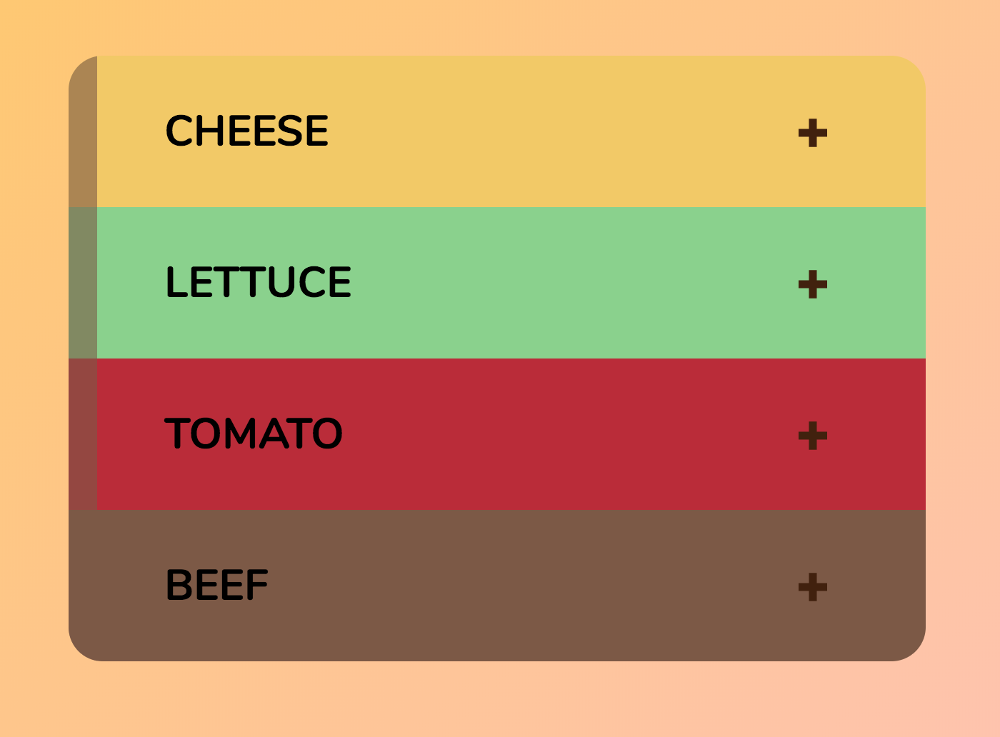
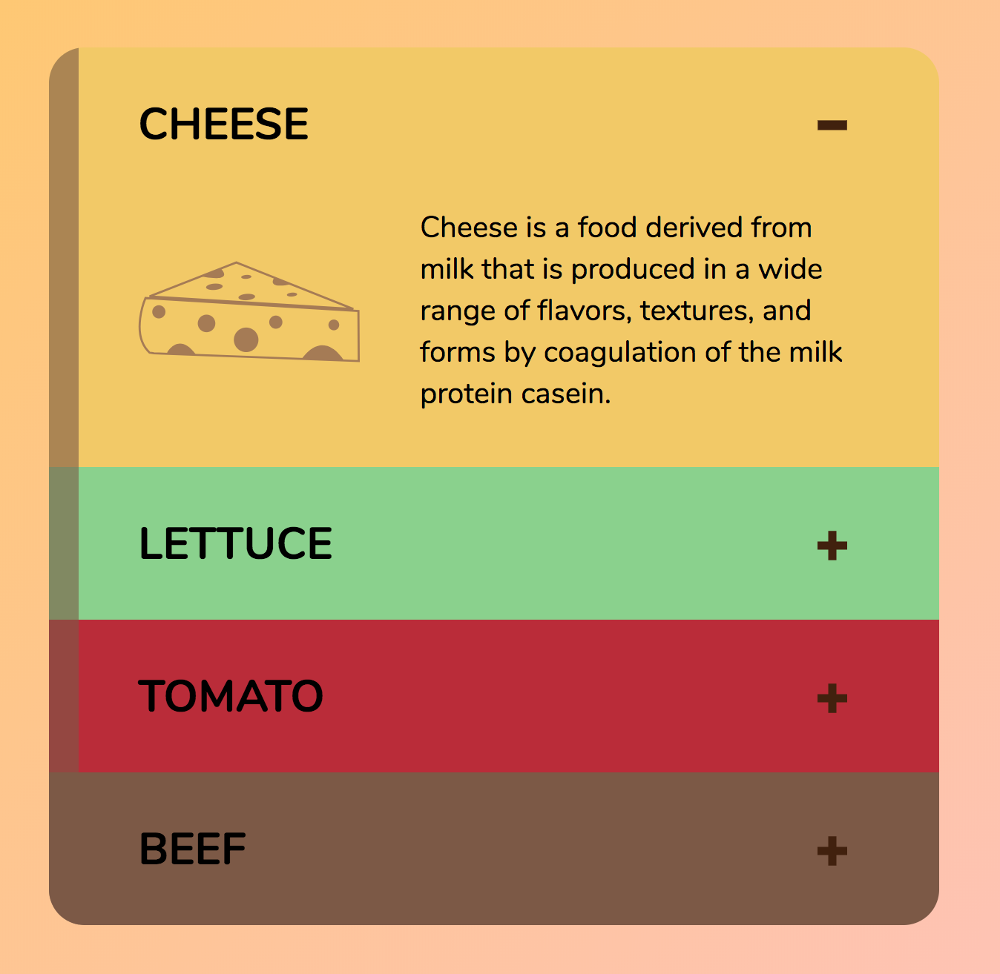
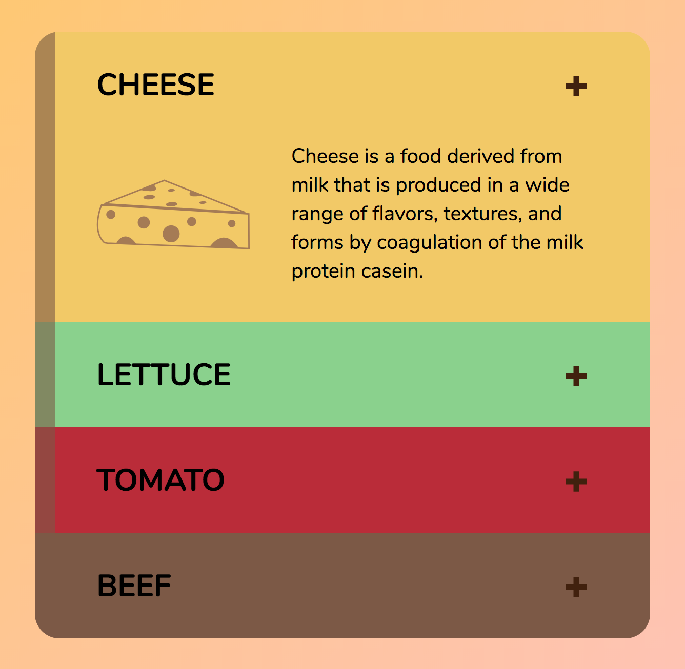
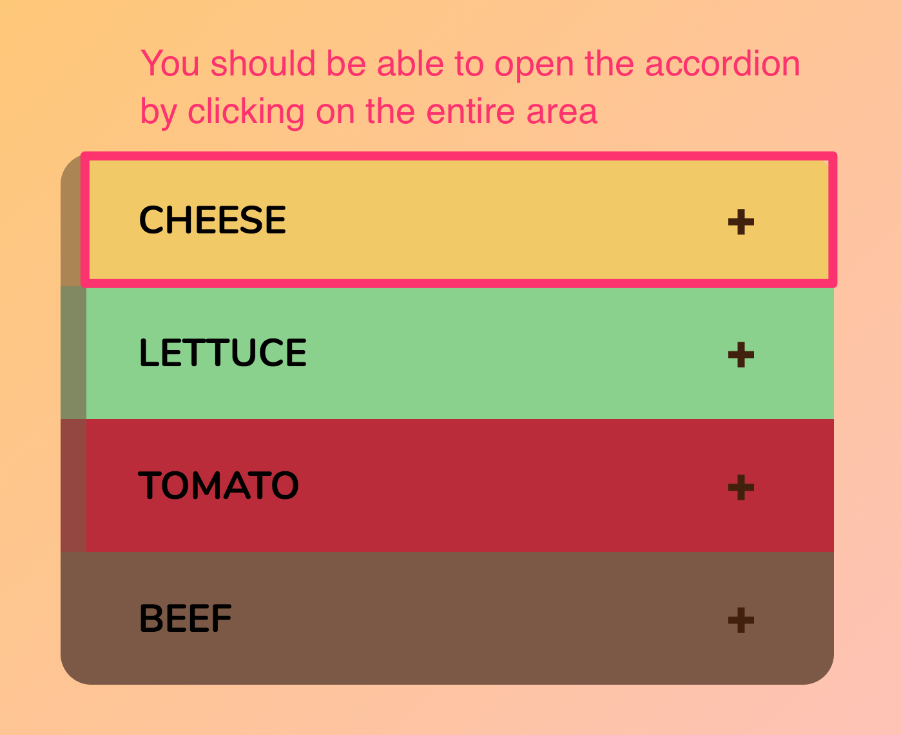
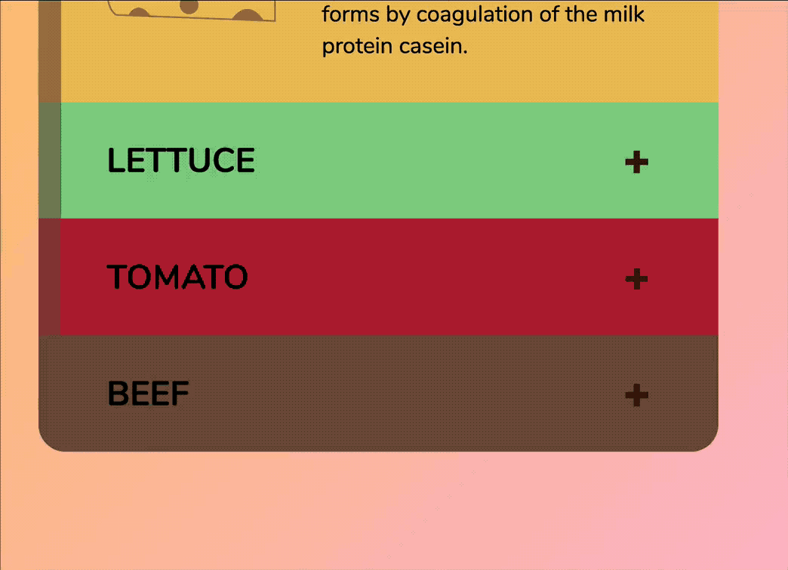
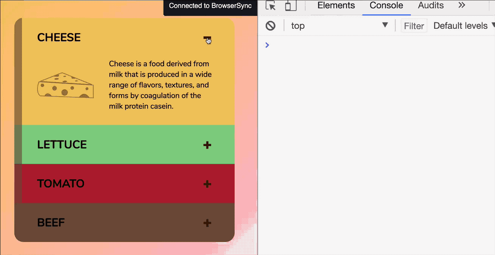
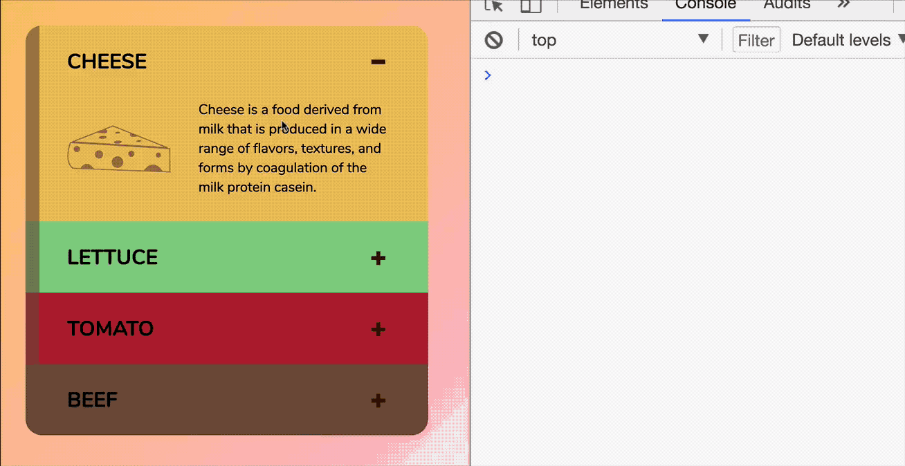

# 🛠 Building accordions

In this lesson, you'll learn to build accordions. Accordions are components that allows you to show important content at a glance. The details of each piece of important content is hidden away until you click on the important piece.

They look like this:

<figure>
  
  <figcaption>Completed accordion</figcaption>
</figure>

Before continuing, make sure you grab the starter files in the Github repo, under `components/03.accordion/01.starter`.

## How to build the accordion – the general idea

When accordions are closed, only their header is revealed. You don't see anything else.

<figure>
  
  <figcaption>When accordions are closed, you only see the accordion header</figcaption>
</figure>

When accordions open up, their content gets revealed.

<figure>
  
  <figcaption>When accordions are opened, the details are revealed</figcaption>
</figure>

Is the accordion content hiding behind the header? Is the accordion just invisible in the same location? You can't tell right now. You need to look at the accordion's animation before you can make a decision. We'll look at animations in a later chapter. For now, let's say the accordion disappears entirely.

**Accordions can by tricky.**

By themselves, an accordion is simple. But accordions don't come alone. They always come in a bunch. This means you need to be able to find the correct content to reveal.

So, in short, to build an accordion, you need to:

1. Add event listeners to show and hide the accordions.
2. Make sure the correct content gets revealed when you click on the accordion header.

Let's get started.

## Building the accordion

From the above section, you know you need to find the accordion content from the accordion title. To do this, you can stack the accordion content and header as siblings in your HTML. When you do so, you can wrap the accordion content and header in a `.accordion` div.

```html
<div class="accordion">
  <header class="accrdion__header">...</header>
  <div class="accrdion__content">...</div>
</div>
```

Before moving on, you want to think about how to open up your accordion (you've expected I'm going to say this, didn't you? 😉). Ideally, you'll want to use one class say the accordion is open. Everything else should be contingent on this class. In the case of our accordions, we have the perfect place – the `.accordion` div.

Let's call this class `.is-open`.

```html
<!-- Opening the accordion -->
<div class="accordion is-open"> ...</div>
```

But wait. Why `is-open` and not `accordion-is-open` like what we did with the off-canvas menu and the modal window?

In the both the off-canvas menu and modal window components, we added the opening class (`offcanvas-is-open`/`modal-is-open`) to the `<body>` element.

When you add classes to the body element (or any ancestor element), you want to make sure the class is specific enough. If you add `is-open` to the `<body>`, you can't tell what is opened. The off-canvas menu? The modal? Something else?

On the other hand, if you add `is-open` to `.accordion`, it's pretty obvious you're opening the accordion itself.

```html
<!-- This is obvious you're opening the accordion, yeah? -->
<div class="accordion is-open"> ...</div>
```

When the accordion is closed, you want to hide the content. To make it simple for now, let's set the display property to `none`.

When the accordion is closed, you can show the content by setting the display property to something other than `none`. In this case, I styled the accordion with CSS grid, so let's set the display to `grid`.

```css
.accordion__content {
  display: none;
  /* other properties */
}

.accordion.is-open .accordion__content {
  display: grid;
}
```

Try adding the `is-open` class to a single accordion and you should the accordion content showing up.

<figure>
  
  <figcaption>Opening the content up by adding the is-open class</figcaption>
</figure>

In addition showing and hiding the content, you also need to change the indicator icon from a plus to a minus. The plus and minus icons used in the starter file are SVGs, as you can see:

```html
<div class="accordion__indicator">
  <svg class="indicator__plus" viewBox="0 0 80 80"><use xlink:href="images/sprite.svg#plus"/></svg>
  <svg class="indicator__minus" viewBox="0 0 80 80"><use xlink:href="images/sprite.svg#minus"/></svg>
</div>
```

Here, you want to hide the minus icon and show the plus icon when the accordion is closed. You want to hide the plus icon and show the minus icon when the accordion is open.

```css
.indicator__plus {
  display: block;
}

.indicator__minus {
  display: none;
}

.accordion.is-open .indicator__plus {
    display: none;
}

.accordion.is-open  .indicator__minus {
    display: block;
}
```

When you do so, you should see the indicator change to minus when the accordion is open:

<figure>
  
  <figcaption>Changing the indicator</figcaption>
</figure>

That's it for building the accordion. Now, let's look at adding some JavaScript functionality to open and close the accordion.

## Opening the accordion with JavaScript

One way to open the accordion is to listen for a click on the accordion indicator (the plus/minus sign). That's what you'd think immediately, but that's not the best way.

A better way is to allow the entire header to become a click-able element so users have a larger surface area to trigger the accordion.

<figure>
  
  <figcaption>Clicking on the accordion header should open up the accordion.</figcaption>
</figure>

Since you're revealing content on JavaScript, the correct element to use is a `<button>` element. This means you need to wrap the contents of your accordion header in a button element, like this:

```html
<header class="accordion__header">
  <h2>
    <button>
      <span>Cheese</span>
      <div class="accordion__indicator">
        <svg class="indicator__plus" viewBox="0 0 80 80"><use xlink:href="images/sprite.svg#plus"/></svg>
        <svg class="indicator__minus" viewBox="0 0 80 28"><use xlink:href="images/sprite.svg#minus"/></svg>
      </div>
    </button>
  </h2>
</header>
```

Let's examine the JavaScript next.

Since accordions don't come alone, you need to listen to all your accordions at once. One way to do so is through `querySelectorAll`.

```html
<button class="accordion__header jsAccordionHeader">
```

```js
const accordionHeaders = document.querySelectorAll('.jsAccordionHeader')
```

Once you've select your headers, you want to add an event listener to each of them. When the header is clicked, you want to add an `is-open` class to the `.accordion`, which is the parent element of the header. You can traverse to the parent element with parentNode.

```js
accordionHeaders.forEach(header => {
  header.addEventListener('click', _ => {
    header.classList.toggle('is-open')
  })
})
```

<figure>
  
  <figcaption>Adding and removing is-open on the header on alternate clicks</figcaption>
</figure>

Quiz question: Do you know why you car listen for a click on the accordion headers instead of on each `<button>` element?

Answer: The `click` event bubbles upwards from the `<button>` to the accordion header!

## A better event listener

The `querySelectorAll` method works, but it's not the best way because you're adding too many event listeners.

A better way is to use the event delegation pattern. If you use the event delegation pattern, you only need one event listener (instead of 4 in this example).

To use the delegation pattern, you need to listen to an ancestor element that contains all your accordion headers. This ancestor element should be as close as possible to your accordions.

For the accordions we're building, I grouped all accordions into an `.accordion-container` element, which would be the delegator.

```html
<div class="accordion-container jsAccordionContainer"> ... </div>
```

```js
const accordionContainer = document.querySelector('.jsAccordionContainer')
accordionContainer.addEventListener('click', e => {
  // Do something here
})
```

In the delegator (the `accordionContainer`), you want to listen for a `click` event on the `.jsAccordionHeader` elements. There are a few ways to do so. But first, let's take a look at what `event.target` returns.

```js
accordionContainer.addEventListener('click', e => {
  console.log(e.target)
})
```

<figure>
  
  <figcaption>event.target returs the element that was clicked</figcaption>
</figure>

As you can see, `event.target` returns the element that was clicked. If you click on the indicator, the `event.target` returns the SVG used for the indicator. If you click on the paragraph text, `event.target` returns the paragraph.

This is a problem for us because we want to listen to a `click` event on `.jsAccordionHeader`, not any element within `.jsAccordion` (especially not those within the accordion content!).

What to do? You can solve this problem by checking for the existence of `.jsAccordionHeader` in your event listener.

```js
accordionContainer.addEventListener('click', e => {
  const header = e.target.closest('.jsAccordionHeader')
  console.log(header)
})
```

<figure>
  
  <figcaption>Clicking on anything within content returns null while clicking on anything within the header returns the accordion header</figcaption>
</figure>

Once you've located the `.jsAccordionHeader`, you can toggle the `.accordion` with `header.parentNode.classList` as before.

```js
accordionContainer.addEventListener('click', e => {
  const header = e.target.closest('.jsAccordionHeader')
  if (header) {
    header.parentNode.classList.toggle('is-open')
  }
})
```

<figure>
  
  <figcaption>Completed accordion</figcaption>
</figure>

With this, you've learned how to build accordions!

## Wrapping up

You learned how to use `querySelectorAll` and the event delegation patter to build the accordion in this lesson. We're far from done yet. You'll learn to improve the accordion in a later lesson when we dive into animations.


