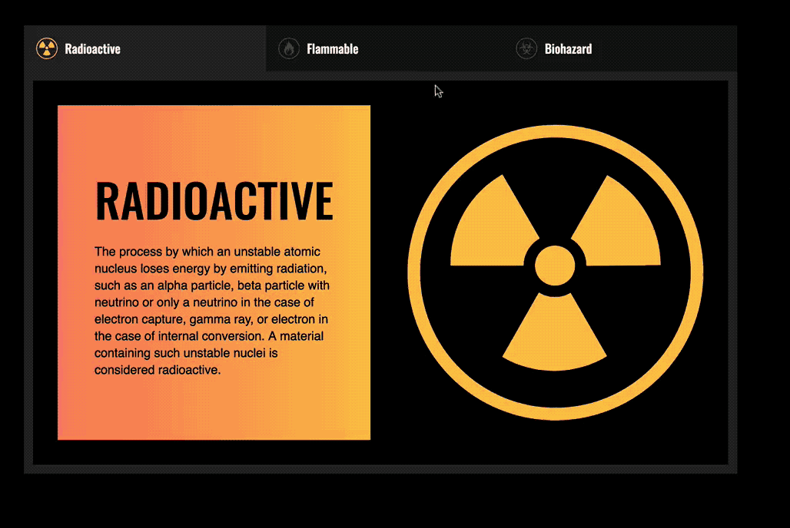
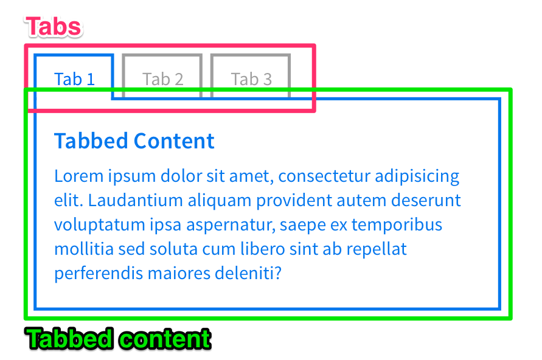
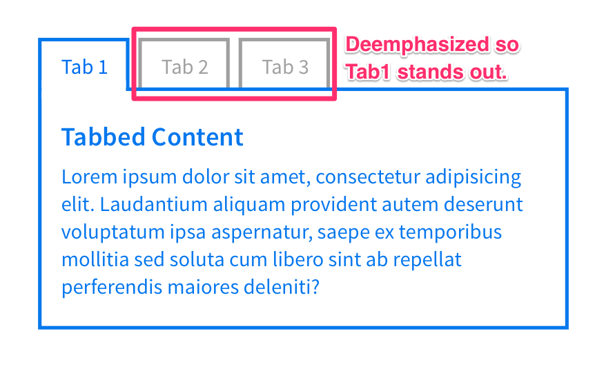
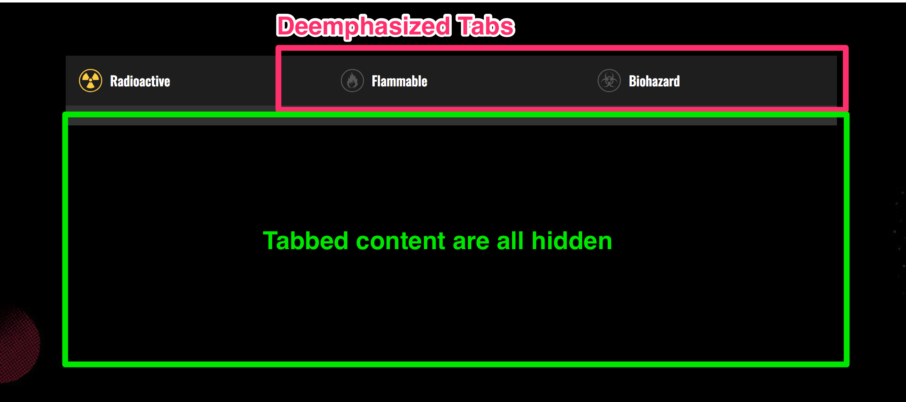
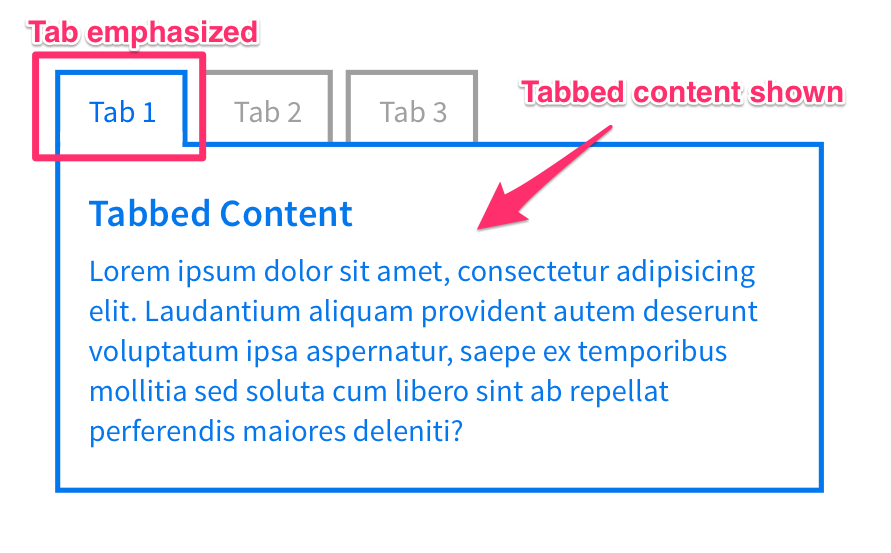
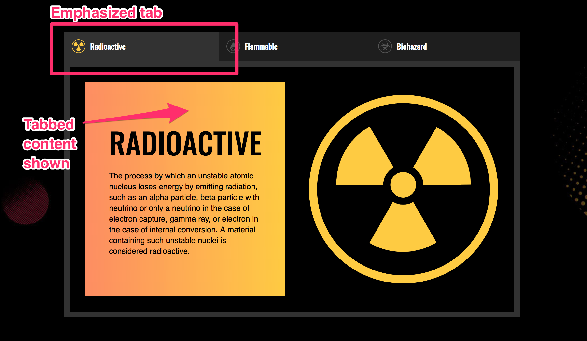
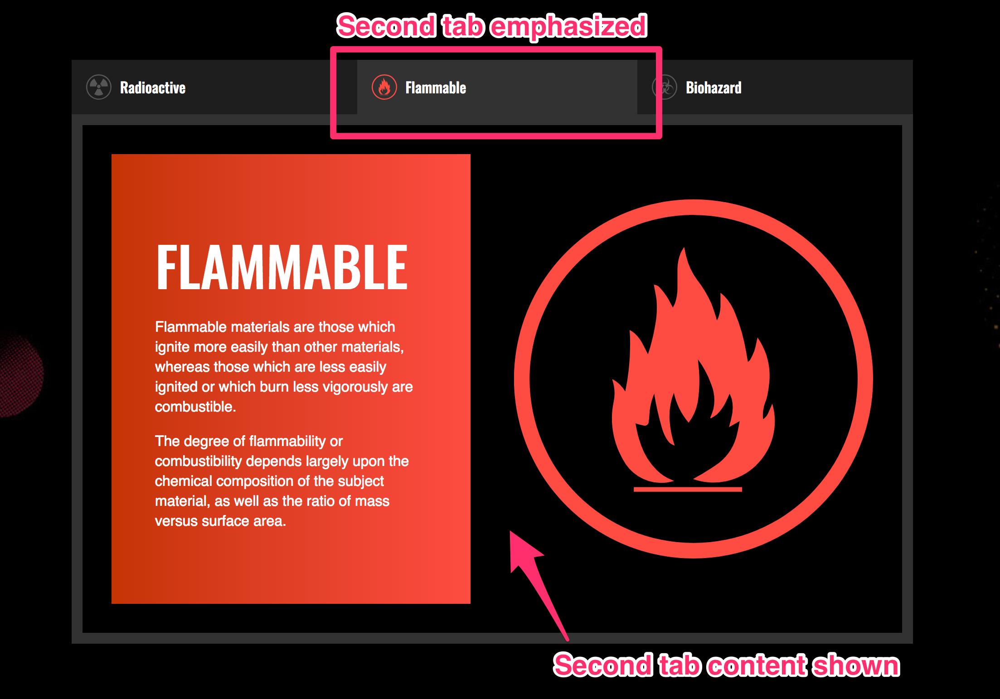
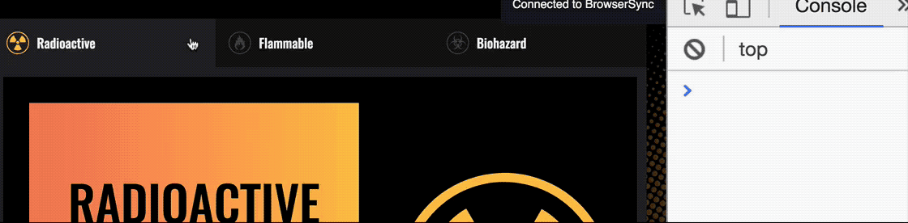
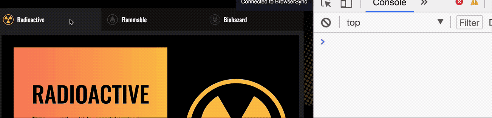
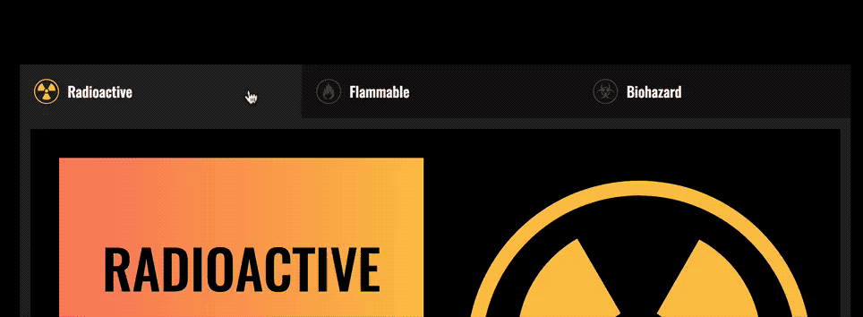

# 🛠 Building a tabbed interface

Tabbed interfaces behave like tabbed folders in a file. They're great for categorizing content and showing only parts that are relevant to the user at any point in time.

The tabbed interface you're building looks like this:

<figure>
  
  <figcaption>Completed tab</figcaption>
</figure>

Before continuing, make sure you grab the starter files in the Github repo, under `components/04.tabs/01.starter`.

## Building the tabbed interface

A tabbed interface consist of two parts – the tabs and the tabbed content.

<figure>
  
  <figcaption>Tabbed interfaces contains tabs and tabbed content</figcaption>
</figure>

Your HTML structure should be similar to this:

```html
<div class="tab-component">
  <ul class="tabs">
    <li class="tab"><a href="#">Tab 1</a></li>
    <li class="tab"><a href="#">Tab 2</a></li>
    <li class="tab"><a href="#">Tab 3</a></li>
  </ul>

  <section class="tab-content">Content 1</section>
  <section class="tab-content">Content 2</section>
  <section class="tab-content">Content 3</section>
</div>
```

One tab should be active at any time, so let's add the `is-active` class to the HTML right away.

```html
<div class="tab-component">
  <ul>
    <li class="tab is-active"><a href="#">Tab 1</a></li>
    <li class="tab"><a href="#">Tab 2</a></li>
    <li class="tab"><a href="#">Tab 3</a></li>
  </ul>

  <section class="tab-content is-active">Content 1</section>
  <section class="tab-content">Content 2</section>
  <section class="tab-content">Content 3</section>
</div>
```

**When you click on a tab, you want to activate the tab that is clicked on, and deactivate other tabs.**

When tabs are deactivated, you want to deemphasize the tab and hide their content.

<figure>
  
  <figcaption>Deemphasize inactive tabs and hide their content</figcaption>
</figure>

For the tabs you're building, the styles you need to deemphasize the tabs and hide the tab-content are the following:

```css
/* Set inactive tab icons to 25% white to deemphasize the icons*/
.tab-container:not(.is-active) .tab__icon {
  color: rgba(255, 255, 255, 0.25);
}

.tab-content {
  display: none;
}
```

<figure>
  
  <figcaption>How the tabbed interface looks like with deemphasized styles</figcaption>
</figure>

When a tab is activated, you want to emphasize the tab and show its content.

<figure>
  
  <figcaption>Emphasize the active tab and show its content</figcaption>
</figure>

For the tabs you're building, the styles you need to emphasize the active tab is as follows:

```css
/* Adds a background highlight to the active tab */
.tab-container.is-active .tab {
  background-color: #323232;
}

/* Shows tab content */
/* Using grid here instead of block since I styled the contents with CSS Grid */
.tab-content.is-active {
  display: grid;
}
```

<figure>
  
  <figcaption>How the tabbed interface looks like with emphasized tabs</figcaption>
</figure>

## Changing the tabs manually

You've already styled the active tab and tab-content with CSS, so you should have no problems switching tabs manually by setting the `.is-active` on the right HTML Element.

To activate the second tab, all you need to do is change the `is-active` class to the second tab and the second tab content.

```html
<!-- Activating the second tab by setting is-active
to the second tab and tab content -->
<div class="tab-component">
  <ul>
    <li class="tab"><a href="#">Tab 1</a></li>
    <li class="tab is-active"><a href="#">Tab 2</a></li>
    <li class="tab"><a href="#">Tab 3</a></li>
  </ul>

  <section class="tab-content">Content 1</section>
  <section class="tab-content is-active">Content 2</section>
  <section class="tab-content">Content 3</section>
</div>
```

<figure>
  
  <figcaption>Changing to the second tab</figcaption>
</figure>

## Changing the tabs with JavaScript

There are four steps to changing the tabs with JavaScript:

1. Add event listeners to tabs
2. Find the correct tab and tab content
3. Hide inactive tabs and tab-content
4. Show the selected tab and tab content

Let's go through each of these steps, one by one.

### Add event listeners to the tabs

Your first step is to add event listener to the tabs. To do this, you can either add an event listener to each tab (the normal way), or you could add a event listener to the parent of the tabs (using event delegation).

In this example, we're going straight for event delegation. You can refer to the lessons on [event delegation](../04.events/06.event-delegation.md) and [building accordions](./06.building-accordions.md) if you need a refresher on the event delegation pattern.

Before continuing further, it makes sense to add JavaScript classes to the element you want to target:

```html
<ul class="jsTabList">
  <li ... ><a href="#">Tab 1</a></li>
  <li ... ><a href="#">Tab 2</a></li>
  <li ... ><a href="#">Tab 3</a></li>
</ul>
```

```js
const tabList = document.querySelector('.jsTabList')

tabList.addEventListener('click', e => {
  // Proceed with event delegation pattern
})
```

In this event delegation pattern, you'll be interested to know if the `<a>` link of each tab is clicked (you'll find out why in a bit).

```js
tabList.addEventListener('click', e => {
  if (!e.target.matches('a')) { return }

  // 1. Find correct tab to open.
  // 2. Hide previous active tab
  // 3. Open right tab
})
```

```css
.tab > a * {
  pointer-events: none;
}
```

### Finding the correct tab content

One way to find the right tabbed content is through the `href` attribute of the clicked tab. The `href` attribute is only present on `<a>` links, which why you looked for the `<a>` in the event delegation pattern mentioned above.

To link the tabs to their respective tabbed content, you need to provide each tab with a `href` that links to an `id` of the tabbed content.

So, tab 1 should have a `href` of `#tab1`; its corresponding tabbed content should have an id of `tab1`.

```html
<div class="tab-component">
  <ul class="jsTabList">
    <li ... ><a href="#tab1">Tab 1</a></li>
    <li ... ><a href="#tab2">Tab 2</a></li>
    <li ... ><a href="#tab3">Tab 3</a></li>
  </ul>

  <section ... id="tab1">Content 1</section>
  <section ... id="tab2">Content 2</section>
  <section ... id="tab3">Content 3</section>
</div>
```

In your JavaScript, you can get the value of the `href` attribute through `Element.getAttribute`.

```js
tabList.addEventListener('click', e => {
  if (!e.target.matches('a')) { return }

  const href = e.target.getAttribute('href')
  console.log(href)
})
```

<figure>
  
  <figcaption>Getting the href attribute</figcaption>
</figure>

In the GIF above, you saw `#radioactive`, `#flammable` and `#biohazard` instead of `#tab1`, `#tab2` and `#tab3`. This is because it's always better to write links and ids that have meaning.

Once you have the `href` value, you can use `parentNode` and `querySelector` to find the correct tab content. Refer back to the [DOM Traversal lesson](../03.dom-basics/09.dom-traversals.md) if you need help with this traversal.

```js
tabList.addEventListener('click', e => {
  if (!e.target.matches('a')) { return }

  const href = e.target.getAttribute('href')

  // tabList.parentNode is '.tab-component'.
  // From .tab-component, you can use querySelector to find `#tab1`, `#tab2` or `#tab3`.
  const newTabContent = tabList.parentNode.querySelector(href)
  console.log(newTabContent)
})
```

<figure>
  
  <figcaption>Getting the tab content</figcaption>
</figure>

Let's move on to the next step

### Hiding the previous tab

When a tab is active, it has the `is-active` class.

To hide the previous tab, you can find both the tab and tabbed content by searching for all elements than contain the `is-active class`. Once you've found them, you can remove their classes.

```js
tabList.addEventListener('click', e => {
  if (!e.target.matches('a')) { return }

  const href = e.target.getAttribute('href')
  const newTabContent = tabList.parentNode.querySelector(href)

  // Find previous tab and tabbed content by searching for all elements with the `is-active` class
  const prevTabAndContent = tabList.parentNode.querySelectorAll('.is-active')

  // Hide prev tab and content by removing the `is-active` class
  prevTabAndContent.forEach(elem => elem.classList.remove('is-active'))
})
```

### Showing the selected tab

To show the selected tab, you need to add the `is-active` class to the new tab and the new tabbed content.

You have already found the new tab content. What's next is to find the new tab, and you can add `is-active` to both of them.

```js
tabList.addEventListener('click', e => {
  if (!e.target.matches('a')) { return }

  const href = e.target.getAttribute('href')

  // Get new tab
  const newTab = e.target.parentNode
  const newTabContent = tabList.parentNode.querySelector(href)

  // Hides previous tab and tabbed content
  const prevTabAndContent = tabList.parentNode.querySelectorAll('.is-active')
  prevTabAndContent.forEach(elem => elem.classList.remove('is-active'))

  // Shows new tab and tabbed content
  newTab.classList.add('is-active')
  newTabContent.classList.add('is-active')
})
```

<figure>
  
  Tabbed interface completed!</figcaption>
</figure>

## Preventing the awkward jump

When you click on the tabs, you may find that your browser performs an awkward jump if your window is smaller than the tabbed component.

<figure>
  
  <figcaption>Awkward jump</figcaption>
</figure>

This is normal.

When you click on a link with the `href` that begins with `#`, the browser automatically looks for the same id within the page. (So, if the `href` is `#tab1`, the browser looks for an element with `id="tab1`). This is the default behavior of a link that starts with `#`.

Once the browser finds the element, it jumps to the element automatically.

Although that is okay for a default behavior, you don't want this to happen when your user clicks on the tabbed component. To prevent this awkward jump from happening, you need to add `event.preventDefault` to your event handler.

```js
tabList.addEventListener('click', e => {
  if (!e.target.matches('a')) { return }
  e.preventDefault()

  // The rest of the code
})
```

## Cleaning up the code

At this point, you may have noticed that we used `e.target` and `tabList.parentNode` twice in the code. Each of these could be hard to understand if you leave the code for a while.

To help the future you understand the code, it makes sens to create a understandable variable names for these two properties.

You can also rearrange the code order a little to make more sense. For example, you may want to remove the previously active tab and tabbed content before finding and showing the new ones.

```js
tabList.addEventListener('click', e => {
  if (!e.target.matches('a')) { return }
  e.preventDefault()

  const link = e.target
  const href = link.getAttribute('href')
  const component = tabList.parentNode

  // Hides previous tab and tabbed content
  const prevTabAndContent = component.querySelectorAll('.is-active')
  prevTabAndContent.forEach(elem => elem.classList.remove('is-active'))

  // Shows new tab and tabbed content
  const newTab = link.parentNode
  const newTabContent = component.querySelector(href)
  newTab.classList.add('is-active')
  newTabContent.classList.add('is-active')
})
```

## Wrapping up

The structure of a tabbed component in this lesson. The key here is to link the tab with its tabbed content, and add an `is-active` class to both the active tab and tabbed content.

To get the correct tabbed content, you can use the `href` attribute. When you do so, make sure you write understandable names for both the `href` on the `<a>` tag of each tab, and the `id` of their respective tabbed content.

To hide the previously active tabbed content, you can search for an `is-active` class on all present elements. If you do this, make sure to remove the hide the previously active tab and tabbed content before showing the new one.

Finally, you performed a few DOM traversals with parentNode. Practice DOM traversals a bit more if you found this traversal confusing. You'll need to get good with traversals, or you'll find it hard to create components.


