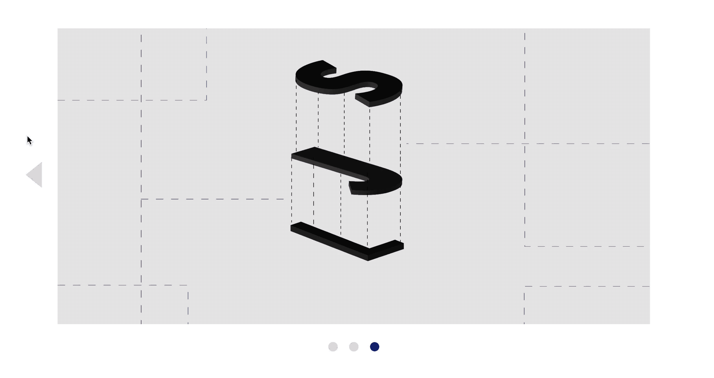
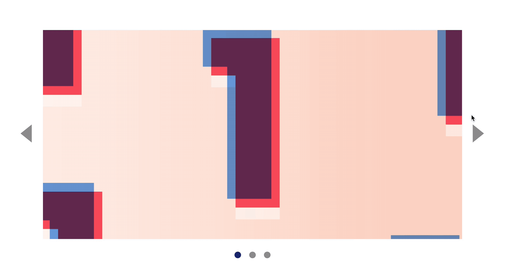

# 🛠 Building a carousel (part 2)

Here's what you'll build by the end of this lesson:

<figure>
  
  <figcaption>The complete interaction</figcaption>
</figure>

You'll find the starter files for this part of the carousel in `components/05.carousel/02.basic-part-1-completed`.

## Interaction for the previous button

To build the previous button, you need to do the following:

1. Add an event listener to the previous button
2. Change to the previous slide when a user clicks on the button
3. Update the `is-selected` classes accordingly
4. Update the dots accordingly
5. Show/hide arrow buttons accordingly.

Let's get started.

First off, let's create an event listener for the previous button.

```html
<button class="carousel__button jsPrevious">...</button>
```

```js
const previousButton = document.querySelector('.jsPrevious')

previousButton.addEventListener('click', e => {
  // Change to previous slide
})
```

### Switching to the previous slide

You need to know what the current slide is to switch to the previous slide. You can get the current slide by searching for the `is-selected` class. This is the same as what you've done in the previous lesson.

```js
previousButton.addEventListener('click', e => {
  let currentSlide

  for (let slide of slides) {
    if (slide.classList.contains('is-selected')) {
      currentSlide = slide
    }
  }
})
```

Then, to get the previous slide, you can use
`previousElementSibling`.

```js
previousButton.addEventListener('click', e => {
  // ...
  const previousSlide = currentSlide.previousElementSibling
})
```

Once you have `previousSlide`, you can determine the `track`'s left property.

```js
previousButton.addEventListener('click', e => {
  // ...
  const amountToMove = previousSlide.style.left
  track.style.left = '-' + amountToMove
})
```

Next, you want to update the `is-selected` classes so `previousButton`'s handler can find the correct current slide. To do so, you remove `is-selected` from `currentSlide` and add it to `previousSlide`.

```js
previousButton.addEventListener('click', e => {
  //...
  currentSlide.classList.remove('is-selected')
  previousSlide.classList.add('is-selected')
})
```

### Updating the dots

Updating the dots is quite self-explanatory. You can do pretty much the same thing as what you did with `nextButton`'s event lister.

```js
previousButton.addEventListener('click', e => {
  //...
  const dotContainer = document.querySelector('.jsDotContainer')
  const currentDot = dotContainer.querySelector('.is-selected')
  const previousDot = currentDot.previousElementSibling
  currentDot.classList.remove('is-selected')
  previousDot.classList.add('is-selected')
})
```

If you did everything correctly, you should have the following result at this point:

<figure>
  
  <figcaption>Slides and dots should update properly when the left button is clicked</figcaption>
</figure>

### Hiding the previous button

When a user lands on the first slide, the `previousButton` should be hidden. To do so, we check if `previousSlide` has a `previousElementSibling`.

```js
previousButton.addEventListener('click', e => {
  // ...
  const isFirstSlide = !previousSlide.previousElementSibling

  if (isFirstSlide) {
    previousButton.classList.add('is-hidden')
  }
})
```

<figure>
  
  <figcaption>Hiding the next button</figcaption>
</figure>

We also want to hide `previousButton`, since a user will always see the first slide when the carousel loads. This prevents the user from clicking on `previousButton` when they shouldn't be able to.

```html
<button class="carousel__button jsPrevious is-hidden">...</button>
```

### Showing nextButton

You'd always want to show `nextButton` when a user clicks on `previousButton` because they'll never be on the final slide.

```js
previousButton.addEventListener('click', e => {
  // ...
  nextButton.classList.remove('is-hidden')
})
```

The reverse is true. When a user clicks on `nextButton`, you'd always want to show the `previousButton`.

```js
nextButton.addEventListener('click', e => {
  // ...
  previousButton.classList.remove('is-hidden')
})
```

<figure>
  
  <figcaption>Show and hide previous and next buttons depending on the slide the user is on</figcaption>
</figure>

## Clicking on the dots

When a user clicks on a dot, they're interested to view the content of the dot they clicked on. They should be brought to the correct slide. If they clicked on the first dot, you'll want to bring them to the first slide; if the click on the third dot, you'd want to bring them to the third slide.

Since there are three dots, let's create an event listener with the event delegation pattern.

```js
const dotContainer = document.querySelector('.jsDotContainer')

dotContainer.addEventListener('click', e => {
  if (!e.target.matches('button')) return
})
```

```css
.carousel__dot > * {
  pointer-events: none;
}
```

To switch to the `targetSlide` (the slide of the clicked dot), we need to know a few things:

1. What's the current slide?
2. Which dot was clicked?
3. How to find the target slide from the clicked dot?

We already know the first two things:

```js
dotContainer.addEventListener('click', e => {
  let currentSlide

  for (let slide of slides) {
    if (slide.classList.contains('is-selected')) {
      currentSlide = slide
    }
  }
})
```

```js
dotContainer.addEventListener('click', e => {
  // ...
  const clickedDot = e.target
})
```

### Finding targetSlide

If you look at the HTML for `.carousel__track` and `.carousel__dots`, you should see a pattern.

```html
<ul class="carousel__track jsTrack">
  <li class="carousel__slide is-selected">...</li>
  <li class="carousel__slide">...</li>
  <li class="carousel__slide">...</li>
</ul>
```

```html
<div class="carousel__nav jsDotContainer">
  <button class="carousel__dot is-selected"></button>
  <button class="carousel__dot"></button>
  <button class="carousel__dot"></button>
</div>
```

If you click on the third dot, you should switch to the third slide. To find the third slide, you can find the `index` of the clicked dot.

Remember: index is the position of an item in an array.

- If the first dot gets clicked, index will be 0.
- If the second dot gets clicked, index will be 1.
- If the third dot gets clicked, index will be 2.

To find the index of the clicked dot, you can loop through `dotContainer` and compare the `<button>` element with `clickedDot` with `===`. (Why is this so? Can you solve the mystery?)

To get the index, you can use a `for` loop instead of a `for...of` loop:

```js
dotContainer.addEventListener('click', e => {
  // ...
  const dots = dotContainer.children
  let targetIndex

  for (let index = 0; index < dots.length; index++) {
    if (dots[index] === clickedDot) {
      targetIndex = index
    }
  }
})
```

Once you have `targetIndex`, you'll be able to get `targetSlide`. (Why is this so? Have a think! Remember to ask the community if you're having problems with any questions).

```js
dotContainer.addEventListener('click', e => {
  // ...
  const targetSlide = slides[targetIndex]
})
```

Once you know `targetSlide`, you'll know how to update slides and dots.

```js
dotContainer.addEventListener('click', e => {
  // ...

  // Update slides
  const amountToMove = targetSlide.style.left
  track.style.left = '-' + amountToMove
  currentSlide.classList.remove('is-selected')
  targetSlide.classList.add('is-selected')

  // Update dots
  const currentDot = dotContainer.querySelector('.is-selected')
  currentDot.classList.remove('is-selected')
  clickedDot.classList.add('is-selected')
})
```

<figure>
  
  <figcaption>Clicking on dots updates the slides and dots</figcaption>
</figure>

### Updating arrows when clicking on dots

To update arrows, you need to know which dot was clicked.

- If the first dot is clicked, hide `previousButton` and show `nextButton`
- If the last dot is clicked, hide `nextButton` and show `previousButton`
- If the second dot is clicked, show both buttons.

You can tell if the first dot is clicked by the index. If the index is 0, the first dot is clicked.

```js
dotContainer.addEventListener('click', e => {
  // ...
  if (targetIndex === 0) {
    previousButton.classList.add('is-hidden')
    nextButton.classList.remove('is-hidden')
  }
})
```

Similarly, in our case right now, the last dot is clicked if the index is 2. If there's a different number of slides in the carousel, the index changes.

- If there are 4 slides in the carousel, the final slide's index is 3.
- If there are 5 slides in the carousel, the final slide's index is 4.
- If there are 6 slides in the carousel, the final slide's index is 5.

Here, you can see that the final slide's is index always `numberOfSlides - 1`. You can find the `numberOfSlides` through `slides.length`.

```js
dotContainer.addEventListener('click', e => {
  // ...
  if (targetIndex === 0) {
    previousButton.classList.add('is-hidden')
    nextButton.classList.remove('is-hidden')
  } else if (targetIndex === slides.length - 1) {
    previousButton.classList.remove('is-hidden')
    nextButton.classList.add('is-hidden')
  }
})
```

If the index falls between between 0 and `slides.length`, you show both previous and next buttons.

```js
dotContainer.addEventListener('click', e => {
  // ...
  if (targetIndex === 0) {
    previousButton.classList.add('is-hidden')
    nextButton.classList.remove('is-hidden')
  } else if (targetIndex === slides.length - 1) {
    previousButton.classList.remove('is-hidden')
    nextButton.classList.add('is-hidden')
  } else {
    previousButton.classList.remove('is-hidden')
    nextButton.classList.remove('is-hidden')
  }
})
```

<figure>
  
  <figcaption>The complete interaction when a user clicks on the dots</figcaption>
</figure>

## Let's take another pause

You learned to write code to handle a both a `click` event on `previousButton` and on any of the dots. At this point, you may be uncomfortable with the code because we've repeated quite a few things. Don't worry. You're going to learn how to tidy up the code in the next lesson.

But before you jump ahead, take some time to redo the lesson. Make sure you can create both `previousButton`'s and `dotContainer`'s event listener without referring back to this lesson.

Also, try to tidy the code up on your own. When you're done, move to the next lesson.

Go.

---

- Previous Lesson: [Building carousel](09.building-carousel.md)
- Next Lesson: [Building carousel (part 3)](11.building-carousel-3.md)