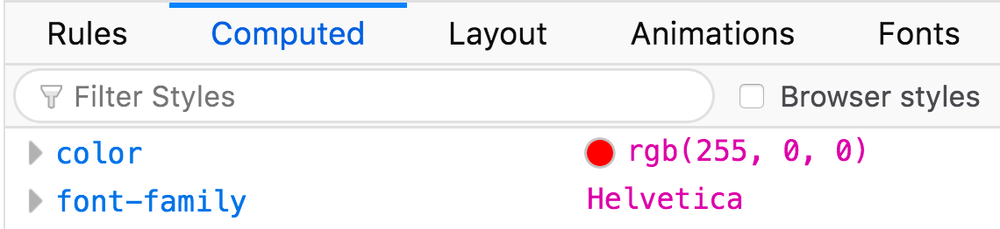
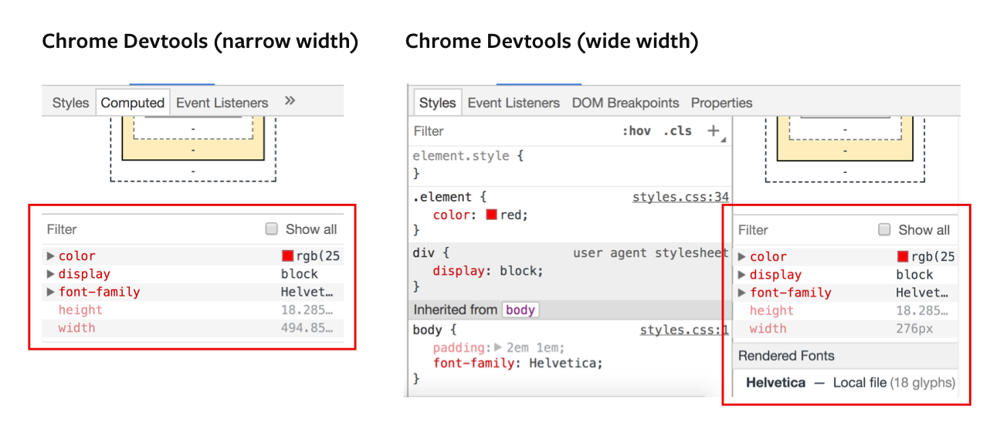

# Getting CSS with JavaScript

CSS alone is not enough sometimes. You might need to control your CSS values with JavaScript. But how do you get CSS values in JavaScript?

Turns out, there are two possible ways, depending on whether you're trying to get inline styles or computed styles.

## Getting inline styles

Inline styles are styles that are present in the HTML in the `style` attribute.

```html
<div class="element" style="font-size: 2em; color: red;">Red hot chili pepper!</div>
```

To get inline styles, you can use the `style` property.

```js
const element = document.querySelector('.element')

const fontSize = element.style.fontSize
console.log(fontSize) // 2em

const color = element.style.color
console.log(color) // red
```

## Getting computed styles

If your styles are written in the CSS file, you need to get the computed style. To do so, you can use `getComputedStyle`.

It takes in two values:

```js
const style = getComputedStyle(Element, pseudoElement);
```

`Element` here refers to the element you've selected with `querySelector`.

`pseudoElement` here refers to the string of the pseudo element you're trying to get (if any). You can omit this value if you're not selecting a pseudo element.

Let's walk through an example to help make sense of things. Say you have the following HTML and CSS:

```html
<div class="element"> This is my element </div>
```

```css
.element { background-color: red }
```

First, you need to select the element with `querySelector`. Then, you use `getComputedStyle` to get the element's styles.

```js
const element = document.querySelector('.element')
const style = getComputedStyle(element)
```

If you log `style`, you should see an object that contains every CSS property and their respective values.

<figure>
  
  <figcaption>`getComputedStyle` returns an object that contains every CSS property and their respective values</figcaption>
</figure>

You can also see this object in Chrome's and Firefox's dev tools.

For Firefox dev tools, look under "Inspector", "Computed".

<figure>
  
  <figcaption aria-hidden>Firefox dev tools computed tab</figcaption>
</figure>

For Chrome dev tools, look under "Elements". If the dev tools window is large, you can see the computed styles on the right panel. If the dev tools window is small, you can look under the "Computed" tab.

<figure>
  
  <figcaption aria-hidden>Chrome dev tools computed tab</figcaption>
</figure>

To get the value of a CSS property, you write the property in camel case.

```js
const style = getComputedStyle(element)

const backgroundColor = style.backgroundColor
console.log(backgroundColor) // rgb(0, 0, 0)
```

Note: `getComputedStyle` is read-only. You cannot set a CSS value with `getComputedStyle`.

Note2: `getComputedStyle` gets the computed CSS values. You'll get `px` from `getComputedStyle`, not relative units like `em` and `rem`.

## Getting styles from pseudo elements

To get styles from pseudo elements, you need to pass in a string of the pseudo element as the second argument to `getComputedStyle`.

```html
<div class="element"> This is my element </div>
```

```css
.element { background-color: red }
.element::before { content: "Before pseudo element"; }
```

```js
const element = document.querySelector('.element')
pseudoElementStyle = getComputedStyle(element, '::before')

console.log(pseudoElementStyle.content) // Before pseudo element
```

## Exercise

Say you have the following HTML. Get its styles with both the `style` property and `getComputedStyle`. What's the difference between the values of these properties?

```html
<div style="color: red; background-color: white; font-size: 5em">Big red text!</div>
```

---

- Previous lesson: [Changing CSS with JavaSCript](02.changing-css.md)
- Next lesson: [Changing attributes](04.changing-attributes.md)
