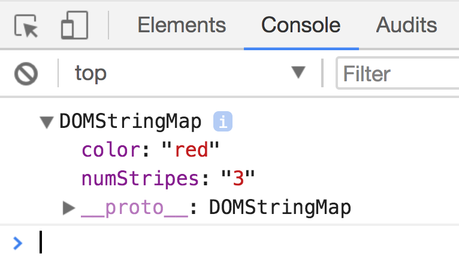

# Changing Attributes

Attributes are additional values within HTML tags. They help to adjust behaviors of the tag. Here are some examples of attributes in a `<div>` tag.

```html
<div id="purple" class="triceratops" data-attr="rule" contenteditable >Any tag can contain multiple attributes!</div>
```

## Built-in attributes

The first, second, and fourth attributes (`id`, `class`, and `contenteditable`) are built directly into HTML. Each serves a different purpose. You can see a list of built-in attributes through the [HTML attribute reference](https://developer.mozilla.org/en-US/docs/Web/HTML/Attributes).

The third attribute, `data-attr`, is an example of custom attribute.

## Custom attributes

Custom attributes lets you store information on an element. You can create any number of custom attributes. You can also name them anything you want, with three conditions attached:

1. custom attributes always start with a `data-` prefix.
2. custom attributes can only contain lowercase letters, numbers, dashes (`-`), underscores (`_`), dots (`.`) or colons (`:`).
3. custom attributes cannot contain capital letters

Here are some examples of valid custom attributes:

```html
<div
  data-superhero
  data-ball-bearing="27"
  data-clown-cap="red"
> Examples of weird custom attributes </div>
```

## True when present

Built-in attributes have a unique behavior. When an attribute is present, they're always in a `true` state. To see this in action, let's say you have three checkboxes as follows:

```html
<input type="checkbox">
<input type="checkbox" checked>
<input type="checkbox" checked="false">
```

The first checkbox would not be checked because it does not contain the `checked` attribute.

The second checkbox will be checked because it contains the `checked` attribute.

The third checkbox will also be checked because it contains the `checked` attribute, even though the attribute stores the string `'false'`.

<figure>
  
  <figcaption>Third checkbox is checked even though it's "false"</figcaption>
</figure>

When you build custom attributes, remember to make your attributes' behavior consistent with this unique behavior.

## Why use attributes?

**Built-in attributes create functionality for HTML elements.** You can use them if you need them. For example, the `checked` attribute adds a checkmark to checkboxes when it's present. We'll explore more attributes as you go through the course.

**Custom attributes let you store and retrieve custom information**, which is useful when you create more complicated components. You'll see how we use them as you build more components.

For now, you need to learn how to set, get and remove attributes.

## Setting Attributes

To set (add or change) an attribute, you can use the `setAttribute` method:

```js
Element.setAttribute('name-of-attribute', 'value to set')
```

The first argument is the name of the attribute you want to set. The second argument is the value of the attribute you wish to set.

```js
const element = document.querySelector('element')
element.setAttribute('checked', true)
```

You can also set custom attributes with `Element.setAttribute`.

```js
element.setAttribute('data-color', 'red')
```

## Reading Attributes

To get (or read) an attribute, you can use the `Element.getAttribute` method.

```js
Element.getAttribute('name-of-attribute')
```

You can get the attribute of both built-in and custom attributes with this method:

```html
<div class="clown-hat" data-color="red" data-size="big">A Clown hat</div>
```

```js
const clownHat = document.querySelector('.clown-hat')
const clownHatColor = clownHat.getAttribute('data-color')
const clownHatSize = clownHat.getAttribute('data-size')

console.log(clownHatColor) // => 'red'
console.log(clownHatSize) // => 'big'
```

## Dataset

`getAttribute` and `setAttribute` lets you get and set both built-in attributes and custom attributes. `dataset`, on the other hand, only lets you get and set custom attributes. On the plus side, `dataset` makes it easier to get and set custom attributes.

Here's how it works.

First, every custom attribute you use is added to a `dataset` property automatically.

```html
<div class="clown-hat" data-color="red" data-num-stripes="3">A Clown hat</div>
```

```js
const clownHat = document.querySelector('.clown-hat')
console.log(clownHat.dataset)
```

<figure>
  
  <figcaption></figcaption>
</figure>

You can get and set the value of any custom attribute with the dot notation (just like normal objects)

```js
const clownHatColor = clownHat.dataset.color
const clownHatSize = clownHat.dataset.numStripes

console.log(clownHatColor) // => 'red'
console.log(clownHatSize) // => '3'

// Set custom attribute
clownHat.dataset.numStripes = 4
```

Note: At the time of writing, Opera Mini does not allow you to get and set attributes with dataset. If you need support for Opera Mini, consider using `getAttribute` and `setAttribute` instead.

## Removing Attributes

To remove attributes, you use the `removeAttribute` method:

```js
Element.removeAttribute('attribute-name')
```

You can remove both built-in and custom attributes. Here's an example:

```html
<div class="clown-hat" data-color="red" data-num-stripes="3">A Clown hat</div>
```

```js
const clownHat = document.querySelector('.clown-hat')
clownHat.removeAttribute('data-color')
```

Once you run the above code, you'll end up with this:

```html
<div class="clown-hat" data-num-stripes="3">A Clown hat</div>
```

## Exercise

Practice adding, and removing attributes with `Element.getAttribute`, `Element.setAttribute` and `Element.dataset`.

Try these tasks:

1. Set an attribute with `Element.setAttribute`
2. Get an attribute with `Element.getAttribute`
3. Get an attribute with `Element.dataset`
4. Set an attribute with `Element.dataset`
5. Remove attribute with `Element.removeAttribute`

---

- Previous lesson: [Getting CSS with JavaScript](03.getting-css.md)
- Next lesson: [Finding an element's size and position](05.finding-element-size-and-position.md)
