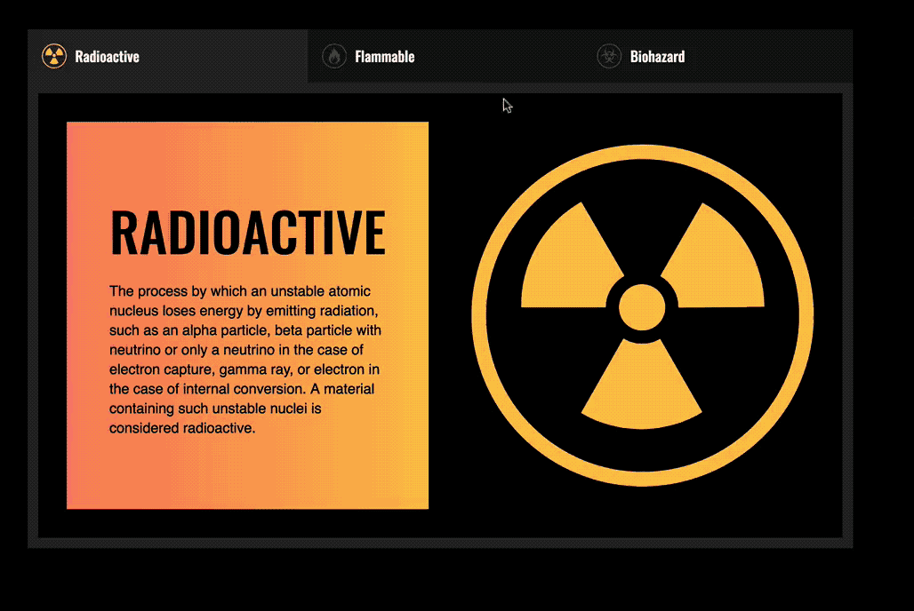
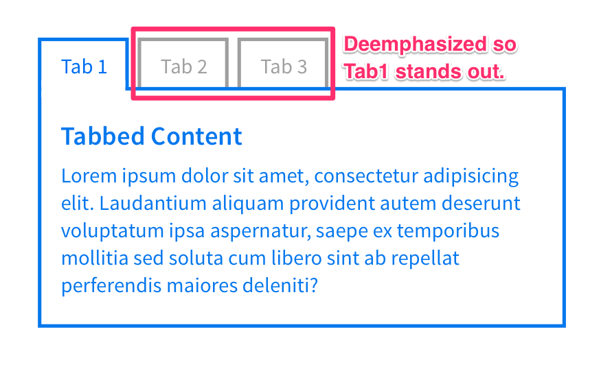
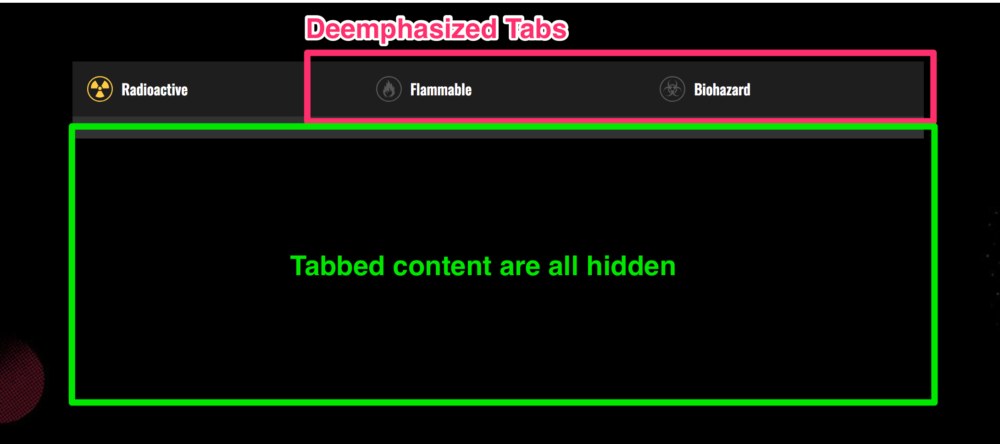
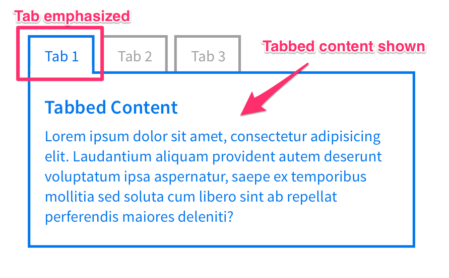
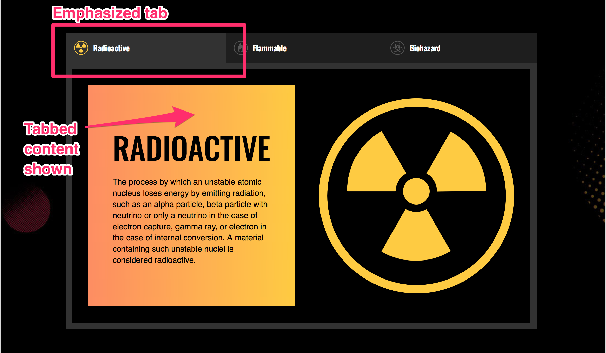
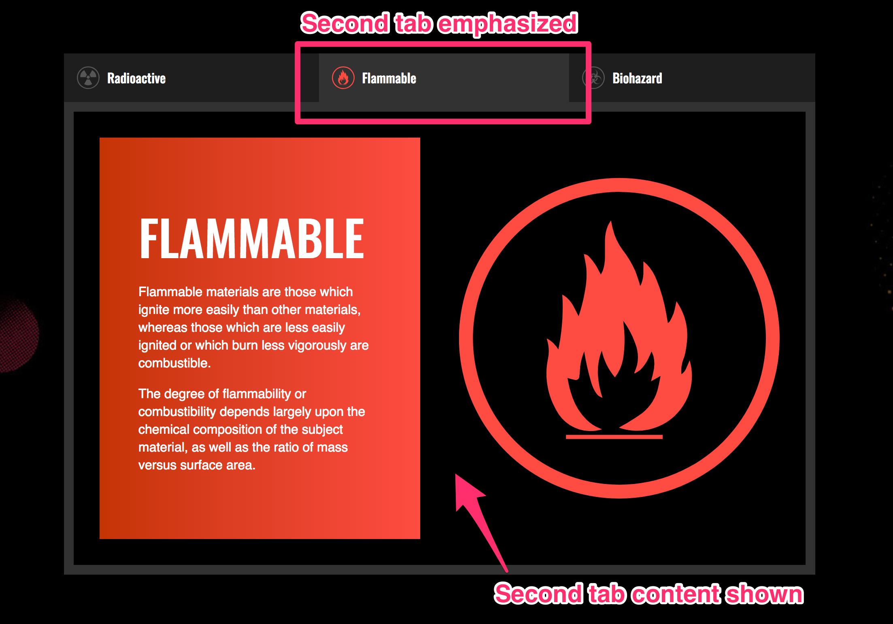
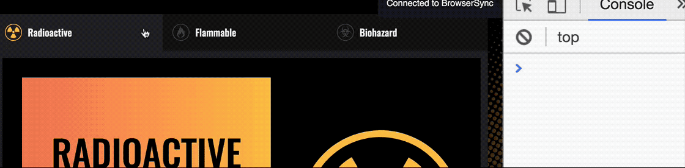
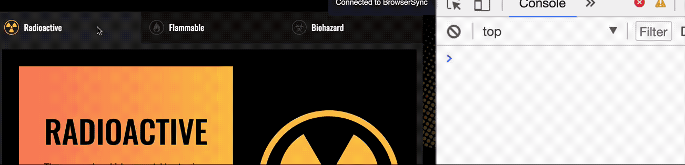
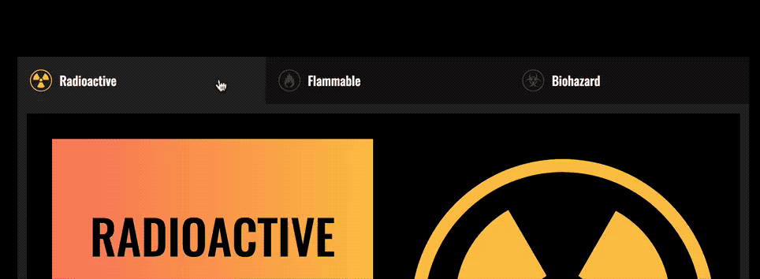

# 🛠 Building a tabbed component

A tabbed component is a component that lets you show and hide content. The tabbed component you're going to build in this lesson looks like this:

<figure>
  
  <figcaption>Completed tab</figcaption>
</figure>

Before continuing, make sure you grab the starter files from the Github repo, in `components/04.tabbed-component/01.starter`.

## Building the tabbed component

A tabbed component consist of two parts—the tabs and the tabbed content.

<figure>
  
  <figcaption>Tabbed components contains tabs and tabbed content</figcaption>
</figure>

Your HTML structure should be similar to this:

```html
<div class="tabbed-component">
  <ul class="tabs">
    <li class="tab"><a href="#">Tab 1</a></li>
    <li class="tab"><a href="#">Tab 2</a></li>
    <li class="tab"><a href="#">Tab 3</a></li>
  </ul>

  <div class="tab-content-container">
    <section class="tab-content">Content 1</section>
    <section class="tab-content">Content 2</section>
    <section class="tab-content">Content 3</section>
  </div>
</div>
```

Let's add the `is-selected` class to the first `.tab` and `.tab-content` since one tab must always be selected.

```html
<div class="tabbed-component">
  <ul>
    <li class="tab is-selected"><a href="#">Tab 1</a></li>
    <li class="tab"><a href="#">Tab 2</a></li>
    <li class="tab"><a href="#">Tab 3</a></li>
  </ul>

  <div class="tab-content-container">
    <section class="tab-content is-selected">Content 1</section>
    <section class="tab-content">Content 2</section>
    <section class="tab-content">Content 3</section>
  </div>
</div>
```

### Selecting tabs

When you click on a tab, you want to emphasize that tab. All other tabs should be deemphasized.

<figure>
  
  <figcaption>Deemphasize inactive tabs and hide their content</figcaption>
</figure>

For the tabs you're building, the styles you need to deemphasize the tabs and hide the tab-content are the following:

```css
/* Set inactive tab icons to 25% white to deemphasize the icons*/
.tab:not(.is-selected) .tab__icon {
  color: rgba(255, 255, 255, 0.25);
}

.tab-content {
  display: none;
}
```

<figure>
  
  <figcaption>How the tabbed interface looks like with deemphasized styles</figcaption>
</figure>

When a tab is activated, you want to emphasize the tab and show its content.

<figure>
  
  <figcaption>Emphasize the active tab and show its content</figcaption>
</figure>

For the tabs you're building, the styles you need to emphasize the active tab is as follows:

```css
.tab.is-selected > a {
  background-color: #323232;
}

/* Using grid here instead of block since I styled the contents with CSS Grid */
.tab-content.is-selected {
  display: grid;
}
```

<figure>
  
  <figcaption>How the tabbed interface looks like with emphasized tabs</figcaption>
</figure>

## Changing the tabs manually

You've already styled the active tab and tab-content with CSS, so you should have no problems switching tabs manually by setting the `.is-selected` on the right HTML Element.

To activate the second tab, all you need to do is change the `is-selected` class to the second tab and the second tab content.

```html
<!-- Activating the second tab by setting is-selected
to the second tab and tab content -->
<div class="tabbed-component">
  <ul>
    <li class="tab"><a href="#">Tab 1</a></li>
    <li class="tab is-selected"><a href="#">Tab 2</a></li>
    <li class="tab"><a href="#">Tab 3</a></li>
  </ul>

  <div class="tab-content-container">
    <section class="tab-content">Content 1</section>
    <section class="tab-content is-selected">Content 2</section>
    <section class="tab-content">Content 3</section>
  </div>
</div>
```

<figure>
  
  <figcaption>Changing to the second tab</figcaption>
</figure>

## Changing the tabs with JavaScript

There are four steps to changing the tabs with JavaScript:

1. Add event listeners to each tab
2. Find the correct tab and tab content
3. Hide inactive tabs and tab-content
4. Show the selected tab and tab content

Let's go through each of these steps, one by one.

### Add event listeners to the tabs

To add an event listener to each tab, you can use `querySelectorAll`.

```js
const tabs = Array.from(document.querySelectorAll('.tab'))

tabs.forEach(tab => {
  tab.addEventListener('click', e => {
    // Do something here
  })
})
```

### Finding the correct tab content

One way to find the correct tab content is through the `href` attribute.

Before you can use the `href` attribute, you need to make sure the `href` attribute of each `tab` matches the id of their tab content—tab 1 should have a `href` of `#tab1`, tab 2 should have a `href` of `#tab2` and so on.

```html
<div class="tabbed-component">
  <ul class="tabs">
    <li ... ><a href="#tab1">Tab 1</a></li>
    <li ... ><a href="#tab2">Tab 2</a></li>
    <li ... ><a href="#tab3">Tab 3</a></li>
  </ul>

  <div class="tab-content-container">
    <section ... id="tab1">Content 1</section>
    <section ... id="tab2">Content 2</section>
    <section ... id="tab3">Content 3</section>
  </div>
</div>
```

To get the `href` attribute of the clicked tab, you need to:

1. Look for the anchor element with `querySelector` or `children`.
2. Get the `href` through `Element.getAttribute`

```js
tabs.forEach(tab => {
  tab.addEventListener('click', _ => {
    const link = tab.children[0]
    const href = link.getAttribute('href')
    console.log(href)
  })
})
```

<figure>
  
  <figcaption>Getting the href attribute</figcaption>
</figure>

In the GIF above, you'll see `#radioactive`, `#flammable` and `#biohazard` instead of `#tab1`, `#tab2` and `#tab3`. This is because it's always better to write links and ids that have meaning.

Next, you need to find the correct tab content. One way to do so is through `querySelector`. As much as possible, you want to search through the component only.

```js
const component = document.querySelector('.tabbed-component')
const tabs = Array.from(component.querySelectorAll('.tab'))

tabs.forEach(tab => {
  tab.addEventListener('click', _ => {
    const link = tab.children[0]
    const href = link.getAttribute('href')
    const tabContent = component.querySelector(href)

    console.log(tabContent)
  })
})

```

<figure>
  
  <figcaption>Getting the tab content</figcaption>
</figure>

### Hiding the previous tab and tab content

You can hide the previous tab and tab content by removing the `is-selected` class from them.

```js
const component = document.querySelector('.tabbed-component')
const tabs = Array.from(component.querySelectorAll('.tab'))
const contents = Array.from(component.querySelectorAll('.tab-content'))

tabs.forEach(tab => {
  tab.addEventListener('click', _ => {
    // ...
    tabs.forEach(elem => elem.classList.remove('is-selected'))
    contents.forEach(elem => elem.classList.remove('is-selected'))
  })
})
```

### Showing the selected tab and tab content

You can show the selected tab and tab content by adding the `is-selected` class to them.

```js
tabs.forEach(tab => {
  tab.addEventListener('click', _ => {
    // ...
    tab.classList.add('is-selected')
    tabContent.classList.add('is-selected')
  })
})
```

<figure>
  
  Tabbed interface completed!</figcaption>
</figure>

## But the awkward jump...

When you click on the tabs, you may find that your browser performs an awkward jump if your window is smaller than the tabbed component.

<figure>
  
  <figcaption>Awkward jump</figcaption>
</figure>

This happens naturally when you click on `<a>` tags with a valid `href` attribute. If the `href` attribute begins with a `#`, browsers automatically look for the an element with the same `id` as the `href` attribute and navigates to it. This process causes the browser to "jump".

You'll learn how to prevent this awkward jump in the events deep dive module.

## Wrapping up

You learned how to build a tabbed component in this lesson. The key is to able to:

1. Find the correct tab content
2. Hide the previous tab and tab content
3. Show the selected tab and tab content.

---

- Previous Lesson: [DOM Traversal](06.dom-traversals.md)
- Next Lesson: [Building a carousel](08.building-carousel.md)
