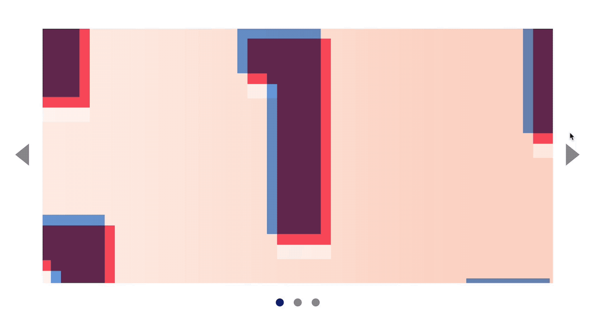
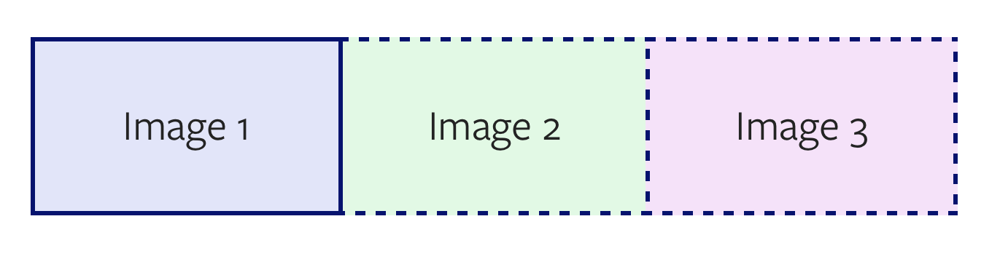
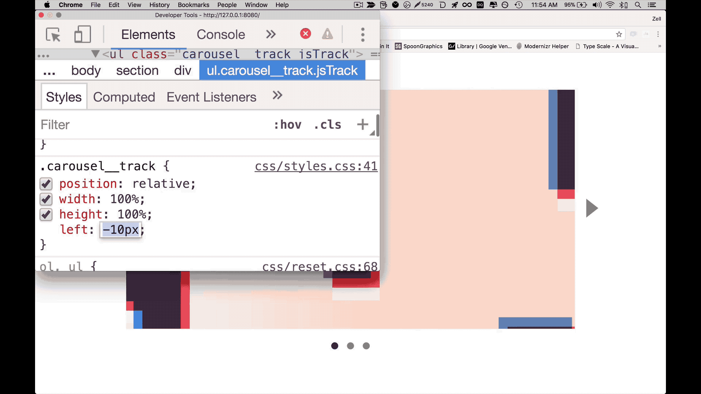
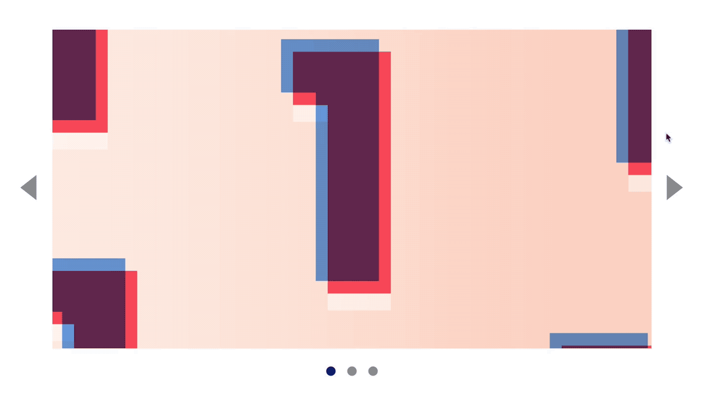
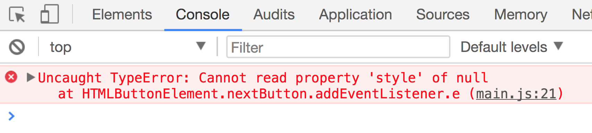
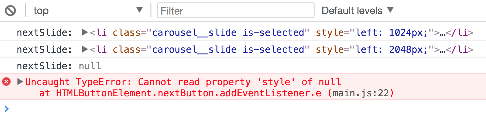

# 🛠 Building a carousel (part 1)

You'll learn to build a carousel in this lesson. Here's what it looks like:

<figure>
  
</figure>

Before continuing, make sure you grab the starter files from the Github repo, in `components/05.carousel/01.starter`.

## Anatomy of a carousel

Carousels, also called sliders, contain a list of content that's often laid in a horizontal manner. They contain four things:

1. A left button
2. A main content area for the carousel—we'll call this a track-container
3. A right button
4. Dots

<figure>
   
   <figcaption>Anatomy of a carousel</figcaption>
 </figure>

To build these four parts, you'll need the following HTML:

```html
<div class="carousel">
  <button class="carousel__button">Left</button>
  <div class="carousel__track-container"> ... </div>
  <button class="carousel__button">Right</button>
  <nav class="carousel__dots">...</nav>
</div>
```

### The track-container

The track container contains a list of content. Let's call each piece of content a **slide**.

Since there's a list of content, you should use a list element (either `<ul>` or `<ol>`).

```html
<div class="carousel__track-container">
  <ul class="carousel__track">
    <li class="carousel__slide"> ... </li>
    <li class="carousel__slide"> ... </li>
    <li class="carousel__slide"> ... </li>
  </ul>
</div>
```

The contents of each slide differs from carousel to carousel. Some carousels, like the example we're building, contains images only. Each slide should link to a different page when they're clicked.

Since slides should link to a different page, they should be wrapped with an anchor tag.

```html
<li class="carousel__slides">
  <a href="#link-to-somewhere">
    <!-- Content within the carousel -->
  </a>
</li>
```

### The dots

Dots of a carousel indicate two things:

1. The total number of slides
2. The currently selected slide.

Usually, you can click on a dot to change the currently selected slide. This means each dot should be created with a `<button>` element.

```html
<div class="carousel__dots">
  <button class="carousel__dot"></button>
  <button class="carousel__dot"></button>
  <button class="carousel__dot"></button>
</div>
```

Note: You need to create dots with JavaScript to ensure the total number of dots match the total number of slides. You'll learn how to do this in a later module. For now, let's imagine our carousel contains three slides.

### The selected slide

The carousel has one slide that's always selected. This should be the first slide when your website is loaded; the corresponding dot should be selected too.

```html
<ul class="carousel__track">
  <li class="carousel__slide is-selected"> ... </li>
  <li class="carousel__slide"> ... </li>
  <li class="carousel__slide"> ... </li>
</ul>
```

```html
<div class="carousel__dots">
  <button class="carousel__dot is-selected"></button>
  <button class="carousel__dot"></button>
  <button class="carousel__dot"></button>
</div>
```

## Styling the carousel

CSS for carousels vary depending on how arrows and dots are positioned.

Some carousels have arrows and dots that are positioned above the track. To accomplish this affect, you need set `position: absolute` for dots and arrows.

<figure>
  
  <figcaption>Arrows are positioned on the image for Bootstrap's carousel</figcaption>
</figure>

For the carousel we're building, we'll position arrows outside of the image. The styles have already been done for you.

### Positioning the slides

Slides of a carousel are often placed side by side, as shown in the picture below:

<figure>
  
  <figcaption>Slides are often positioned side by side</figcaption>
</figure>

There are many techniques to position the slides side by side—you can `float` each slides to the left and set a large `width` property on the track; use `flexbox` to create the slides; set `position: absolute` on each slide; etc. There's no best way, so pick the one you like.

In this example, we'll set `position: absolute` on each slide.

```css
.carousel__slide {
  position: absolute;
  top: 0;
  bottom: 0;
  left: 0;
  right: 0;
  width: 100%;
  height: 100%;
}
```

To position the second slide properly, we set the `left` property of the second slide as the width of a slide (let's call this `slideWidth`). If the width is 800px, the `left` property should be 800px.

To position the third slide, we set the `left` property to two `slideWidth`s.

```css
/* The following code applies only if the width of one slide is 800px */
.carousel__slide:nth-child(2) {
  left: 800px;
}

.carousel__slide:nth-child(3) {
  left: 1600px;
}
```

Our carousel is responsive; that means we cannot use `800px` as `slideWidth`. We need to detect what the actual `slideWidth` is with JavaScript.

But before we do that, let's style the slide content so you can see each slide.

### Styling the slide content

Since each carousel is a link that can be clicked on, you'll want to make each `<a>` tag fill a slide. You can do so by setting `width` and `height` to inherit since `width: 100%` and `height: 100%` is already present on `.carousel__slide`.

Furthermore, each slide contains images that fills the entire slide. For these images, you can set a `background-image` with a `background-size` of `cover`.

```html
<li class="carousel__slide is-selected">
  <a href="#" style="background-image: url('images/image1.jpg')"> </a>
</li>
```

```css
.carousel__slide > a {
  display: block;
  width: inherit;
  height: inherit;
  background-size: cover;
  background-repeat: no-repeat;
  background-position: center center;
}
```

## Positioning the slides with JavaScript

We need to select the slides with JavaScript before we can position them.

```js
const track = document.querySelector('.carousel__track')
const slides = Array.from(track.children)
```

Since slides are responsive, we need to get the width of a slide with JavaScript. We can use `getBoundingClientRect` to do so. Here, checking the width of the first slide is sufficient.

```js
const rect = slides[0].getBoundingClientRect()
console.log(rect)
```

<figure>
  
  <figcaption>Position and size of the first slide</figcaption>
</figure>

The `slideWidth` is the `width` property from `getBoundingClientRect`.

```js
const rect = slides[0].getBoundingClientRect()
const slideWidth = rect.width

console.log(slideWidth) // 1024 (or another number, depending on the width of your slide)
```

You can shorten the above code slightly by chaining the properties together.

```js
const slideWidth = slides[0].getBoundingClientRect().width
```

Next, you need to position the slides with JavaScript. Let's do that manually for now.

We know the following:

- first slides's `left` is `0px`
- second slide's `left` is one `slideWidth`
- third slide's `left` is two `slideWidth`s

```js
slides[0].style.left = '0px'
slides[1].style.left = slideWidth + 'px'
slides[2].style.left = slideWidth * 2 + 'px'
```

To make the calculations consistent, you can substitute the above with this:

```js
slides[0].style.left = slideWidth * 0 + 'px'
slides[1].style.left = slideWidth * 1 + 'px'
slides[2].style.left = slideWidth * 2 + 'px'
```

Did you notice that you can use the zero-based index of each slide to calculate the correct `left` value? Now you see the pattern, we can switch to a `forEach` loop to do the same thing.

```js
slides.forEach((slide, index) => {
  slide.style.left = slideWidth * index + 'px'
})
```

<figure>
  
  <figcaption>Slides are positioned as they should</figcaption>
</figure>

### Preventing overflow

We know the carousel should only show one slide at a time. You can cut off the second, third, and following slides visually by setting `overflow: hidden` on `.carousel__track-container`.

```css
.carousel__track-container {
  /* ... */
  overflow: hidden;
}
```

<figure>
  
  <figcaption>Carousel is finally styled properly!</figcaption>
</figure>

## Moving the slides

When you click on the next button, the carousel should change to the second slide. Ideally, there should be an animation that moves the second slide from the right to the left. We'll work on the animation in a later module. For now, you need to know how to get the correct slide.

To move the slides, you can change track's `left` property. A negative value moves the track to the left and reveals the next slide.

<figure>
  
  <figcaption>You can change the `left` property to reveal subsequent slides</figcaption>
</figure>

To move to the second slide, the `left` property should be set to one `slideWidth`. To move to the third slide, the `left` property should be set to two `slideWidth`s.

## Clicking on the next button

Few things need to happen when a user clicks on the next button.

1. We need to move the carousel to the next slide
2. We need to remove the next arrow when there are no more slides left
3. We need to update the dots to reflect the current slide

Before anything can happen, we need an event listener. Let's build the event listener first.

```html
<button class="carousel__button jsNext">...</button>
```

```js
const nextButton = document.querySelector('.jsNext')
nextButton.addEventListener('click', e => {
  // Move to next slide
})
```

## Moving the carousel to the next slide

To move the carousel to the next slide, we need to know what the current slide is. We can get the current slide by searching for an `.is-selected` class.

```js
nextButton.addEventListener('click', e => {
  const currentSlide = track.querySelector('.is-selected')
})
```

Once we know the current slide, we can get the next slide with `nextElementSibling`.

```js
nextButton.addEventListener('click', e => {
  const currentSlide = track.querySelector('.is-selected')
  const nextSlide = currentSlide.nextElementSibling
})
```

Next, we need to know how much to move the carousel track by. We can find the amount in the next slide's `left` property.

```js
nextButton.addEventListener('click', e => {
  // ...
  const amountToMove = nextSlide.style.left
})
```

To move the carousel, we set a negative pixel value that's equal to the next slide's `left` property.

```js
nextButton.addEventListener('click', e => {
  // ...
  track.style.left = '-' + amountToMove
})
```

At this point, you should get the second slide if you click on the next button.

<figure>
  
  <figcaption>Clicking on the next button brings us to the second slide</figcaption>
</figure>

### Moving to the third slide

Click the next button again. Notice that nothing happens. This is because we identified the current slide with the `is-selected` class. If we don't change the `is-selected` class, `currentSlide` will always be the first slide.

We need to update the next click's `currentSlide` by removing `is-selected` from `currentSlide` and adding it to `nextSlide`.

```js
nextButton.addEventListener('click', e => {
  // ...
  currentSlide.classList.remove('is-selected')
  nextSlide.classList.add('is-selected')
})
```

Now, the carousel moves to the third slide as expected:

<figure>
  
  <figcaption>Clicking on the next button twice brings us to the third slide</figcaption>
</figure>

## Hiding the next button

If you click the next button when you're on the third slide, you'll get an error (in the console).

<figure>
  
  <figcaption>An error occurs when you click on the next button more than twice!</figcaption>
</figure>

This error occurs because there are no more slides after `currentSlide`; `nextSlide` is null; you can't change the `style` property `null`.

You can verify it easily by logging `nextSlide`.

```js
nextButton.addEventListener('click', e => {
  // ...
  console.log('nextSlide: ', nextSlide)
})
```

<figure>
  
  <figcaption>Logging the error</figcaption>
</figure>

To prevent this error from happening, we want to hide the next button when the carousel is on the final slide. Doing so ensures our users do not have the ability to click next when they're not supposed to.

We know that `nextSlide` is the final slide if there are no subsequent slides left.

```js
nextButton.addEventListener('click', e => {
  // ...
  let isFinalSlide = false

  if (!nextSlide.nextElementSibling) {
    isFinalSlide = true
  }
})
```

We can shorten the above code into a single line by assigning a truthy or falsey value to `isFinalSlide`.

```js
nextButton.addEventListener('click', e => {
  // ...
  const isFinalSlide = !nextSlide.nextElementSibling
})
```

If the next slide is the final slide, we want to hide the next button. To do so, we add a `is-hidden` class.

```js
nextButton.addEventListener('click', e => {
  // ...
  if (isFinalSlide) {
    nextButton.classList.add('is-hidden')
  }
})
```

```css
.is-hidden {
  display: none;
}
```

## Updating the dots

To update the selected dot, we need to remove the `is-selected` class from the current dot, and add it to the next dot.

```js
const dotsContainer = document.querySelector('.carousel__nav')

nextButton.addEventListener('click', e => {
  // ...
  const currentDot = dotsContainer.querySelector('.is-selected')
  const nextDot = currentDot.nextElementSibling

  currentDot.classList.remove('is-selected')
  nextDot.classList.add('is-selected')
})
```

## Let's take a pause

We've covered a lot in this lesson. You learned to build the carousel, make sure it looks right initially, and implement the functionality for the next button.

But we're not done yet. In the next lesson, you'll learn to add functionality to the previous button and the dots.

Before jumping into the next lesson, take time to build what you've learned here yourself. Redo the lesson until you're able to create the next button functionality on your own.

Then, give yourself a chance to try building the interaction for the previous button and the dots.

---

- Previous lesson: [🛠 Building a tabbed component](07.building-tabbed-component.md)
- Next lesson: [🛠 Building a carousel (part 2)](09.building-carousel-2.md)
