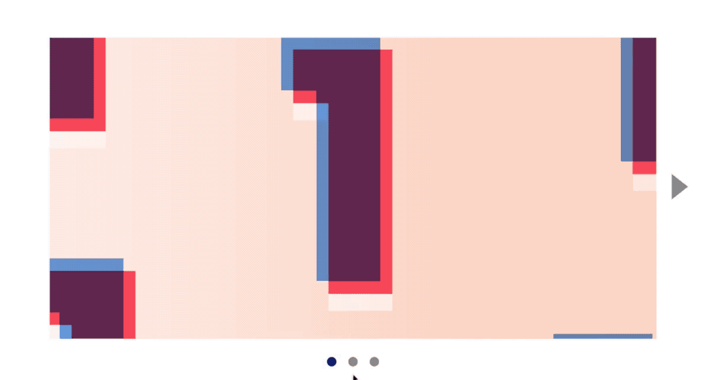
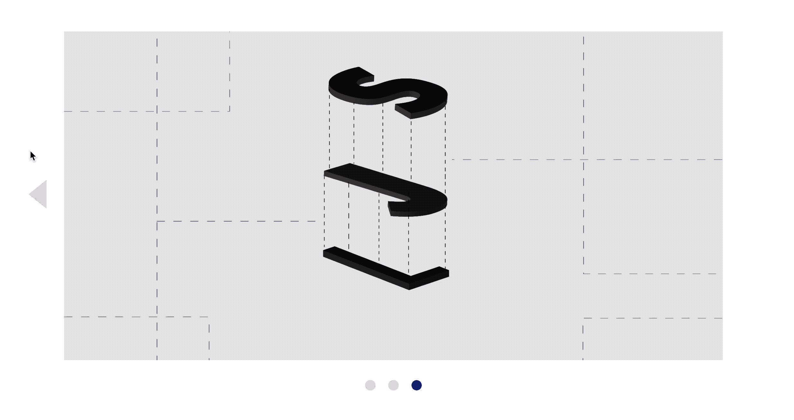
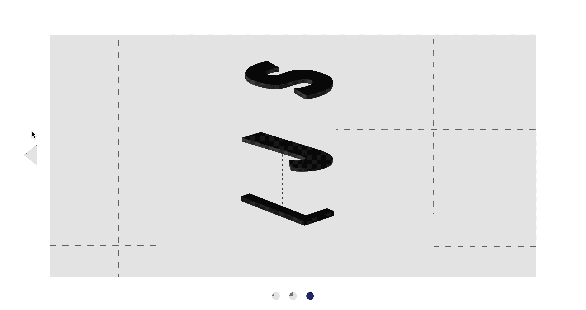
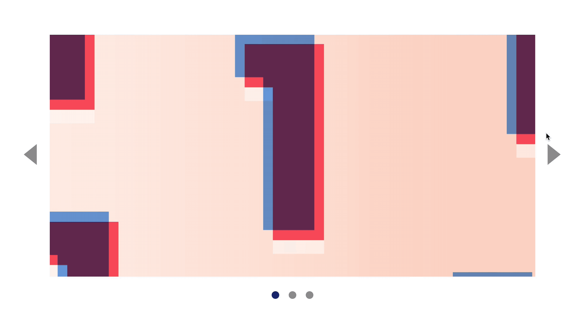
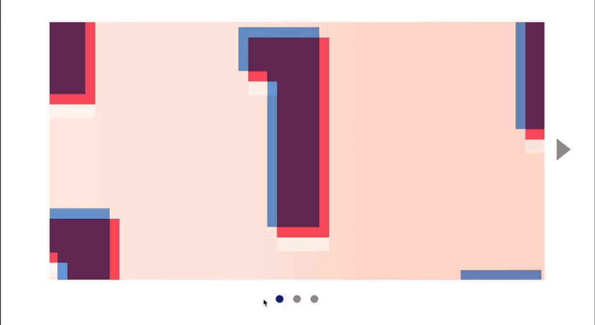

# 🛠 Building a carousel (part 2)

Here's what you'll build by the end of this lesson:

<figure>
  
  <figcaption>The complete interaction</figcaption>
</figure>

You'll find the starter files for this part of the carousel in `components/05.carousel/02.dom-basics-part-1-completed`.

## Clicking on the previous button

Few things need to happen when a user clicks on the previous button.

1. We need to move the carousel to the previous slide
2. We need to remove the previous arrow when there are no more slides left
3. We need to update the dots to reflect the current slide

First, we need to create an event listener for the previous button.

```html
<button class="carousel__button jsPrevious">...</button>
```

```js
const prevButton = document.querySelector('.jsPrevious')

prevButton.addEventListener('click', e => {
  // Change to previous slide
})
```

### Switching to the previous slide

To switch to the previous slide, we need to know what the current slide is. We can get `currentSlide` by searching for the `is-selected` class. To get the previous slide, we can use `previousElementSibling`

```js
const prevButton = document.querySelector('.jsPrevious')
prevButton.addEventListener('click', e => {
  const currentSlide = track.querySelector('.is-selected')
  const prevSlide = currentSlide.previousElementSibling
})
```

We can move the track according to the previous slide's `left` property.

```js
prevButton.addEventListener('click', e => {
  // ...
  const amountToMove = prevSlide.style.left
  track.style.left = '-' + amountToMove
})
```

Finally, we need to remove `.is-selected` from `currentSlide` and add it to `prevSlide`.

```js
prevButton.addEventListener('click', e => {
  //...
  currentSlide.classList.remove('is-selected')
  prevSlide.classList.add('is-selected')
})
```

### Updating the dots

You probably know how to update the dots already. Here's the code.

```js
prevButton.addEventListener('click', e => {
  //...
  const currentDot = dotsContainer.querySelector('.is-selected')
  const prevDot = currentDot.previousElementSibling
  currentDot.classList.remove('is-selected')
  prevDot.classList.add('is-selected')
})
```

If you did everything correctly, you should have the following result at this point:

<figure>
  
  <figcaption>Slides and dots should update properly when the left button is clicked</figcaption>
</figure>

### Hiding the previous button

When the user lands on the first slide, we want to hide the previous button. The reason we do so is the same as why we hid the next button in the last lesson.

To do so, we check if `prevSlide` has a `previousElementSibling`. If it does not have a `previousElementSibling`, we know that `prevSlide` is the first slide.

```js
prevButton.addEventListener('click', e => {
  // ...
  const isFirstSlide = !prevSlide.previousElementSibling

  if (isFirstSlide) {
    prevButton.classList.add('is-hidden')
  }
})
```

<figure>
  
  <figcaption>Hiding the next button</figcaption>
</figure>

We also want to hide the previous button when the carousel loads since the first slide is the selected slide.

```html
<button class="carousel__button jsPrevious is-hidden">...</button>
```

### Showing the next button

We want to show the next button when a user clicks on the previous button. This is because the carousel isn't on the final slide anymore.

```js
prevButton.addEventListener('click', e => {
  // ...
  nextButton.classList.remove('is-hidden')
})
```

The reverse is true. When a user clicks on the next button, we want to show the previous button.

```js
const prevButton = document.querySelector('.jsPrevious')

nextButton.addEventListener('click', e => {
  // ...
  prevButton.classList.remove('is-hidden')
})
```

<figure>
  
  <figcaption>Show and hide previous and next buttons depending on the slide the user is on</figcaption>
</figure>

## Clicking on the dots

When we click on a dot, we want to see the slide that corresponds to the dot.

- The first dot should show the first slide
- The second dot should show the second slide
- The third dot should show the third slide

To build this functionality, we need to add an event listener to each dot.

```js
const dotsContainer = document.querySelector('.carouser__nav')
const dots = Array.from(dotsContainer.children)

dots.forEach(dot => {
  dot.addEventListener('click', e => {
    // Do something
  })
})
```

Let's call the slide we're supposed to switch to `targetSlide`. To find `targetSlide` we need to know:

1. The current slide
2. The current dot
3. The target slide
4. The target dot

We can find the current slide and current dot by searching for the `is-selected` class.

```js
dot.addEventListener('click', e => {
  const currentSlide = track.querySelector('.is-selected')
  const currentDot = dotsContainer.querySelector('.is-selected')
})
```

We also know the target dot. It's the dot that was clicked on.

```js
dot.addEventListener('click', e => {
  const currentSlide = track.querySelector('.is-selected')
  const currentDot = dotsContainer.querySelector('.is-selected')
  const targetDot = dot
})
```

Now, we need to find `targetSlide`.

### Finding targetSlide

Look at the HTML for `track` and `dotsContainer`. You should see a pattern.

```html
<ul class="carousel__track jsTrack">
  <li class="carousel__slide is-selected">...</li>
  <li class="carousel__slide">...</li>
  <li class="carousel__slide">...</li>
</ul>
```

```html
<div class="carousel__nav">
  <button class="carousel__dot is-selected"></button>
  <button class="carousel__dot"></button>
  <button class="carousel__dot"></button>
</div>
```

To find the `targetSlide`, we need to know the index of the `targetDot`. Remember: index is the position of an item in an array.

- The first dot as an index of 0.
- The second dot as an index of 1.
- The third dot as an index of 2.

We can find the index by iterating through `dots`. Here, we check whether the `dot` in `dotsContainer` is the same dot as `targetDot`. If it is, we assign index to a variable.

```js
dot.addEventListener('click', e => {
  // ...
  let targetIndex

  for (let index = 0; index < dots.length; index++) {
    if (dots[index] === targetDot) {
      targetIndex = index
    }
  }
})
```

Here's how you get `targetSlide` from `targetIndex`.

```js
dot.addEventListener('click', e => {
  // ...
  const targetSlide = slides[targetIndex]
})
```

You'll know how to update the slides and dots once you know what the target slide is.

```js
dot.addEventListener('click', e => {
  // ...

  // Move to target slide
  const amountToMove = targetSlide.style.left
  track.style.left = '-' + amountToMove
  currentSlide.classList.remove('is-selected')
  targetSlide.classList.add('is-selected')

  // Update dots
  currentDot.classList.remove('is-selected')
  targetDot.classList.add('is-selected')
})
```

<figure>
  
  <figcaption>Clicking on dots updates the slides and dots</figcaption>
</figure>

### Updating arrows

To update arrows, you need to know which dot was clicked.

- If the first dot is clicked, hide `prevButton` and show `nextButton`
- If the last dot is clicked, hide `nextButton` and show `prevButton`
- If neither the first nor last dot is clicked, show both buttons.

We know the index of the clicked dot by now. If `targetIndex` is 0, we know the user clicked the first dot.

```js
dot.addEventListener('click', e => {
  // ...
  if (targetIndex === 0) {
    prevButton.classList.add('is-hidden')
    nextButton.classList.remove('is-hidden')
  }
})
```

We know the last dot is clicked if the index is 2. This index changes if the total number of slides changes.

- Final index is 3 if there are 4 slides
- Final index is 4 if there are 5 slides
- Final index is 5 if there are 6 slides

The index of the final slide is always `numberOfSlides - 1`. You can find the `numberOfSlides` through `slides.length`.

```js
dotsContainer.addEventListener('click', e => {
  // ...
  if (targetIndex === 0) {
    prevButton.classList.add('is-hidden')
    nextButton.classList.remove('is-hidden')
  } else if (targetIndex === slides.length - 1) {
    prevButton.classList.remove('is-hidden')
    nextButton.classList.add('is-hidden')
  }
})
```

If the index falls between between 0 and `slides.length`, you show both previous and next buttons.

```js
dotsContainer.addEventListener('click', e => {
  // ...
  if (targetIndex === 0) {
    prevButton.classList.add('is-hidden')
    nextButton.classList.remove('is-hidden')
  } else if (targetIndex === slides.length - 1) {
    prevButton.classList.remove('is-hidden')
    nextButton.classList.add('is-hidden')
  } else {
    prevButton.classList.remove('is-hidden')
    nextButton.classList.remove('is-hidden')
  }
})
```

<figure>
  
  <figcaption>The complete interaction when a user clicks on the dots</figcaption>
</figure>

## Wrapping up

You built a carousel that works when a user clicks on the previous button, the next button, and the dots.

At this point, you may feel a little uncomfortable with the code we wrote. That's okay. You'll learn to clean it up in the best practices module.

Homework for you: build a carousel without referring to these two lessons.

---

- Previous lesson: [Building a carousel (part 1)](09.building-carousel.md)
- Next lesson: [Module 6 (events deep dive), lesson 1—the listening element](../06.events-deep-dive/01.listening-element)
