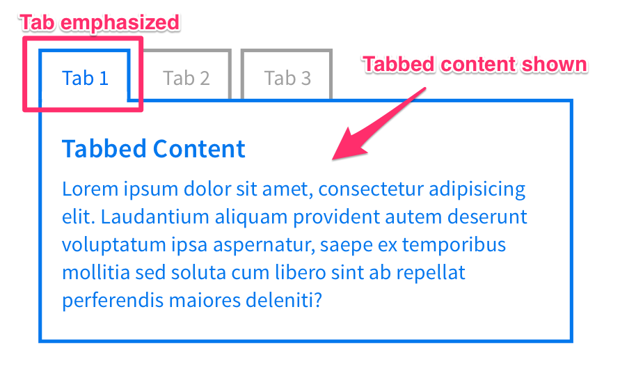
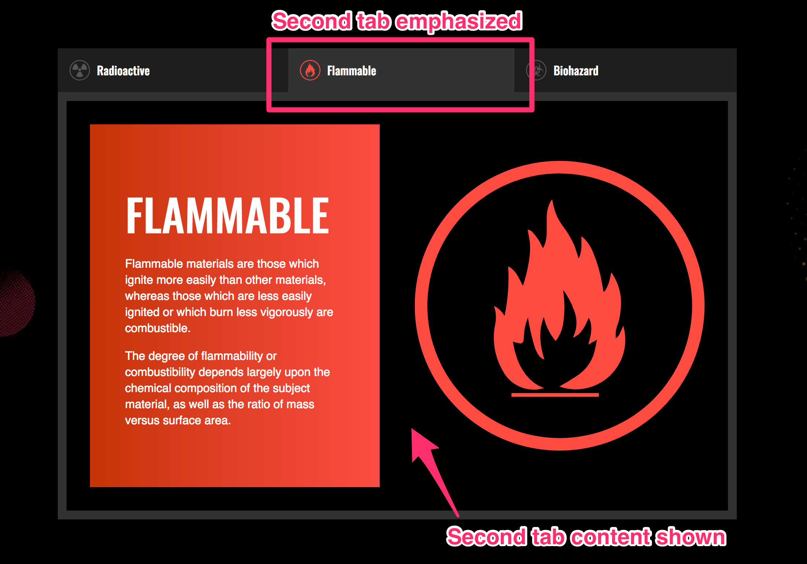
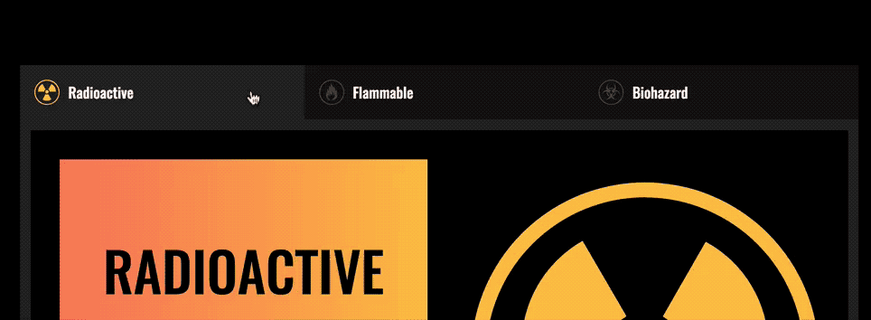

# 🛠 Building a tabbed interface

A tabbed interface is another component that lets you show and hide content. The tabbed interface you're going to build in this lesson looks like this:

<figure>
  
  <figcaption>Completed tab</figcaption>
</figure>

Before continuing, make sure you grab the starter files from the Github repo, in `components/04.tabbed-component/01.starter`.

## Building the tabbed interface

A tabbed interface consist of two parts—the tabs and the tabbed content.

<figure>
  
  <figcaption>Tabbed interfaces contains tabs and tabbed content</figcaption>
</figure>

Your HTML structure should be similar to this:

```html
<div class="tabbed-component">
  <ul class="tabs">
    <li class="tab"><a href="#">Tab 1</a></li>
    <li class="tab"><a href="#">Tab 2</a></li>
    <li class="tab"><a href="#">Tab 3</a></li>
  </ul>

  <div class="tab-content-container">
    <section class="tab-content">Content 1</section>
    <section class="tab-content">Content 2</section>
    <section class="tab-content">Content 3</section>
  </div>
</div>
```

Let's add the `is-selected` class to the first `.tab` and `.tab-content` since one tab must always be selected.

```html
<div class="tabbed-component">
  <ul>
    <li class="tab is-selected"><a href="#">Tab 1</a></li>
    <li class="tab"><a href="#">Tab 2</a></li>
    <li class="tab"><a href="#">Tab 3</a></li>
  </ul>

  <div class="tab-content-container">
    <section class="tab-content is-selected">Content 1</section>
    <section class="tab-content">Content 2</section>
    <section class="tab-content">Content 3</section>
  </div>
</div>
```

### Selecting tabs

When you click on a tab, you want to emphasize that tab. All other tabs should be deemphasized.

<figure>
  
  <figcaption>Deemphasize inactive tabs and hide their content</figcaption>
</figure>

For the tabs you're building, the styles you need to deemphasize the tabs and hide the tab-content are the following:

```css
/* Set inactive tab icons to 25% white to deemphasize the icons*/
.tab:not(.is-selected) .tab__icon {
  color: rgba(255, 255, 255, 0.25);
}

.tab-content {
  display: none;
}
```

<figure>
  
  <figcaption>How the tabbed interface looks like with deemphasized styles</figcaption>
</figure>

When a tab is activated, you want to emphasize the tab and show its content.

<figure>
  
  <figcaption>Emphasize the active tab and show its content</figcaption>
</figure>

For the tabs you're building, the styles you need to emphasize the active tab is as follows:

```css
.tab.is-selected > a {
  background-color: #323232;
}

/* Using grid here instead of block since I styled the contents with CSS Grid */
.tab-content.is-selected {
  display: grid;
}
```

<figure>
  
  <figcaption>How the tabbed interface looks like with emphasized tabs</figcaption>
</figure>

## Changing the tabs manually

You've already styled the active tab and tab-content with CSS, so you should have no problems switching tabs manually by setting the `.is-selected` on the right HTML Element.

To activate the second tab, all you need to do is change the `is-selected` class to the second tab and the second tab content.

```html
<!-- Activating the second tab by setting is-selected
to the second tab and tab content -->
<div class="tabbed-component">
  <ul>
    <li class="tab"><a href="#">Tab 1</a></li>
    <li class="tab is-selected"><a href="#">Tab 2</a></li>
    <li class="tab"><a href="#">Tab 3</a></li>
  </ul>

  <div class="tab-content-container">
    <section class="tab-content">Content 1</section>
    <section class="tab-content is-selected">Content 2</section>
    <section class="tab-content">Content 3</section>
  </div>
</div>
```

<figure>
  
  <figcaption>Changing to the second tab</figcaption>
</figure>

## Changing the tabs with JavaScript

There are four steps to changing the tabs with JavaScript:

1. Add event listeners to each tab
2. Find the correct tab and tab content
3. Hide inactive tabs and tab-content
4. Show the selected tab and tab content

Let's go through each of these steps, one by one.

### Add event listeners to the tabs

To add an event listener to each tab, you can use `querySelectorAll`.

```js
const tabs = Array.from(document.querySelectorAll('.tab'))
tab.forEach.

tabs.forEach(tab => {
  tab.addEventListener('click', e => {
    // Do something here
  })
})
```

### Finding the correct tab content

One way to find the correct tab content is through the `href` attribute. Before you can use the `href` attribute, you need to make sure the `href` attribute of each `tab` matches the id of their tab content—tab 1 should have a `href` of `#tab1`, tab 2 should have a `href` of `#tab2` and so on.

```html
<div class="tabbed-component">
  <ul class="tabs">
    <li ... ><a href="#tab1">Tab 1</a></li>
    <li ... ><a href="#tab2">Tab 2</a></li>
    <li ... ><a href="#tab3">Tab 3</a></li>
  </ul>

  <div class="tab-content-container">
    <section ... id="tab1">Content 1</section>
    <section ... id="tab2">Content 2</section>
    <section ... id="tab3">Content 3</section>
  </div>
</div>
```

To get the value of the `href` attribute
In your JavaScript, you can get the value of the `href` attribute through `Element.getAttribute`.

```js
tabList.addEventListener('click', e => {
  if (!e.target.matches('a')) { return }

  const href = e.target.getAttribute('href')
  console.log(href)
})
```

<figure>
  
  <figcaption>Getting the href attribute</figcaption>
</figure>

In the GIF above, you saw `#radioactive`, `#flammable` and `#biohazard` instead of `#tab1`, `#tab2` and `#tab3`. This is because it's always better to write links and ids that have meaning.

Once you have the `href` value, you can use `parentNode` and `querySelector` to find the correct tab content. Refer back to the [DOM Traversal lesson](../03.dom-basics/09.dom-traversals.md) if you need help with this traversal.

```js
tabList.addEventListener('click', e => {
  if (!e.target.matches('a')) { return }

  const href = e.target.getAttribute('href')

  const targetTabContent = tabList.parentNode.querySelector(href)
  console.log(targetTabContent)
})
```

<figure>
  
  <figcaption>Getting the tab content</figcaption>
</figure>

### Hiding the previous tab

To hide the previous tab and tab content, you need to remove the `is-selected` class from them. Can you understand what's happening in the following code?

```js
tabList.addEventListener('click', e => {
  if (!e.target.matches('a')) { return }

  const href = e.target.getAttribute('href')
  const targetTabContent = tabList.parentNode.querySelector(href)

  // Hiding previous tab and tab content
  const prevTabAndContent = tabList.parentNode.querySelectorAll('.is-selected')
  prevTabAndContent.forEach(elem => elem.classList.remove('is-selected'))
})
```

### Showing the selected tab

To show the selected tab, you need to add the `is-selected` class to the new tab and the new tabbed content.

You have already found the new tab content. What's next is to find the new tab, and you can add `is-selected` to both of them.

```js
tabList.addEventListener('click', e => {
  if (!e.target.matches('a')) { return }

  const href = e.target.getAttribute('href')

  // Hides previous tab and tabbed content
  const prevTabAndContent = tabList.parentNode.querySelectorAll('.is-selected')
  prevTabAndContent.forEach(elem => elem.classList.remove('is-selected'))

  // Shows new tab and tabbed content
  const targetTab = e.target.parentNode
  const targetTabContent = tabList.parentNode.querySelector(href)
  targetTab.classList.add('is-selected')
  targetTabContent.classList.add('is-selected')
})
```

<figure>
  
  Tabbed interface completed!</figcaption>
</figure>

## Preventing the awkward jump

When you click on the tabs, you may find that your browser performs an awkward jump if your window is smaller than the tabbed component.

<figure>
  
  <figcaption>Awkward jump</figcaption>
</figure>

This is normal.

When you click on a link with the `href` that begins with `#`, the browser automatically looks for the same id within the page. (So, if the `href` is `#tab1`, the browser looks for an element with `id="tab1`). This is the default behavior of a link that starts with `#`.

Once the browser finds the element, it jumps to the element automatically.

Although that is okay for a default behavior, you don't want this to happen when your user clicks on the tabbed component. To prevent this awkward jump from happening, you need to add `event.preventDefault` to your event handler.

```js
tabList.addEventListener('click', e => {
  if (!e.target.matches('a')) { return }
  e.preventDefault()

  // The rest of the code
})
```

## Cleaning up the code

We used `e.target` and `tabList.parentNode` twice. These properties can be hard to remember later on, so let's create sensible variables to hold them.

```js
tabList.addEventListener('click', e => {
  if (!e.target.matches('a')) { return }
  e.preventDefault()

  const link = e.target
  const href = link.getAttribute('href')
  const component = tabList.parentNode

  // Hides previous tab and tabbed content
  const prevTabAndContent = component.querySelectorAll('.is-selected')
  prevTabAndContent.forEach(elem => elem.classList.remove('is-selected'))

  // Shows new tab and tabbed content
  const targetTab = link.parentNode
  const targetTabContent = component.querySelector(href)
  targetTab.classList.add('is-selected')
  targetTabContent.classList.add('is-selected')
})
```

## Wrapping up

The structure of a tabbed component in this lesson. The key here is to link the tab with its tabbed content, and add an `is-selected` class to both the active tab and tabbed content.

To get the correct tabbed content, you can use the `href` attribute. When you do so, make sure you write understandable names for both the `href` on the `<a>` tag of each tab, and the `id` of their respective tabbed content.

To hide the previously active tabbed content, you can search for an `is-selected` class on all present elements. If you do this, make sure to remove the hide the previously active tab and tabbed content before showing the new one.

Finally, you performed a few DOM traversals with parentNode. Practice DOM traversals a bit more if you found this traversal confusing. You'll need to get good with traversals, or you'll find it hard to create components.

---

- Previous Lesson: [Building accordions](07.building-accordions.md)
- Next Lesson: [Building carousel](09.building-carousel.md)
