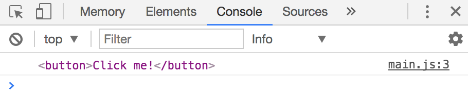
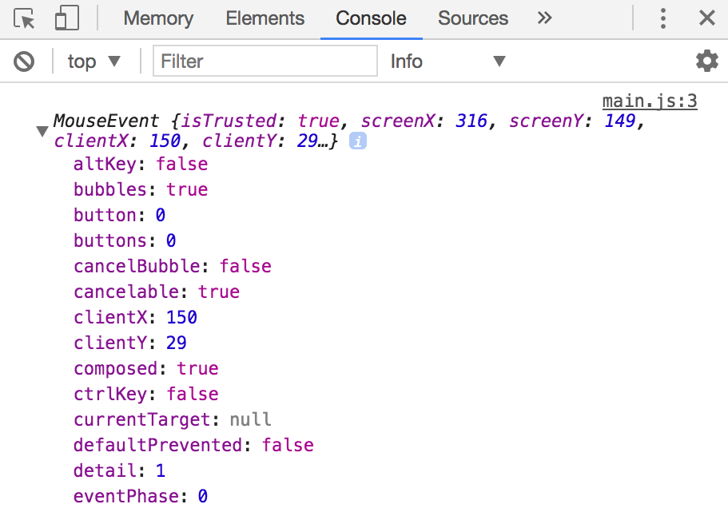

## The listening element

Let's say we added an event listener to a button. When the button is clicked, we want to change the button's color to blue.

Here's what you would have written given what you know so far:

```js
const button = document.querySelector('button')
button.addEventListener('click', e => {
  button.style.color = 'blue'
})
```

Here, `button` is the element that listens to the `click` even. Let's call `button` the **listening element**.

What happens if you decide to create a callback separately? Would the code still work?

```js
const changeButtonColorToBlue = e => {
  button.style.color = 'blue'
}

const button = document.querySelector('button')
button.addEventListener('click', changeButtonColorToBlue)
```

The answer is yes.

The answer is yes because `button` is defined before `changeButtonColorToBlue` is used.

However, if (for some bloody weird reason) you decide to name `button` as something else, the code would break.

```js
// This wouldn't work, because `button` is not defined
const changeButtonColorToBlue = e => {
  button.style.color = 'blue'
}

const someButton = document.querySelector('button')
someButton.addEventListener('click', changeButtonColorToBlue)
```

We don't want to write code that breaks when we change the name of a variable. We want it to be robust. The question is, how do you get the listening element in the event listener, without using the `button` variable?

There are two ways:

1. The `this` keyword
2. `Event.currentTarget`

## The this keyword

`this` is a JavaScript keyword. It changes depending on how a function is called; it refers to the listening element if you use a normal function as the callback of an event listener.

```js
const button = document.querySelector('button')
button.addEventListener('click', function(e) {
  console.log(this)
})
```

<figure>
  
  <figcaption>this refers to the listening element</figcaption>
</figure>

Note: `this` doesn't work if you use an arrow function!

```js
const button = document.querySelector('button')
button.addEventListener('click', e => {
  console.log(this)
})
```

<figure>
  
  <figcaption>`this` doesn't point to the listening element if you use arrow functions</figcaption>
</figure>

## Event.currentTarget

All event listener callbacks accepts an argument. This argument is the event object. People usually abbreviate it either to `evt` or `e`.

I'm sure you've seen it a couple of times by now :)

```js
button.addEventListener('click', e => {/* ... */})
```

This event object gives you information about the triggered event. Here's what you'll see if you log the event object into the console.

```js
button.addEventListener('click', e => {
  console.log(e)
})
```

<figure>
  
  <figcaption>Properties in an event object</figcaption>
</figure>

You can get the listening element through the `currentTarget` property.

```js
const button = document.querySelector('button')
button.addEventListener('click', function (event) {
  console.log(event.currentTarget)
})
```

<figure>
  
  <figcaption>You can get the listening element through Event.currentTarget</figcaption>
</figure>

## Circling back

To make `changeButtonColorToBlue` regardless of the variable used to store the button, you can use either `this` or `currentTarget` to get the listening element.

```js
// This works now
const changeButtonColorToBlue = e => {
  e.currentTarget.style.color = 'blue'
}

const someButton = document.querySelector('button')
someButton.addEventListener('click', changeButtonColorToBlue)
```

## this or event.currentTarget?

They both work. Choose either method.

`this` only works if you use normal functions (not arrow functions) while `currentTarget` works regardless of what type of functions you use.

I default to writing arrow functions nowadays, so I almost always go for `currentTarget`.

## Exercise

1. Get the listening element with `this`.
2. Get the listening element with `Event.currentTarget`.
