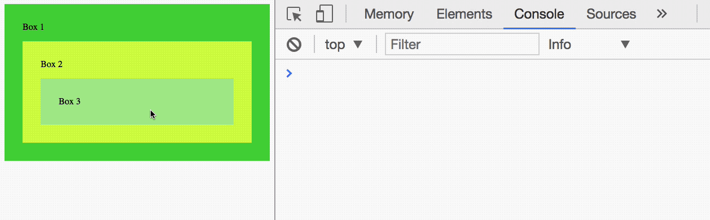
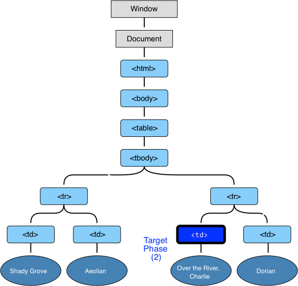
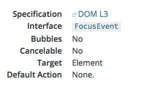
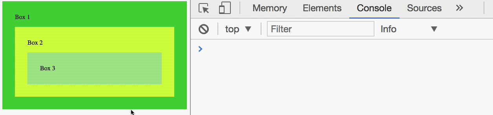

# Event propagation

Three phases occur when an event is fired:

1. The capturing phase
2. The target phase
3. The bubbling phase

Together, they're called **event propagation**.

## The capturing phase

Here, JavaScript goes through `window`, `document`, followed by every element until it reaches the event target.

<figure>
  
  <figcaption>The capturing phase</figcaption>
</figure>

Event listeners can listen to the capturing phase if you provide it with a third argument, `useCapture`, which is a boolean.

```js
document.addEventListener('event-name', callback, useCapture)
```

If `useCapture` is `true`, the callback will be called in the capturing phase. If `useCapture` is `false`, the callback will not be called in the capturing phase.

To see how the capturing phase works, we can build a demo with three nested `<div>`, like this:

```html
<div class="box box1">
  <span>Box 1</span>
  <div class="box box2">
    <span>Box 2</span>
    <div class="box box3"> <span>Box 3</span> </div>
  </div>
</div>
```

<figure>
  
  <figcaption>A demo for understanding event propagation</figcaption>
</figure>

Here, we add an event listener to each element. In each callback, we want to log the `eventPhase` property. This event phase property tells us which phase we're in.

- We're in the capturing phase if `eventPhase` returns 1
- We're in the target phase if `eventPhase` returns 2
- We're in the bubbling phase if `eventPhase` returns 3

```js
const boxes = document.querySelectorAll('.box')
boxes.forEach(box => {
  box.addEventListener('click', e => {
    console.log(e.eventPhase, e.currentTarget)
  }, true)
})
```

I clicked on `.box3` in the gif below.

<figure>
  
  <figcaption>Capturing events trigger event listeners with useCapture</figcaption>
</figure>

You can see that the events are fired such in this order:

1. Box 1, capturing phase
2. Box 2, capturing phase
3. Box 3, target phase

## The target phase

The target phase comes next. Here, JavaScript reaches the element that fired the event and triggers all event listeners attached to it. The target phase disregards the `useCapture` flag.

<figure>
  
  <figcaption>The target phase</figcaption>
</figure>

```js
const box3 = document.querySelector('.box3')
box3.addEventListener('click', listener, true)
box3.addEventListener('click', listener)
```

<figure>
  
  <figcaption>The target phase triggers all events regardless of useCapture</figcaption>
</figure>

In the GIF above, you can see all event listeners activate. It doesn't matter if `useCapture` is present.

## The bubbling phase

The bubbling phase comes last. Here, JavaScript goes through every HTML Element, starting from the target, back to `Window`.

<figure>
  
  <figcaption>The bubbling phase</figcaption>
</figure>

Event listeners without the `useCapture` flag will trigger in this phase.

```js
const boxes = document.querySelectorAll('.box')
boxes.forEach(box => box.addEventListener('click', e => {
  console.log(e.eventPhase, e.currentTarget)
}))
```

I clicked on `.box3` in the gif below.

<figure>
  
  <figcaption>Bubbling events trigger event listeners without useCapture</figcaption>
</figure>

You can see that events trigger in the following sequence:

1. Box 3, target phase
2. Box 2, bubbling phase
3. Box 1, bubbling phase

## Events that bubble

Events that bubble have a `bubbles` property set to `true`. An example is a `click` event:

<figure>
  
  <figcaption>Information on the click event on MDN</figcaption>
</figure>

Some events don't bubble. Examples of these events are `focus` and `blur`.

<figure>
  
  <figcaption>Information on the focus event on MDN</figcaption>
</figure>

## Event firing sequence

If two listeners are attached to the same element, listener that is attached first fires first.

```js
const button = document.querySelector('button')
button.addEventListener('click', e => console.log('First event'))
button.addEventListener('click', e => console.log('Second event'))
```

<figure>
  
  <figcaption>Event Listeners are fired in the order they are attached</figcaption>
</figure>

## Preventing bubbling

If you want to prevent an event from bubbling, you can use `stopPropagation` or `stopImmediatePropagation`.

- `stopPropagation` prevents events from bubbling upwards
- `stopImmediatePropagation`  prevents events from bubbling upwards, and also prevents subsequent events on the listening element from firing.

```js
// Stopping propagation
const box2 = document.querySelector('.box2')
const box3 = document.querySelector('.box3')

box2.addEventListener('click', e => console.log('box 2 clicked!'))
box3.addEventListener('click', e => e.stopPropagation())
```

Events from `.box3` will not bubble to `.box2` because we called `stopPropagation` in `.box3`.

<figure>
  
  <figcaption>Propagation stopped for box 3</figcaption>
</figure>

## Exercise

Familiarize yourself with the sequence of events that occur.

1. Add an event listener in the capturing phase
2. Add an event listener in the bubbling phase

Answer these questions:

1. Which phase comes first? The capturing phase or the bubbling phase?
2. What event listeners are fired in the capturing phase?
3. What event listeners are fired in the target phase?
4. What event listeners are fired in the bubbling phase?
5. How do you stop an event from bubbling?

---

- Previous lesson: [Default behaviors](02.default-actions.md)
- Next lesson: [Event delegation](04.event-delegation.md)
